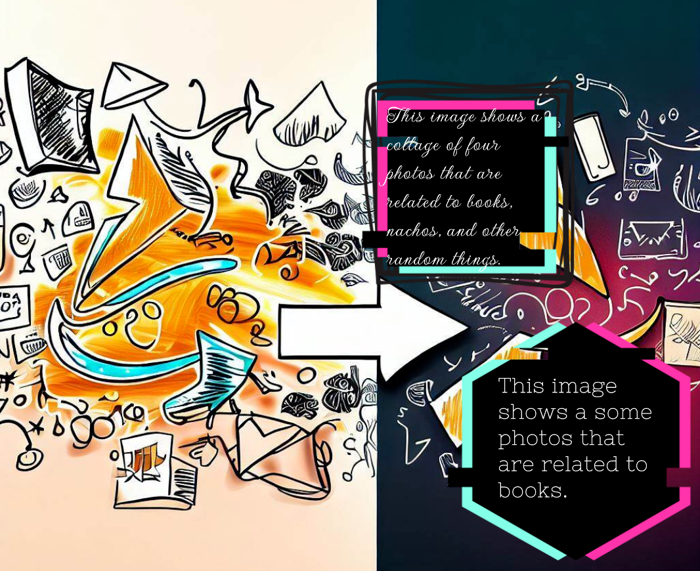
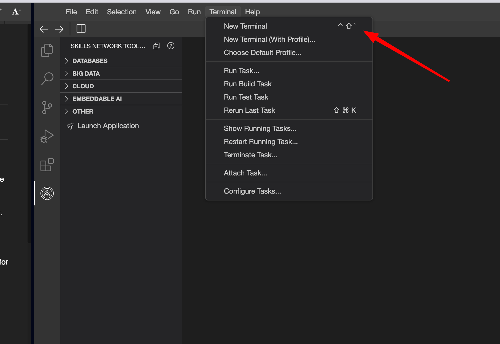
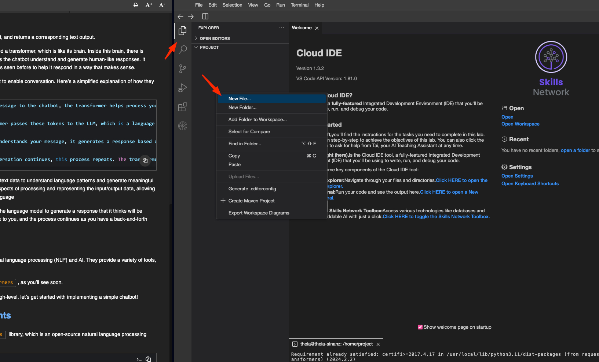
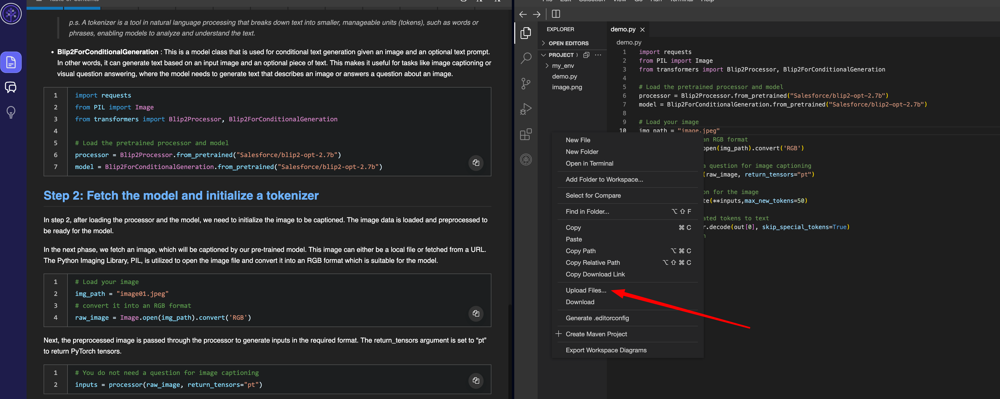
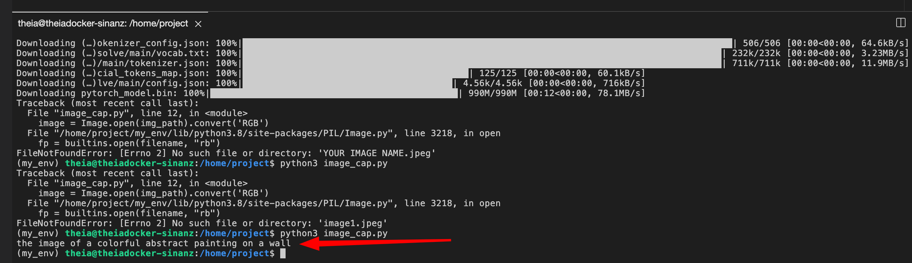
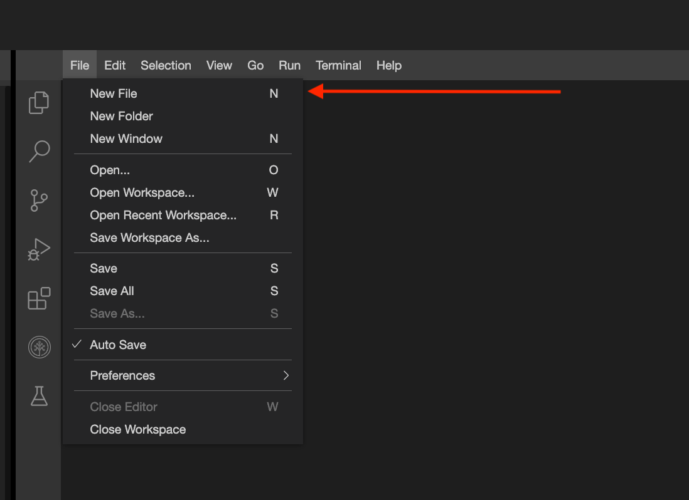
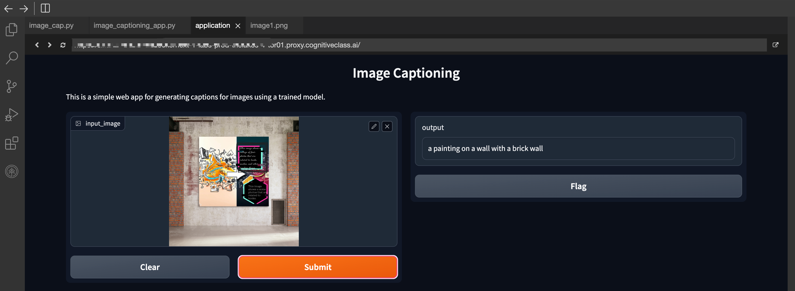
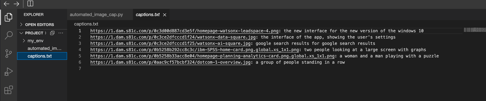

İşte metnin Türkçeye çevrilmiş hali; konu bütünlüğüne göre paragraflara ayrılmış ve her başlığa emoji eklenmiştir:

---

### 🖼️ Yapay Zekâ ile Fotoğraflarınıza Anlamlı İsimler Verin

**cognitiveclass.ai logosu**

---

### 🌟 Giriş

Görseller, henüz değerlendirilmemiş zengin bilgiler barındırır, ancak arama motorları ve veri sistemleri bu içerikleri genellikle göz ardı eder. Görsel veriyi makine tarafından okunabilir dile dönüştürmek kolay değildir, ancak burada **görsel açıklama yapay zekâsı (image captioning AI)** devreye girer.

İşte bu teknolojinin nasıl fark yaratabileceği:

* **Erişilebilirliği artırır:** Görme engelli bireylerin görsel içerikleri anlamasına yardımcı olur.
* **SEO'yu iyileştirir:** Arama motorlarının görsel içerikleri tanımasını sağlar.
* **İçerik keşfini kolaylaştırır:** Büyük görsel veritabanlarının analizini ve kategorilendirilmesini hızlandırır.
* **Sosyal medya ve reklamcılığı destekler:** Görsel içerikler için etkileyici açıklamaları otomatik üretir.
* **Güvenliği artırır:** Video kayıtlarında gerçek zamanlı etkinlik açıklamaları sağlar.
* **Eğitim ve araştırmada kullanılır:** Görsel materyallerin anlaşılmasını ve yorumlanmasını kolaylaştırır.
* **Çok dilli destek sunar:** Farklı dillerde açıklamalar üreterek küresel erişim sağlar.
* **Veri organizasyonu sağlar:** Büyük görsel veri kümelerinin yönetimi ve sınıflandırılmasını destekler.
* **Zamandan tasarruf sağlar:** Otomatik açıklamalar, manuel etiketlemeden çok daha verimlidir.
* **Kullanıcı etkileşimini artırır:** Detaylı açıklamalar, görselleri daha ilgi çekici ve bilgilendirici kılar.

---

### 🎯 Öğrenme Hedefleri

Bu projeyi tamamladığınızda şunları yapabileceksiniz:

* **Hugging Face’in Transformers kütüphanesinden BLIP modelini** kullanarak bir görsel açıklama aracı geliştirmek
* **Gradio** ile kullanıcı dostu bir arayüz oluşturmak
* **Gerçek dünya iş senaryolarına** uygun şekilde aracı uyarlamak ve uygulamalı kullanım örneklerini göstermek



### 🛠️ Ortamı Hazırlama ve Gerekli Kütüphaneleri Yükleme

Bu projede bir yapay zekâ uygulaması geliştirmek için Hugging Face tarafından sağlanan **Gradio arayüzünü** kullanacaksınız.

Haydi, proje için ortamı ve bağımlılıkları birlikte hazırlayalım. Aşağıdaki adımları takip edin:

---

### 💻 Yeni Bir Terminal Açın

1. Yeni bir terminal penceresi açın.
2. Projenizin bulunduğu dizine gidin (örneğin `home/project` klasörü).



### ⚙️ Python Sanal Ortam Oluşturma ve Kütüphaneleri Yükleme

Projeyi izole bir ortamda geliştirmek için bir Python **sanal ortamı** oluşturacağız ve gerekli kütüphaneleri bu ortama kuracağız.

---

### 🧪 Adım 1: Sanal Ortamı Oluştur ve Etkinleştir

Terminalde aşağıdaki komutları sırasıyla çalıştırın:

```bash
pip3 install virtualenv 
virtualenv my_env  # my_env adında bir sanal ortam oluşturulur
source my_env/bin/activate  # Ortamı etkinleştirir
```

---

### 📦 Adım 2: Gerekli Kütüphaneleri Yükleyin

Etkinleştirilmiş ortamda şu komutu çalıştırarak gerekli tüm kütüphaneleri kurun:

```bash
pip install langchain==0.1.11 gradio==5.23.2 transformers==4.38.2 bs4==0.0.2 requests==2.31.0 torch==2.2.1
```

---

### ☕ Kurulum Sürerken Kahve Molası

Kurulum yaklaşık 5 dakika sürebilir. Bu sırada biraz rahatlayın:

```
      )  (
     (   ) )
      ) ( (
    _______)_
 .-'---------|
( C|/\/\/\/\/|
 '-./\/\/\/\/|
   '_________'
    '-------'
```

---

### ✅ Hazır!

Artık Python dosyalarını oluşturmak ve geliştirmeye başlamak için ortamınız hazır.

Devam etmek ister misiniz? Bir `caption_app.py` dosyası oluşturup kodlamaya geçebiliriz.



---

### 🧠 Kullanacağınız Bileşenler: AutoProcessor ve BlipForConditionalGeneration

Bu projede Hugging Face Transformers kütüphanesinden şu bileşenleri kullanacaksınız:

---

### 🛠️ AutoProcessor Nedir?

 **`AutoProcessor`** , BLIP modeli için veri ön işleme yapan bir yardımcı sınıftır.

* **Görsel işlemeyi (image processor)** ve **metin çözümleyiciyi (OPT/T5 tokenizer)** bir araya getirir.
* Hem görsel hem metin verisini alarak, bu verileri model için hazır hale getirir.

📌 *Not:*

Tokenizer, doğal dil işleme alanında metni daha küçük parçalara (token) ayırarak modelin metni analiz edebilmesini sağlar. Bu parçalar genellikle kelimeler veya kelime öbekleridir.

---

### ✍️ BlipForConditionalGeneration Nedir?

 **`BlipForConditionalGeneration`** , bir görsel (ve isteğe bağlı olarak bir metin girdisi) verildiğinde açıklayıcı metin üretimi (captioning) yapan bir model sınıfıdır.

* Görsel açıklama (image captioning)
* Görsel soru-cevap (visual question answering)

  gibi görevlerde kullanılır.

---

### 📥 Adım 1: Kütüphaneleri ve Modeli Yükleme

Aşağıdaki Python kodunu kullanarak model bileşenlerini yükleyin:

```python
import requests
from PIL import Image
from transformers import AutoProcessor, BlipForConditionalGeneration

# Önceden eğitilmiş işlemci ve modeli yükleyin
processor = AutoProcessor.from_pretrained("Salesforce/blip-image-captioning-base")
model = BlipForConditionalGeneration.from_pretrained("Salesforce/blip-image-captioning-base")
```

---

### 🖼️ Adım 2: Görseli Hazırlamak

Açıklanacak görseli hazırlamak için aşağıdaki adımları izleyin:

1. Kod editörünüzün sol tarafındaki **Explorer (Dosya Gezgininde)** boş bir alana sağ tıklayın.
2. **Upload Files...** seçeneğine tıklayın.
3. Bilgisayarınızdan bir görsel seçip yükleyin.
4. Kodda `img_path` değerini yüklediğiniz görselin adıyla değiştirin.

---



---

### 🖼️ Dosya Yükleme: Görseli Hazırlama

Sonraki aşamada, eğitilmiş modeliniz tarafından açıklanacak bir görsel alacaksınız.

Bu görsel ister yerel dosya olarak bilgisayarınızdan, ister bir URL üzerinden alınabilir.

Görsel, Python Imaging Library ( **PIL** ) ile açılır ve modele uygun hale getirmek için **RGB formatına** dönüştürülür.

```python
# Görselinizi yükleyin – GÖRSEL ADINI UNUTMAYIN!
img_path = "GORSEL_ADINIZ.jpeg"
# RGB formatına dönüştürün
image = Image.open(img_path).convert('RGB')
```

---

### 🧪 Görseli İşleyip Model Girdisine Dönüştürme

İşlenen görsel, `processor` aracılığıyla modele uygun girdiye çevrilir.

`return_tensors="pt"` argümanı, çıktının PyTorch tensörü olarak dönmesini sağlar.

```python
# Görsel açıklama için soruya gerek yok
text = "the image of"
inputs = processor(images=image, text=text, return_tensors="pt")
```

---

### 🤖 Model ile Açıklama Üretimi

Modelin `generate` metodu kullanılarak açıklama oluşturulur.

`max_new_tokens=50` parametresi, en fazla 50 token’lık açıklama üretmesini belirtir.

📌 Not: Python'da `**` işareti, bir sözlüğü açarak anahtar-değer çiftlerini fonksiyona argüman olarak iletmek için kullanılır.

```python
# Görsel için açıklama üret
outputs = model.generate(**inputs, max_length=50)
```

---

### 📝 Üretilen Açıklamayı Okunabilir Metne Dönüştürme

Modelin ürettiği çıktı, token dizisidir. Bu diziyi insan tarafından okunabilir metne çevirmek için `decode` metodu kullanılır.

`skip_special_tokens=True` ile özel karakterler çıktıdan çıkarılır.

```python
# Üretilen token'ları metne çevir
caption = processor.decode(outputs[0], skip_special_tokens=True)
# Açıklamayı yazdır
print(caption)
```

---

### 💾 Python Dosyasını Kaydet ve Çalıştır

Kodlarınızı bir dosyaya (örneğin `image_cap.py`) kaydedin ve şu komutla çalıştırın:

```bash
python3 image_cap.py
```

---

### ✅ Sonuç: Görselin Açıklaması Hazır!

Modelinizin ürettiği açıklama, görselin içeriğini metin olarak ifade eder.

Bu açıklama, **BLIP modeli** tarafından görselin analiz edilip yorumlanmasıyla elde edilir.

Hazırsan, bu projeyi Gradio arayüzüyle birleştirip etkileşimli hale getirebiliriz. Devam edelim mi?



### 💻 Gradio ile Görsel Açıklama Uygulaması

Artık **görsel açıklama mekanizmasını** anladığınıza göre, bunu **kullanıcı dostu bir arayüzle birleştirerek gerçek bir uygulama** haline getirebiliriz.

Bu amaçla, Hugging Face tarafından sunulan **Gradio** aracını kullanacağız.

---

### 🚀 Hızlı Başlangıç: Gradio ile Basit Bir Demo

Gradio’ya alışmak için önce küçük bir uygulama oluşturalım.

📁 Hâlâ proje klasöründeyken şu adımları izleyin:

1. Yeni bir Python dosyası oluşturun.
2. Dosyaya şu ismi verin: `hello.py`

---



---

### 👨‍💻 `hello.py` Dosyasını Oluştur ve Kodu Yapıştır

Yeni oluşturduğun `hello.py` dosyasını aç ve aşağıdaki Python kodunu içerisine kopyalayıp kaydet:

```python
import gradio as gr

def greet(name):
    return "Hello " + name + "!"

demo = gr.Interface(fn=greet, inputs="text", outputs="text")
demo.launch(server_name="0.0.0.0", server_port=7860)
```

---

### 🧪 Ne Yapar Bu Kod?

Yukarıdaki kod, `demo` adında bir **`gr.Interface`** oluşturur.

Bu arayüz, **`greet()` fonksiyonunu** basit bir **metin girişinden metin çıktısına** kullanıcı arayüzüyle sarar.

`gr.Interface` sınıfı şu 3 temel parametreyle başlatılır:

* `fn`: Arayüzle sarılacak fonksiyon
* `inputs`: Giriş bileşeni (örneğin: `"text"`, `"image"`, `"audio"`)
* `outputs`: Çıkış bileşeni (örneğin: `"text"`, `"image"`, `"label"`)

Son satırdaki `demo.launch()` ifadesi, uygulamayı barındıracak yerel sunucuyu başlatır.

---

### 🚀 Demo Uygulamayı Başlatmak

Terminale geri dön ve `my_env` sanal ortamının etkin olduğunu kontrol et. Satırın başında `(my_env)` ibaresi görünmelidir.

Uygulamayı çalıştırmak için şu komutu yaz:

```bash
python3 hello.py
```

---

### 🌐 Web Arayüzünü Görüntüle

Kod, localhost (127.0.0.1) üzerinden servis edildiğinden, tarayıcına şu adresi yazabilirsin:

👉 [http://127.0.0.1:7860](http://127.0.0.1:7860)

---

### 🧾 Ne Göreceksiniz?

Girdi alanına adınızı yazın (örneğin: `bob`), **Submit** tuşuna basın.

Sağda şu çıktıyı göreceksiniz:

```
Hello bob!
```

---


Uygulama ile oynamayı bitirdiğinizde çıkmak için:

**Terminalde `Ctrl + C` tuşlarına basın** ve ardından tarayıcıdaki uygulama sekmesini kapatın.

---

### 🎉 İlk Gradio Deneyiminiz

Gradio arayüzünü ilk kez denediniz — **kolay değil mi?**

Basit birkaç satır kodla etkileşimli bir web uygulaması oluşturabildiniz.

---

### 📚 Daha Fazla Öğrenmek İster Misiniz?

Gradio hakkında daha fazla özelleştirme öğrenmek isterseniz, sizi şu rehberli projeye davet ediyoruz:

**“Bring your Machine Learning Model to Life with Gradio”**

Bu projeyi **[cognitiveclass.ai](https://cognitiveclass.ai)** platformunda, **Courses & Projects** bölümünde bulabilirsiniz!

---

### 🧪 Uygulama: Gradio ile Görsel Açıklama (Image Captioning) Uygulaması Geliştirme

Bu egzersizde, **BLIP-2 modeli** ve **Gradio kütüphanesini** kullanarak görseller için açıklama üreten bir web uygulaması geliştireceksiniz. Aşağıdaki adımları izleyin:

---

### 🔧 Adım 1: Ortamı Hazırlayın

📌 Gerekli kütüphanelerin kurulu olduğundan emin olun. Terminalde şu komutu çalıştırın:

```bash
pip install gradio transformers Pillow
```

📁 Ardından yeni bir Python dosyası oluşturun ve adını `image_captioning_app.py` koyun.

İçine aşağıdaki kütüphaneleri ekleyin:

```python
import gradio as gr
import numpy as np
from PIL import Image
from transformers import AutoProcessor, BlipForConditionalGeneration
```

---

### 📦 Adım 2: Önceden Eğitilmiş Modeli Yükleyin

Aşağıdaki kodla `processor` ve `model` bileşenlerini yükleyin:

```python
processor = AutoProcessor.from_pretrained("Salesforce/blip-image-captioning-base")
model = BlipForConditionalGeneration.from_pretrained("Salesforce/blip-image-captioning-base")
```

---

### 🧠 Adım 3: Görsel Açıklama Fonksiyonunu Tanımlayın

Açıklama üretimi için aşağıdaki fonksiyonu yazın:

```python
def caption_image(input_image: np.ndarray):
    # NumPy dizisini PIL Image'e çevir ve RGB formatına dönüştür
    raw_image = Image.fromarray(input_image).convert('RGB')
  
    # Görseli işle
    inputs = processor(images=raw_image, return_tensors="pt")

    # Açıklama üret
    outputs = model.generate(**inputs, max_length=50)

    # Token'ları okunabilir metne çevir
    caption = processor.decode(outputs[0], skip_special_tokens=True)
  
    return caption
```

---

### 🌐 Adım 4: Gradio Arayüzünü Oluşturun

Şimdi uygulama arayüzünü tanımlayın:

```python
iface = gr.Interface(
    fn=caption_image, 
    inputs=gr.Image(), 
    outputs="text",
    title="Image Captioning",
    description="Bu uygulama, eğitilmiş bir model kullanarak görseller için açıklama üretir."
)
```

---

### 🚀 Adım 5: Uygulamayı Başlatın

Gradio uygulamasını başlatmak için şu satırı ekleyin:

```python
iface.launch()
```

---

### 💻 Adım 6: Uygulamayı Çalıştırın

Tüm kodu `image_captioning_app.py` dosyasına kaydedin.

Terminali açın, dosyanın bulunduğu dizine gidin ve şu komutu çalıştırın:

```bash
python3 image_captioning_app.py
```

Tarayıcıda açılan uygulamada görsel yükleyerek açıklama üretebilirsiniz.

📌 Çıkmak için terminalde `Ctrl + C` tuşlarına basın.

---




### 🌐 Web Uygulamasıyla Etkileşime Geçme (Yerel Olarak Çalıştırıyorsanız)

Uygulamanız başarıyla çalışıyorsa, terminalde aşağıdaki adımları takip edebilirsiniz:

1. **Uygulama başlatıldığında** , terminalde bir URL görüntülenecektir (örneğin: `http://127.0.0.1:7860`).
2. Bu URL’yi bir web tarayıcısında açın.
3. Ekranda **görsel yükleme kutusu** bulunan bir arayüz göreceksiniz.

---

### 🎉 Tebrikler!

Gradio ve BLIP modelini kullanarak bir **görsel açıklama (image captioning)** web uygulaması oluşturdunuz.

Artık:

* Arayüzü kişiselleştirebilir
* Kodu geliştirebilir
* Farklı modelleri veya ayarları deneyerek uygulamanın işlevselliğini artırabilirsiniz

---


---

### 🤖 Egzersiz: Otomatik Görsel Açıklama Uygulaması – Web Sayfasından Görsel Çekme ve Açıklama Üretme

Bu egzersizde, **BeautifulSoup** ile bir web sayfasındaki tüm görselleri toplayacak, ardından **BLIP modeli** ile bu görsellerin açıklamalarını otomatik olarak oluşturacaksınız. Sonuçları bir `.txt` dosyasına yazdıracaksınız.

---

### 🧾 Adım 1: Gerekli Kütüphaneleri Yükleme ve Dosyayı Oluşturma

📁 Yeni bir Python dosyası oluşturun:

**`automate_url_captioner.py`**

Kodun başında aşağıdaki kütüphaneleri içe aktarın ve modeli yükleyin:

```python
import requests
from PIL import Image
from io import BytesIO
from bs4 import BeautifulSoup
from transformers import AutoProcessor, BlipForConditionalGeneration

# Önceden eğitilmiş işlemci ve model
processor = AutoProcessor.from_pretrained("Salesforce/blip-image-captioning-base")
model = BlipForConditionalGeneration.from_pretrained("Salesforce/blip-image-captioning-base")
```

---

### 🌐 Adım 2: Web Sayfasını İndir ve HTML'i Ayrıştır

```python
# Görsellerin alınacağı sayfa
url = "https://en.wikipedia.org/wiki/IBM"

# Sayfayı indir
response = requests.get(url)

# BeautifulSoup ile HTML'yi ayrıştır
soup = BeautifulSoup(response.text, 'html.parser')
```

---

### 🖼️ Adım 3: Görselleri Bul ve İşle

```python
# Tüm  etiketlerini bul
img_elements = soup.find_all('img')

# Açıklamaları yazmak için bir dosya aç
with open("captions.txt", "w") as caption_file:
    for img_element in img_elements:
        img_url = img_element.get('src')

        # SVG veya 1x1 görselleri atla
        if 'svg' in img_url or '1x1' in img_url:
            continue

        # Bozuk URL'leri düzelt
        if img_url.startswith('//'):
            img_url = 'https:' + img_url
        elif not img_url.startswith('http://') and not img_url.startswith('https://'):
            continue

        try:
            # Görseli indir
            response = requests.get(img_url)

            # Görseli PIL formatına çevir
            raw_image = Image.open(BytesIO(response.content))
            if raw_image.size[0] * raw_image.size[1] < 400:
                continue  # Çok küçük görselleri atla

            raw_image = raw_image.convert('RGB')

            # Görseli işle ve açıklama üret
            inputs = processor(raw_image, return_tensors="pt")
            out = model.generate(**inputs, max_new_tokens=50)
            caption = processor.decode(out[0], skip_special_tokens=True)

            # Açıklamayı dosyaya yaz
            caption_file.write(f"{img_url}: {caption}\n")
        except Exception as e:
            print(f"Görsel işlenirken hata oluştu {img_url}: {e}")
            continue
```

---

### ✅ Çıktı: `captions.txt`

* Kod çalıştıktan sonra, bulunduğun dizinde **`captions.txt`** adında yeni bir dosya oluşacaktır.
* Bu dosya, her satırda görsel URL’si ve BLIP modeli tarafından oluşturulan açıklamayı içerir.

---



---

### 🖼️ Bonus: Yerel Görseller İçin Görsel Açıklama (BLIP-2 ile)

BLIP-2 modeli daha güçlü bir önceden eğitilmiş modeldir ve görsel açıklama görevlerinde yüksek başarı sağlar.

Aşağıda, bir klasördeki tüm yerel görselleri dolaşarak açıklama üreten bir uygulama oluşturmayı öğreneceksiniz.

> ⚠️ **Not:** BLIP-2 modeli yaklaşık 10 GB boyutundadır. Bu nedenle CloudIDE gibi sınırlı kaynaklı ortamlarda çalışmaz. Yerel çalıştırmanız önerilir.

---

### 🧾 Gerekenler

* `transformers`, `PIL`, `glob`, `os` kütüphaneleri
* Görsellerin bulunduğu klasör
* `Salesforce/blip2-opt-2.7b` modeli

---

### 📁 Dosya Yapısı ve Kod

Yeni bir dosya oluşturun:

**`local_blip2_captioner.py`**

```python
import os
import glob
from PIL import Image
from transformers import Blip2Processor, Blip2ForConditionalGeneration

# Önceden eğitilmiş BLIP-2 işlemcisi ve modeli yükleniyor
processor = Blip2Processor.from_pretrained("Salesforce/blip2-opt-2.7b")
model = Blip2ForConditionalGeneration.from_pretrained("Salesforce/blip2-opt-2.7b")

# Görsellerin bulunduğu klasörü belirtin
image_dir = "/path/to/your/images"  # Burayı kendi dizin yolunuzla değiştirin
image_exts = ["jpg", "jpeg", "png"]  # Desteklenen uzantılar

# Açıklamaları yazmak için dosya açılıyor
with open("captions.txt", "w") as caption_file:
    # Her dosya uzantısı için görselleri tara
    for image_ext in image_exts:
        for img_path in glob.glob(os.path.join(image_dir, f"*.{image_ext}")):
            try:
                # Görseli yükle ve RGB'ye çevir
                raw_image = Image.open(img_path).convert('RGB')

                # BLIP-2 işlemcisi ile giriş hazırla
                inputs = processor(raw_image, return_tensors="pt")

                # Model ile açıklama üret
                out = model.generate(**inputs, max_new_tokens=50)

                # Üretilen token'ları metne çevir
                caption = processor.decode(out[0], skip_special_tokens=True)

                # Açıklamayı dosyaya yaz
                caption_file.write(f"{os.path.basename(img_path)}: {caption}\n")
            except Exception as e:
                print(f"Hata oluştu: {img_path} — {e}")
                continue
```

---

### ✅ Sonuç

Kod çalıştırıldığında:

* Belirttiğiniz klasördeki tüm `.jpg`, `.jpeg`, `.png` dosyaları işlenir
* Her görsel için açıklama üretilir
* Açıklamalar `captions.txt` dosyasına yazılır:

  Örn:

  ```
  sunset.jpg: A beautiful sunset over the ocean.
  ```

---


### 🏁 Sonuç

🎉 **Tebrikler!**

Bu rehberli projeyi başarıyla tamamladınız. Artık **Gradio** ve **IBM Code Engine** kullanarak **görsel açıklama yapay zekâsı (image captioning AI)** oluşturma konusunda uzmanlaştınız.

---

### 🚀 Sonraki Adımlar

#### ☁️ Uygulamanızı İnternete Taşıyın: IBM Code Engine ile Yayınlama

Bu uygulamayı internet üzerinde yayınlamak isterseniz, **IBM Code Engine** kullanarak dağıtım yapabilirsiniz.

Bir sonraki isteğe bağlı bölümde, bunu nasıl yapacağınızı adım adım gösteren bir rehber sunulmaktadır.

---

### ⚙️ Kubernetes ile Uygulama Yayınlama

Projenin sonunda, IBM Developer Skills Network tarafından sağlanan **paylaşımlı bir Kubernetes kümesine** uygulamanızı başarıyla dağıttınız.

📌 Eğer:

* Uygulamanızın **kalıcı bir URL'sine** sahip olmak
* **Yerel makinede Code Engine CLI dışında** dağıtım yapmak

  istiyorsanız:

➡️ **Kubernetes** ve **konteyner teknolojileri** hakkında daha fazla bilgi edinmeniz önerilir.

---

### 🎁 Ücretsiz Kaynaklar

* **Ücretsiz Kubernetes kümesi** edinebilirsiniz
* **Ücretsiz IBM Container Registry** hesabı oluşturabilirsiniz

Bu sayede uygulamanızı daha bağımsız, esnek ve ölçeklenebilir biçimde internete taşıyabilirsiniz.

---
