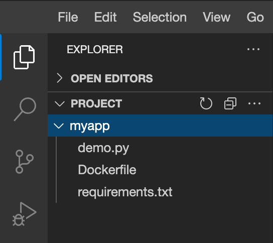
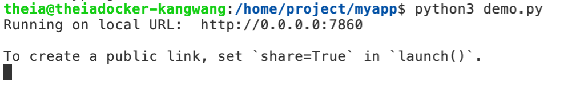
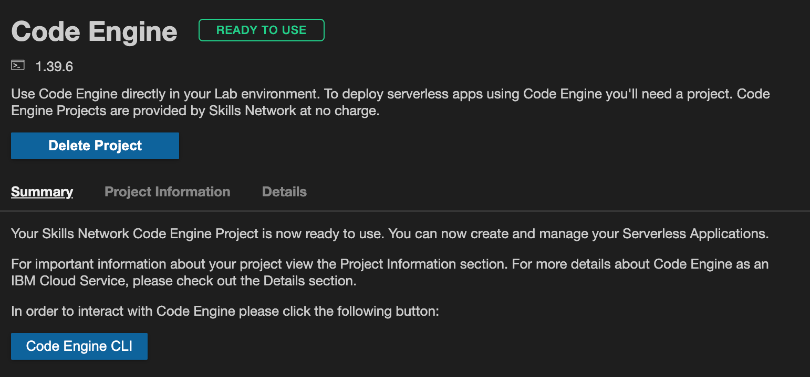
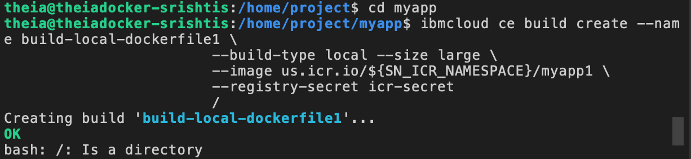
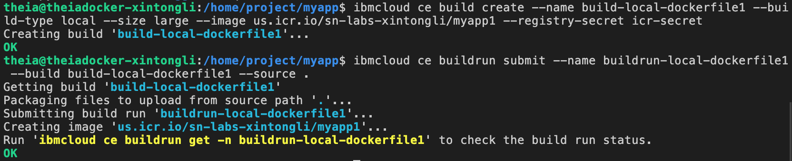
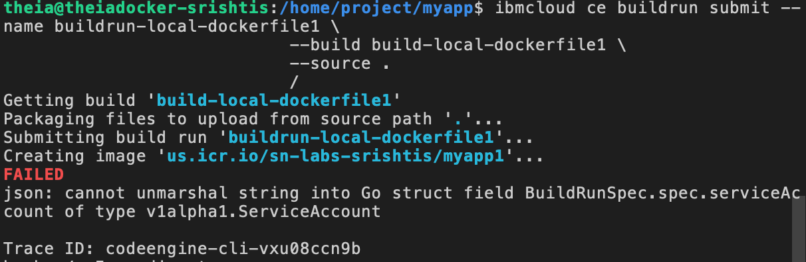
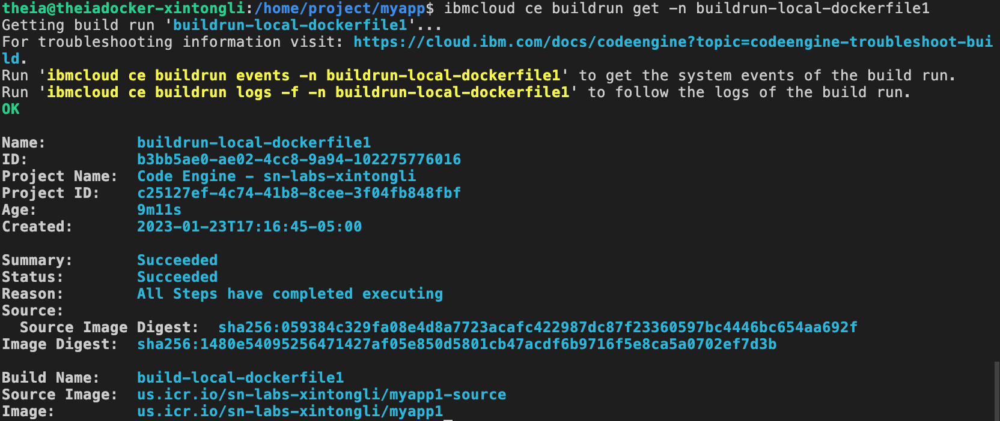

İşte metnin Türkçeye çevrilmiş ve yapılandırılmış hali, başlıklara göre ayrılmış şekilde:

---

### ☁️ IBM Code Engine ile Uygulamanızı Yayınlayın

**cognitiveclass.ai logosu**

---

### 🎯 Giriş

Artık Gradio ile bir kullanıcı arayüzü oluşturmayı öğrendiğinize göre, şimdi uygulamanızı **IBM Cloud üzerinde çalıştırmayı** ve **herkese açık bir URL ile erişilebilir hale getirmeyi** öğreneceksiniz. Bu işlem için IBM Code Engine kullanılacaktır.

---

### 🎓 Öğrenme Hedefleri

Bu projenin sonunda şunları yapabileceksiniz:

* Bir konteyner imajı (container image) oluşturmak
* Uygulamanızı konteyner içinde çalıştırmak için gereken dosyaları hazırlamak
* IBM Code Engine projesi oluşturmak
* Code Engine ile konteyner imajı inşa etmek
* Uygulamanızı konteynerleştirilmiş olarak IBM Cloud üzerinde dağıtmak

---

### 📦 Konteyner İmajları ve Konteynerler

**IBM Code Engine**, uygulamalarınızı IBM Cloud’da konteynerler aracılığıyla çalıştırmanıza olanak tanır.

* **Konteyner**, uygulamanın sistemden izole bir şekilde bağımsız olarak çalıştığı ortamdır.
* Konteynerler işletim sistemi, VM, fiziksel sunucu veya geliştirici makinesinde çalışabilir.
* Bu sayede uygulama her yerde çalışabilir ve sistemin geri kalanından etkilenmez.

Konteynerler, **konteyner imajları** üzerinden oluşturulur.
**Konteyner imajı**, konteynerin çalıştığında içereceği ortamın planıdır.
Bu nedenle, uygulamanızı dağıtmadan önce bir konteyner imajı oluşturmalısınız.

---

### 🛠️ Konteyner İmajı Oluşturma

Bir konteyner imajı oluşturmak için aşağıdaki dosyalara ihtiyacınız var:

* **`demo.py`**: Gradio arayüzünü başlatan Python kodunu içeren dosya
* **`requirements.txt`**: Projede kullanılan tüm kütüphaneleri listeler
* **`Dockerfile`**: Konteynerin nasıl oluşturulacağını tarif eden talimatları içerir

---

### 📁 Dosya ve Klasör Yapısı Oluşturma

1. Terminali açın ve `home/project` dizinindeyken şu komutları çalıştırarak bir klasör oluşturun:

```bash
mkdir myapp
cd myapp
```

2. `myapp` klasörü içindeyken aşağıdaki komutla dosyaları oluşturun:

```bash
touch demo.py Dockerfile requirements.txt
```

---

🔍 Artık dosya gezginini açarsanız, oluşturduğunuz bu üç dosyayı göreceksiniz.

---



Tabii, şimdi üç dosyanın her birine nelerin dahil edilmesi gerektiğine daha yakından bakalım:


### 🧾 Adım 1: requirements.txt Dosyasını Oluşturma

Bir Veri Bilimciyseniz, kütüphaneleri yüklemek için kullanılan `pip3 install <kütüphane-adı>` komutuna aşina olabilirsiniz.

İhtiyacınız olan tüm kütüphaneleri içeren bir `requirements.txt` dosyası sayesinde, tüm kütüphaneleri tek seferde aşağıdaki komutla yükleyebilirsiniz:

```
pip3 install -r requirements.txt
```

Uygulamanızı bir konteynerde çalıştırmayı hedeflediğiniz için, tüm bağımlılıkların da bu konteynerin içinde yer alması gerekir.

Gelin, uygulamanızın ihtiyaç duyabileceği tüm kütüphane ve bağımlılıkları kapsayan bir `requirements.txt` dosyası oluşturalım.

**`/myapp` dizininde `requirements.txt` dosyasını açın** ve aşağıdaki kütüphane adını dosyaya yapıştırın:

```
gradio==5.23.2
```

---

### ✅ requirements.txt Dosyasını Yerel Olarak Test Etme

"Gradio’ya Hızlı Başlangıç" bölümünde gerekli kütüphaneleri zaten yüklemiş olduğunuz için burada yeniden yüklemenize gerek yoktur.

Ancak uygulamanın sorunsuz çalıştığından emin olmak için, Docker ile başlatmadan önce yerel olarak test edilmesi önemlidir.

Aşağıdaki komutla dosyanın doğru çalışıp çalışmadığını test edebilirsiniz:

```
pip3 install -r requirements.txt
```

📌 **Not:** `myapp` dizininde olduğunuzdan ve daha önce oluşturduğunuz `my_env` sanal ortamının aktif olduğundan emin olun.

Bu sayede kütüphaneler sadece sanal ortamınıza yüklenir.

---


### 📝 Adım 2: demo.py Dosyasını Oluşturma

Aşağıdaki kod, basit bir Gradio web uygulaması oluşturmanıza yardımcı olur.

Gradio hakkında daha fazla bilgi almak isterseniz, resmi belgelerine başvurabilirsiniz.

**`/myapp` dizininde `demo.py` dosyasını açın** ve aşağıdaki kodu yapıştırarak boş dosyayı doldurun:

```python
import gradio as gr

def greet(name, intensity):
    return "Hello, " + name + "!" * int(intensity)

demo = gr.Interface(
    fn=greet,
    inputs=["text", "slider"],
    outputs=["text"],
)

demo.launch(server_name="0.0.0.0", server_port=7860)
```

---

### ✅ Uygulamanızı Test Etme – demo.py’yi Yerel Olarak Çalıştırma

1. Terminali açın ve `cd myapp` komutu ile `myapp` dizinine gidin.
2. Eğer bir önceki adımda `pip3 install -r requirements.txt` komutunu başarıyla çalıştırdıysanız, hazırsınız.

   Henüz çalıştırmadıysanız, şimdi bu komutu çalıştırarak gerekli kütüphaneleri yükleyin.
3. Aşağıdaki komutla uygulamanızı başlatın:

```bash
python3 demo.py
```

---

Kod doğru çalışırsa terminalde şu sonucu görmelisiniz:

Uygulamanız yerel IP (`http://0.0.0.0:7860` veya `http://127.0.0.1:7860`) üzerinden erişilebilir hale gelecektir.

Tarayıcıda bu adresi açarak Gradio arayüzünüzü test edebilirsiniz.

Adınızı girin, kaydırıcıyı oynatın ve "Hello, [adınız]!" çıktısını görün.





### 📊 Sonuç

Sonuç, uygulamanızın başarıyla indirildiğini ve **[http://0.0.0.0:7860/](http://0.0.0.0:7860/)** adresinde çalıştığını gösterir.

Aşağıdaki butona tıklayarak uygulamanızın **CloudIDE üzerinde barındırılan web arayüzüne** erişebilirsiniz.

📌 Uygulamayı kapatmak için terminalde **Ctrl + C** tuşlarına basabilirsiniz.

---

### 🔧 Şimdi Sıra Dockerfile Oluşturmada

Sıradaki adımda, **Dockerfile** dosyasını oluşturacağız.

Bu dosya, **konteyner çalışma zamanı** (runtime) için sizin dosyalarınızla **nasıl bir konteyner imajı oluşturulacağını** tanımlar.


### 🛠️ Adım 3: Dockerfile Oluşturma

 **Dockerfile** , bir konteyner imajının nasıl oluşturulacağını tarif eden şablondur (talimat dosyasıdır).

**`/myapp` dizininde Dockerfile dosyasını açın** ve aşağıdaki komutları dosyaya yapıştırın:

```dockerfile
FROM python:3.10
WORKDIR /app
COPY requirements.txt requirements.txt
RUN pip3 install --no-cache-dir -r requirements.txt
COPY . .
CMD ["python", "demo.py"]
```

---

### ❓ Dockerfile Ne Yapar?

#### `FROM python:3.10`

Docker imajları başka imajlardan türetilebilir.

Bu nedenle sıfırdan bir temel imaj oluşturmak yerine, Python uygulamaları için gerekli tüm araç ve paketleri içeren **resmi Python 3.10 imajını** kullanıyoruz.

---

#### `WORKDIR /app`

Tüm komutların çalıştırılacağı **çalışma dizinini** `/app` olarak ayarlıyoruz.

Bu, Docker’a sonraki tüm işlemleri bu dizin üzerinde gerçekleştirmesini söyler. Böylece tüm yolları `/app` üzerinden göreli (relative) olarak yazabiliriz.

---

#### `COPY requirements.txt requirements.txt`

`requirements.txt` dosyasını imajın içine kopyalıyoruz.

İlk parametre: yerel dosya yolu

İkinci parametre: konteyner içindeki hedef yol (bu örnekte aynı isimde)

---

#### `RUN pip3 install --no-cache-dir -r requirements.txt`

Artık `requirements.txt` dosyası imajın içinde olduğuna göre, `pip3` ile gerekli kütüphaneleri kurabiliriz.

`--no-cache-dir` parametresi, gereksiz dosyaların kaydedilmesini engeller (imaj boyutunu azaltır).

---

#### `COPY . .`

Bu komut, bulunduğunuz dizindeki tüm dosyaları (`.`) konteynerin dosya sistemine kopyalar.

Yani `demo.py`, görseller, vs. gibi kaynak dosyalar konteynere aktarılır.

---

#### `CMD ["python", "demo.py"]`

Son olarak, konteyner çalıştırıldığında hangi komutun yürütüleceğini belirtiriz.

Burada, Python uygulaması başlatılır: `python demo.py`

---

Artık üç temel dosyanız (`demo.py`, `requirements.txt`, `Dockerfile`) hazır olduğuna göre, bir sonraki adım olan **Code Engine ile konteyner imajı oluşturma** aşamasına geçebiliriz. Başlayalım mı?


### 🚀 IBM Code Engine Projesi

 **IBM Code Engine** , konteynerleştirilmiş iş yüklerinizi çalıştırmak için tamamen yönetilen, sunucusuz (serverless) bir platformdur.

Bu platform sayesinde şu tür uygulamalar kolayca çalıştırılabilir:

* Web uygulamaları
* Mikro servisler
* Olay temelli fonksiyonlar
* Toplu işler (batch jobs)

Ayrıca, Code Engine kaynak kodunuzdan otomatik olarak konteyner imajı da oluşturabilir.

Tüm bu iş yükleri, aynı Kubernetes altyapısı üzerinde barındırıldığından sorunsuz bir şekilde birlikte çalışabilir.

> 💡  **Code Engine deneyimi** , altyapı yönetimine değil sadece koda odaklanabilmeniz için tasarlanmıştır.

---

### 📁 IBM Code Engine (CE) Projesi Oluşturma

**Serverless uygulamaları** Code Engine üzerinde dağıtabilmek için bir **proje** gerekir.

* Proje, Code Engine varlıklarını (uygulamalar, işler, imaj yapımları) gruplayan yapıdır.
* Kaynak yönetimi ve erişim denetimi bu proje kapsamında sağlanır.

---

### ✅ Bu Projede Size Özel CE Projesi Hazırlandı

Bu rehberli projede, sizin için önceden hazırlanmış bir **Code Engine projesi** bulunuyor.

Bu nedenle proje oluşturma ve yapılandırma adımlarını manuel olarak yapmanıza gerek yok.

Şimdi, aşağıdaki butona tıklayarak projenizi başlatma zamanı!

⏳  **3 ila 5 dakika bekledikten sonra** , Code Engine projenizin kullanıma hazır olduğunu belirten bir bildirim görmelisiniz.




### 🚀 Code Engine (CE) CLI’yi Başlatma

Projeniz hazır olduğunda, terminalde projenizi başlatmak için **Code Engine CLI** butonuna tıklayın.

Yeni açılan terminalde aşağıdaki bilgiler görünmelidir:

* **Proje adı**
* **Proje kimliği (ID)**
* **Projenizin dağıtıldığı bölge (region)**

Bu bilgiler, aktif Code Engine projenizi yönetmeniz için gereklidir.

Artık komut satırından uygulamanızın konteyner imajını oluşturma ve dağıtma adımlarına geçmeye hazırsınız!


### 💡 IBM Cloud Kaynaklarını Görüntüleme

Şu anda oluşturduğunuz proje ile birlikte, IBM Cloud üzerinde size ayrılmış bazı kaynaklara sahipsiniz.

Bunlar arasında şunlar yer alır:

* CPU çalıştırma süresi
* Bellek (RAM)
* Depolama alanı vb.

---

### 📊 Proje Bilgilerine Erişim

**Cloud IDE** üzerinden proje bilgilerinizi görmek için:

1. Sol menüden **“Code Engine”** sayfasına tıklayın
2. Ardından **“Project Summary” (Proje Özeti)** sekmesini seçin

Burada projenizin genel durumu, kaynak kullanımı ve yapılandırma bilgilerini görebilirsiniz.

---

### 🧮 Kaynak Kotalarını ve Kullanımı Görmek

Projenizin ayrılmış kaynaklarını ve mevcut kullanım durumunu terminalden de görebilirsiniz:

```bash
ibmcloud ce project get --name "PROJE_ADI"
```

📌 **Not:** Proje adınız boşluk içeriyorsa, çift tırnak `" "` içinde yazmalısınız.

---

### 🛠️ Sıradaki Adım

Şimdi, bu kaynakları kullanarak **uygulamanızı dağıtmaya** (deploy etmeye) geçeceğiz.


### 🏗️ Code Engine ile Konteyner İmajı Oluşturma

Code Engine ile bir **build (inşa işlemi)** yaparken, kaynak kodlarınızın ve `Dockerfile` dosyanızın bulunduğu yeri belirtmeniz gerekir.

Bu kaynak şunlardan biri olabilir:

* Genel ya da özel bir Git deposu
* Yerel kaynak (çalışma dizinindeki dosyalar)

---

### 📁 Yerel Kaynağa Geçiş

Tüm dosyaları `myapp` dizininde oluşturduğunuza göre, konteyner imajını **yerel kaynaktan** oluşturacağız.

İlk adım olarak, terminalde `myapp` dizinine geçin:

```bash
cd myapp
```

---

### 🗂️ Konteyner Kayıt Sistemleri (Container Registries)

 **Container Registry** , konteyner imajlarını saklayan bir hizmettir.

Örnekler:

* IBM Cloud Container Registry
* Docker Hub

IBM Code Engine, aşağıdaki işlemler için bu kayıt sistemlerine erişim ister:

* Yerel dosyaları inşa sırasında yüklemek ve almak
* Oluşturulan yeni imajı kayıt sistemine kaydetmek
* Bir uygulamayı veya işi çalıştırmak için imajı çekmek (pull)

---

### 🔐 IBM Cloud Container Registry Erişiminiz

Code Engine projenizi oluşturduğunuzda, IBM sizin için:

* Özel bir **ICR (IBM Container Registry) ad alanı**
* Bu alana erişim sağlayan bir **registry secret** oluşturdu

💡 **Not:**

ICR’yi kullanarak imaj kaydetmek için CE komutlarında mutlaka `--registry-secret icr-secret` parametresini belirtmeniz gerekir.

---

### ⚙️ Build Yapılandırması Oluşturma

Kodlarınız yerel klasörde olduğu için `build-type` değerini `local` olarak belirtmelisiniz.

Aşağıdaki komutu terminale girerek build işlemini başlatabilirsiniz:

```bash
ibmcloud ce build create --name build-local-dockerfile1 \
                         --build-type local --size large \
                         --image us.icr.io/${SN_ICR_NAMESPACE}/myapp1 \
                         --registry-secret icr-secret \
                         /
```

📝 Açıklamalar:

* `--name`: Oluşturulan build’e verilen ad
* `--build-type local`: Yerel dosyalarla build yapılacağını belirtir
* `--size large`: Gerekli kaynak boyutu
* `--image`: Oluşturulan imajın nereye yükleneceği (ICR URL'si)
* `--registry-secret`: ICR erişimi için gerekli gizli anahtar

---

✅ Komutu başarıyla çalıştırdığınızda, terminalde build’in başarılı şekilde oluşturulduğuna dair bir mesaj görmelisiniz.

Hazırsanız, bu build sonucunu kullanarak uygulamanızı dağıtmaya geçebiliriz. Devam edelim mi?





### 🏗️ `build create` Komutunun Özeti

`build create` komutu ile:

* **`build-local-dockerfile1`** adında bir build yapılandırması oluşturdunuz.
* `--build-type local` ile kaynak kodun yerel dizinden alınacağını belirttiniz.
* `--size large` seçeneği ile yüksek kaynak gereksinimi olan modeller için yeterli CPU, RAM ve disk alanı ayrılmasını sağladınız.
* **Konteyner imajı** , IBM Cloud Container Registry'deki şu adrese kaydedilecek:

  `us.icr.io/${SN_ICR_NAMESPACE}/myapp1`

  `${SN_ICR_NAMESPACE}` kısmı, Code Engine tarafından size verilen ICR ad alanı ile değiştirilebilir.

  Bunu **Code Engine sayfası → Proje Bilgileri** bölümünde görebilirsiniz.

* `--registry-secret icr-secret` ile kayıt sistemine erişim için gerekli kimlik doğrulama bilgileri sağlanır.

---

### 🚀 Build İşlemini Başlatma ve Çalıştırma

Oluşturduğunuz `build-local-dockerfile1` yapılandırmasına dayanarak bir **buildrun (inşa çalıştırma)** başlatmak için şu komutu kullanın:

```bash
ibmcloud ce buildrun submit --name buildrun-local-dockerfile1 \
                            --build build-local-dockerfile1 \
                            --source .
                            /
```

📌 Açıklamalar:

* `--name`: Bu buildrun işlemi için tanımlanan ad
* `--build`: Kullanılacak build yapılandırmasının adı
* `--source .`: Kaynağın bulunduğu dizin (`.` = geçerli dizin, yani `/myapp`)

---

### ⏱️ Süreç Hakkında

* Buildrun işlemi sırasında kaynak kodunuz **arşivlenerek** IBM Cloud Container Registry’ye yüklenir.
* Bu işlem yaklaşık **3–5 dakika** sürer.
* Yerel kaynakla yapılan build’lerde yalnızca **IBM Cloud Container Registry** kullanılabilir.
* İmaj, build imajı ile aynı ad alanında (namespace) oluşturulur.

---

✅ Komut çalıştıktan sonra terminalde başarılı bir gönderim mesajı görmelisiniz.

Tüm buildrun adımlarının tamamlanması birkaç dakika sürebilir.

Hazırsanız, sıradaki adımda bu imajı kullanarak uygulamanızı dağıtacağız. Devam edelim mi?





### ⚠️ Not:

Yukarıdaki komutu çalıştırdıktan sonra aşağıdaki gibi bir hata mesajıyla karşılaşırsanız, endişelenmeyin.

Bu durumda **bir sonraki adımlara geçmeye devam edebilirsiniz** ve hata mesajını göz ardı edebilirsiniz.

🔄 Bazı build işlemlerinde, sistem arka planda işlemi tamamlamaya devam eder ve dağıtım sürecini etkilemez.

Yani hata mesajı görünse bile imajınız başarıyla oluşturulmuş olabilir.

---

Hazırsanız, oluşturduğunuz bu konteyner imajını kullanarak **uygulamanızı Code Engine üzerinde dağıtmaya (deploy etmeye)** geçebiliriz. Devam edelim mi?




### 🔍 Buildrun İlerlemesini İzleme

**Buildrun işleminin ilerlemesini takip etmek** için aşağıdaki komutu kullanabilirsiniz:

```bash
ibmcloud ce buildrun get -n buildrun-local-dockerfile1
```

---

### ✅ Başarı Durumu

Komut sonucunda durum **`Succeeded`** olarak görünüyorsa (aşağıdaki ekran görüntüsündeki gibi), bu şu anlama gelir:

* Konteyner imajınız başarıyla oluşturulmuştur.
* İmaj, sizin ad alanınız (namespace) altında IBM Container Registry'ye yüklenmiştir.

---

Artık bu imajı kullanarak uygulamanızı Code Engine üzerinde dağıtabilirsiniz.

Hazırsanız “Uygulama Dağıtma” adımına geçelim!


### 🚀 Artık Hazır: Uygulamanızı Dağıtma Zamanı

Konteyner imajınız başarıyla oluşturuldu ve  **IBM Cloud Container Registry** 'ye yüklendi.

Şimdi bu imajı kullanarak bir **konteyner tabanlı uygulama** oluşturup Code Engine üzerinde dağıtma (deploy etme) zamanı!

---

### 🧭 Ne Yapacağız?

1. IBM Cloud Container Registry'den imajı çekeceğiz (pull).
2. Bu imajı kullanarak yeni bir uygulama tanımlayacağız.
3. Uygulamayı Code Engine altyapısında çalıştıracağız.

---

Hazırsanız, bir sonraki adımda size komutları vereceğim:

**Uygulama oluşturma ve dağıtma (`app create`) komutu** ile devam edelim mi?





### 🚀 Code Engine ile Konteynerleştirilmiş Uygulama Dağıtımı

Bir önceki adımda, uygulamanızın imajını oluşturup  **IBM Cloud Container Registry** ’deki kendi ad alanınıza yüklediniz.

Şimdi, bu imajı kullanarak uygulamanızı  **Code Engine üzerinde dağıtacağız** .

---

### 📦 Uygulama Oluşturma

IBM Code Engine, Container Registry’de depolanan bir imajı kullanarak uygulama dağıtmanıza olanak tanır.

Bunun için `ibmcloud ce application create` komutunu kullanacağız.

📌 Terminalinize aşağıdaki komutu girin:

```bash
ibmcloud ce application create --name demo1 \
                               --image us.icr.io/${SN_ICR_NAMESPACE}/myapp1 \
                               --registry-secret icr-secret --es 2G \
                               --port 7860 --minscale 1
```

---

### 📌 Komuttaki Önemli Parametreler

* `--name demo1` → Uygulamanın adı **demo1** olacak
* `--image .../myapp1` → Kullanılacak konteyner imajı
* `--registry-secret icr-secret` → Container Registry erişimi için gerekli gizli anahtar
* `--es 2G` → Konteynerin kullanacağı geçici (ephemeral) depolama alanı
* `--port 7860` → Uygulamanın dış ağdan erişilebilir olması için yönlendirme yapılacak port
* `--minscale 1` → Uygulamanın **her zaman çalışır durumda kalmasını** sağlar, boşta bile dursa durmaz

> 💡 Özellikle `--minscale 1` çok önemlidir: Aksi takdirde her erişimde uygulamanın yeniden başlatılmasını beklemek zorunda kalırsınız.

---

### 🌍 Uygulamaya Erişim

Uygulamanız artık dağıtıldı!

Tarayıcıdan erişmek için aşağıdaki komutu çalıştırarak URL’yi öğrenin:

```bash
ibmcloud ce app get --name demo1 --output url
```

Çıktıdaki URL’ye tıklayarak uygulamanızı tarayıcınızda canlı olarak görebilirsiniz! 🎉

---

### 🌐 Özel Alan Adı (Opsiyonel)

İsterseniz uygulamanız için özel bir alan adı (custom domain) da tanımlayabilirsiniz.

Cloudflare ile alan adı yapılandırması hakkında bilgi almak için:

**“Configuring a Custom Domain for Your Code Engine Application”** dokümanına göz atabilirsiniz.

---


### 🎉 Sonuç

**Bu önemli başarıya ulaştığınız için tebrikler!**

---

### 🧭 Genel Değerlendirme

Bu proje boyunca, **Gradio** ve **IBM Code Engine** kullanarak bir uygulamayı **IBM Cloud** üzerinde nasıl dağıtacağınızı adım adım öğrendiniz.

Yolculuğunuz şu adımlarla şekillendi:

---

### 📦 Konteynerler ve İmajlar

İlk olarak, uygulamaları farklı ortamlarda bağımsız çalıştırmak için gerekli olan **konteyner imajları** ve **konteynerler** kavramını öğrendiniz.

---

### 🛠️ Temel Dosyaların Oluşturulması

Ardından uygulamanızın kalbini oluşturan dosyaları hazırladınız:

* `demo.py` → Uygulamanın Gradio arayüzünü içeren Python kodu
* `requirements.txt` → Gerekli kütüphane bağımlılıkları
* `Dockerfile` → Konteynerin nasıl oluşturulacağını tanımlayan yapılandırma

---

### 🧪 Yerel Test

Bu bileşenleri yerel ortamda test ederek, dağıtımdan önce uygulamanızın sorunsuz çalıştığından emin oldunuz.

---

### ☁️ IBM Code Engine ile Dağıtım

Sonrasında IBM Code Engine dünyasına adım attınız:

* Konteyner imajını oluşturup Container Registry’ye yüklediniz
* Bu imajı kullanarak bir uygulama oluşturup IBM Cloud üzerinde dağıttınız
* Uygulamanıza herkese açık bir URL üzerinden erişim sağladınız

---

### 🔗 Araçların Entegrasyonu

Bu süreçte,  **Gradio** , **Docker** ve **IBM Code Engine** gibi güçlü araçları nasıl entegre edeceğinizi öğrendiniz.

Uygulamanız, yerel geliştirmeden bulut dağıtımına kadar tüm adımlarda başarıyla çalıştı.

---

### 🎓 Kazanımlarınız

Bu süreçte edindiğiniz bilgiler:

* Bulut ortamında uygulama dağıtımı
* Konteyner teknolojileri
* Uçtan uca entegrasyon uygulamaları

gibi çok değerli beceriler kazandırdı. Bu, teknoloji odaklı dünyada sizi bir adım öne çıkaracak yetkinliktir.

---

### 🥳 Kutlama Zamanı!

Bu başarıyı kutlayın!

Gelecekteki projelerinizde bu becerileri nasıl kullanacağınızı düşünmeye başlayın.

Ben her zaman buradayım – bir sonraki projenizde de size yardımcı olmaktan memnuniyet duyarım! 🚀
