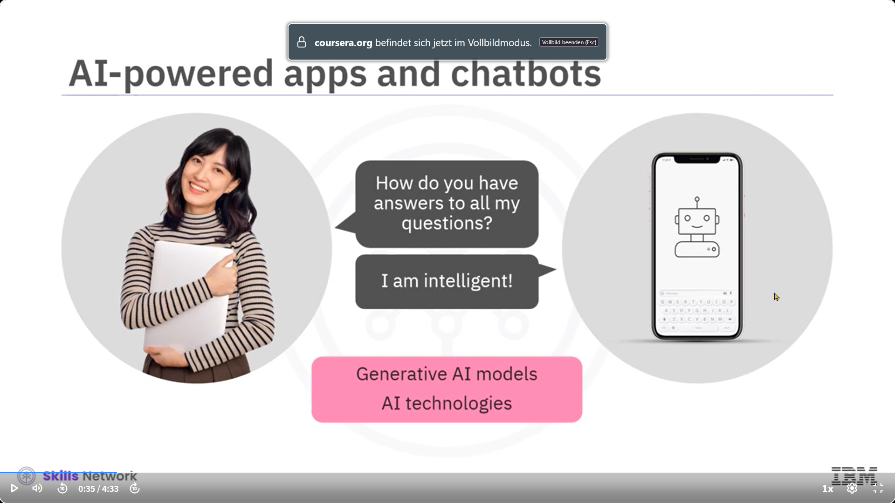
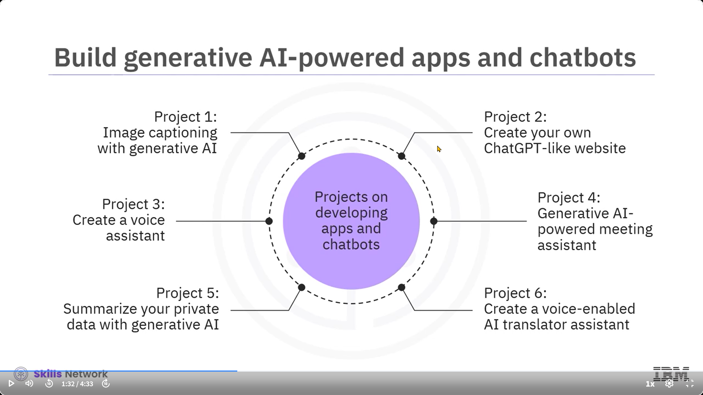
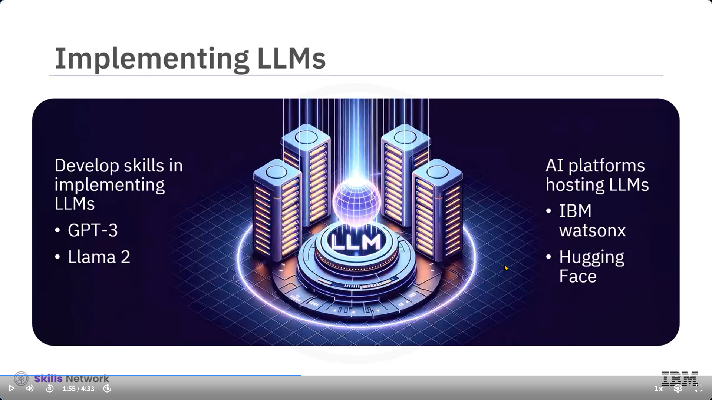
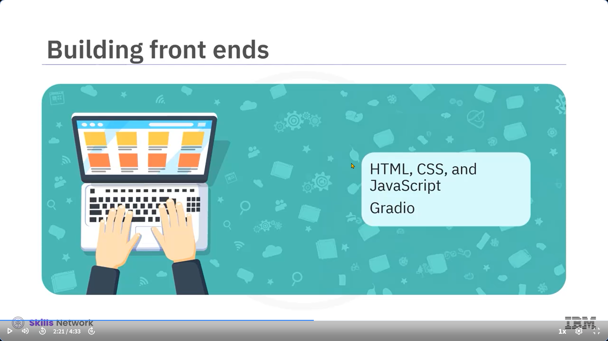
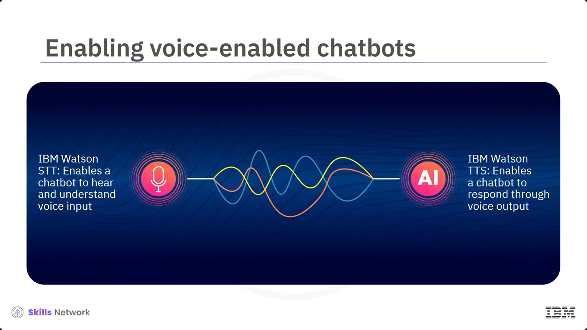
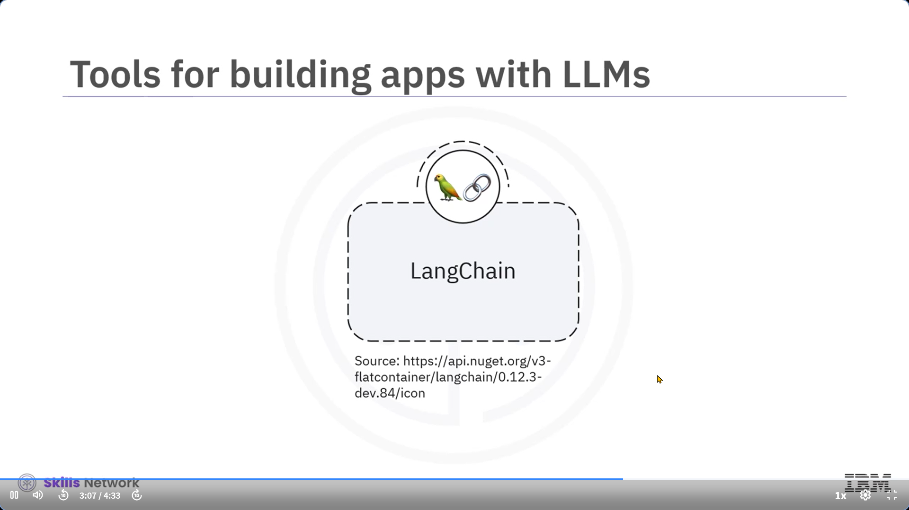
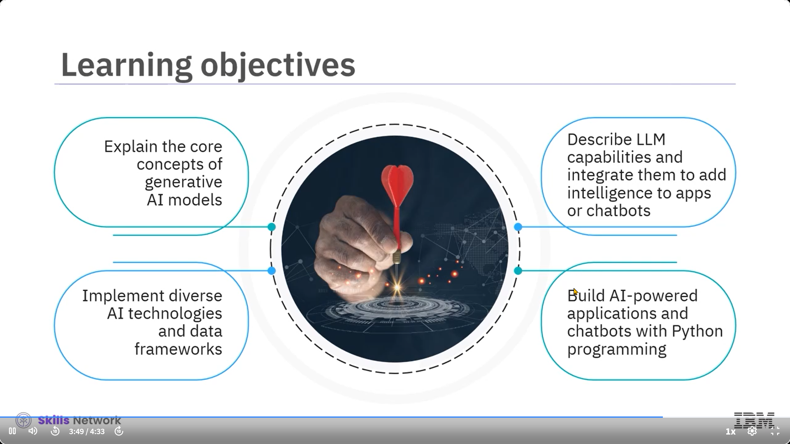
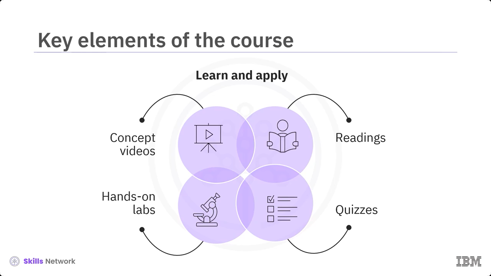

### 🎬 Giriş: Yapay Zeka Destekli Uygulamalara Hoş Geldiniz

Yapay Zeka Destekli Uygulamalar videosuna hoş geldiniz. Haydi, üretici yapay zekâ projeleri üzerinde çalışmaya başlayalım. Hiç sanal bir asistanla sohbet ettiniz mi ya da yapay zekâ destekli uygulamalardan veya sohbet botlarından faydalı öneriler aldınız mı? Sohbet botlarının nasıl konuşabildiğini ya da uygulamaların ihtiyaçlarınızı nasıl önceden bildiğini merak ettiniz mi? Ve dahası, bazıları nasıl doğal bir şekilde sesli konuşabiliyor?

---

### 🤖 Zekânın Arkasındaki Güç: Üretici Yapay Zekâ

Bu zeki ve etkileşimli sohbet botları ve uygulamaların arkasında üretici yapay zekâ modelleri ve diğer yapay zekâ teknolojilerinin birleşimi yer almaktadır. Bu kurs, sizi perde arkasına götürecek ve üretici yapay zekâ destekli uygulamalar ve sohbet botları geliştirme becerileriyle donatacaktır.

---

### 🧪 6 Projeyle Pratik Öğrenim

Bu kursta her biri belirli bir kullanım durumu için bir sohbet botu veya uygulama geliştirmeye odaklanan altı proje üzerinde çalışacaksınız:

* **Proje 1**: Fotoğraflarınıza anlamlı açıklamalar ekleyebileceğiniz bir görüntü açıklama aracı oluşturacaksınız.
* **Proje 2**: Web arayüzüne entegre edilecek bir sohbet botu geliştireceksiniz. ChatGPT gibi, bu bot da bilgiye erişip sorularınıza yanıt bulabilecek.
* **Proje 3**: Sorularınızı dinleyen ve sesli yanıt veren bir ses tabanlı asistan geliştireceksiniz.
* **Proje 4**: Toplantı konuşmalarını metne döküp, ana noktaları özetleyen bir uygulama inşa edeceksiniz.
* **Proje 5**: PDF yükleyip içerisinden bilgi çıkarabileceğiniz bir sohbet botu geliştireceksiniz.
* **Proje 6**: Sesli girişleri yazıya döken ve ardından belirli bir dilde seslendiren bir ses destekli çeviri asistanı oluşturacaksınız.

---

### 🧠 Büyük Dil Modelleri ve RAG Teknolojisi

Bu projeler, sohbet botlarınıza ve uygulamalarınıza zekâ katmak için büyük dil modellerini (LLM) nasıl uygulayacağınızı öğretir. GPT-3 ve Llama 2 gibi popüler modellerle, IBM watsonx ve Hugging Face gibi platformlar üzerinden çalışacaksınız. Ayrıca, büyük dil modellerini eğitim verilerinin ötesindeki bilgilerle güçlendiren "retrieval augmented generation" (RAG) teknolojisini öğreneceksiniz.

---

### 🌐 Uçtan Uca Uygulama Geliştirme: Ön Yüz ve Arka Yüz

Bazı projeler HTML, CSS ve JavaScript kullanarak ön yüz uygulamaları oluşturmayı öğretecek. Diğer projelerde ise Gradio gibi açık kaynaklı Python kütüphaneleriyle etkileşimli ve görsel olarak çekici web arayüzleri geliştirmeyi öğreneceksiniz. Ayrıca, bir web sitesi ya da uygulama geliştirmek için bir arka uç sunucusuna da ihtiyacınız olacak. Bazı projelerde Flask adlı web çatısını kullanarak uygulamanın arka yüzünü inşa etmeyi öğreneceksiniz.

---

### 🗣️ Ses Teknolojileri: IBM Watson Entegrasyonu

Ses destekli sohbet botları ya da uygulamaların yer aldığı projelerde IBM Watson’ın gömülebilir konuşma kütüphanelerinin kullanımı ve entegrasyonu gösterilecektir. Watson'ın konuşmayı metne çeviren (STT) özelliği, sohbet botunun kullanıcıların sesli girişlerini anlamasını sağlar. Metni sese dönüştüren (TTS) özelliği ise botun kullanıcıya sesli yanıt vermesini mümkün kılar.

---

### 🔧 Ek Araçlar: LangChain ve Python ile Geliştirme

Projelerde ayrıca LLM tabanlı uygulamalar geliştirmek için kullanılabilecek ek araçlarla tanışacaksınız. Örneğin, LangChain bağlam farkındalığı olan bileşenlerle daha akıllı uygulamalar geliştirmeyi kolaylaştırır. Tüm projeler Python diliyle geliştirileceği için, temel Python bilgisi gereklidir. HTML, CSS ve JavaScript hakkında temel bilgi faydalı olsa da zorunlu değildir. Projelerde kullanılan çerçeve ve teknolojilere dair temel bilgileri kazandıracak destekleyici videolar ve okumalar da sağlanmaktadır.

---

### 🎯 Kursun Hedefleri ve Uygulamalı Yaklaşımı

Kursun sonunda aşağıdaki hedeflere ulaşabileceksiniz:

* Üretici yapay zekâ modellerinin temel kavramlarını açıklamak,
* Büyük dil modellerinin yeteneklerini tanımlayıp bunları uygulamalara veya sohbet botlarına entegre etmek,
* Yapay zekâ destekli uygulamaların geliştirilmesinde farklı yapay zekâ teknolojilerini ve veri çerçevelerini uygulamak,
* Python programlama ile yapay zekâ destekli uygulamalar ve sohbet botları inşa etmek.

---

### 📚 Öğrenme Stratejisi: Teori ve Pratik Bir Arada

Bu kurs, öğrenme ve uygulama odaklı bir şekilde hazırlanmıştır. Kavramsal videolar ve destekleyici okumalar, projelerde kullanılan modeller, teknolojiler ve araçlarla ilgili sağlam bir temel oluşturmanıza yardımcı olur. Projeler, adım adım yönergelerle uygulamalı laboratuvarlar şeklinde tasarlanmıştır. Ayrıca, temel kavramları ve teknolojileri ne kadar iyi anladığınızı ölçmek için derecelendirilmiş sınavlar da içerir.

Tüm videoları izleyin, okumaları tamamlayın ve uygulamalı projelerde aktif olun ki Python programlama ile üretici yapay zekâ destekli uygulamalar geliştirme becerilerinizi geliştirebilesiniz.

---

### 🚀 Sonuç: Geleceği İnşa Etmeye Hazır Mısınız?

Bu kurs, yapay zekâ destekli etkileşimlerin geleceğini inşa etme yolunda sizin başlangıç noktanızdır.

Haydi başlayalım.

---

