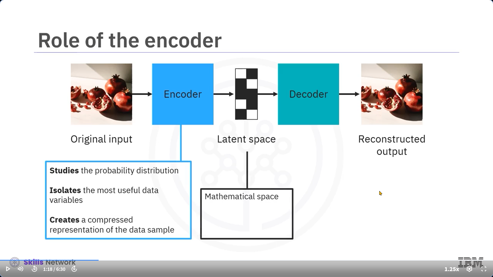

---

### 🎓 Giriş: Üretici Yapay Zekâ Modellerine Hoş Geldiniz

Bu videoyu izledikten sonra, üretici yapay zekânın yapı taşlarını oluşturan temel modelleri tanıyabilecek ve bu modellerin ayırt edici özelliklerini sıralayabileceksiniz.

---

### 🧱 Dört Temel Üretici Yapay Zekâ Modeli

Üretici yapay zekâ dünyasında dört model önemli etki yaratmıştır:

* Variational Autoencoders (VAE)
* Generative Adversarial Networks (GAN)
* Transformer tabanlı modeller
* Diffusion modelleri

Her model farklı bir derin öğrenme mimarisi kullanır ve olasılıksal teknikler uygular. Şimdi bunların nasıl çalıştığına bakalım.

---

### 🌀 Varyasyonel Otokodlayıcılar (VAE)

VAE’ler, üretici yapay zekâ modelleri arasında en popüler olanlardır. İki temel avantajları vardır:

1. Görsel, metin ve ses gibi çeşitli veri türleriyle çalışabilirler.
2. Verilerin boyutunu hızla azaltarak daha yeni ve gelişmiş sürümler oluşturabilirler.

* **Encoder (Kodlayıcı):** Girdi verisinin olasılık dağılımını inceler ve en anlamlı veri değişkenlerini izole ederek *latent space* denilen gizli alanda sıkıştırılmış bir temsil oluşturur.
* **Decoder (Çözücü):** Gizli alandaki veriyi açarak hedef çıktıyı üretir.

Bu modeller, maksimum benzerlik ilkesiyle eğitilir, yani orijinal giriş ile yeniden oluşturulmuş çıktı arasındaki farkı en aza indirirler. Latent alan süreklidir, bu da rastgele örneklemelerle yeni veri üretilebileceği anlamına gelir.

**Kullanım alanları:**

* Görüntü sentezi
* Veri sıkıştırma
* Anomali tespiti

**Sektör örnekleri:**

* Eğlence: Oyun haritası ve avatar üretimi
* Finans: Hisse senedi oynaklık tahmini
* Sağlık: EKG sinyallerinden hastalık tespiti
* 
* 

---

### 🤼 Üretici Çekişmeli Ağlar (GAN)

GAN’ler görsel ve metinsel verilerle çalışabilen başka bir üretici yapay zekâ modelidir. İki adet evrişimli sinir ağı (CNN) bir rekabet ortamında çalışır:

* **Üretici:** Büyük bir veri kümesiyle eğitilerek yeni veri örnekleri üretir.
* **Ayırt edici:** Üretilen verinin sahte mi gerçek mi olduğunu anlamaya çalışır.

Bu etkileşim, üreticinin daha gerçekçi veriler üretmesini sağlar.

**Kullanım alanları:**

* Gerçekçi görsel üretimi
* Stil transferi, görüntüden görüntüye çeviri
* Deepfake oluşturma

**Sektör örnekleri:**

* Finans: Zaman serileri üretimi
* Haritalama: SpaceGAN (coğrafi verilerle çalışır)
* Oyun: StyleGAN2 (karakter üretimi)

**Zorlukları:**

* Eğitim için büyük veri ve yüksek işlem gücü gerekir
* Sahte içerik üretme potansiyeli etik sorunlar doğurabilir

---

### 🧠 Dönüştürücü (Transformer) Tabanlı Modeller

Transformer modelleri, tekrarlayan sinir ağlarının (RNN) "kaybolan gradyan" sorunuyla baş edememesi üzerine geliştirilmiştir.

**Temel Özellik:**

* Dikkat mekanizmaları sayesinde, metindeki en değerli kısımlara odaklanır, gereksizleri eleyerek uzun metin bağımlılıklarını modelleyebilir.

**Yapısı:**

* Encoder-decoder mimarisi
* Girişe verilen kısa bir komutla bağlama uygun anlamlı ve tutarlı metinler üretir

**Uygulama alanları:**

* Doğal dil işleme
* Görsel, müzik ve video sentezi

**Örnekler:**

* GPT-3.5 ve sonraki sürümleri
* BERT
* T5

---

### 🌫️ Difüzyon Modelleri

Difüzyon modelleri, latent alanda gürültü kaynaklı bilgi kaybını engellemek için geliştirilmiştir. İki aşamalı bir süreç izlerler:

1. **İleri Difüzyon:** Eğitim verisine kademeli olarak rastgele gürültü eklenir.
2. **Geri Difüzyon:** Bu gürültü tersine çevrilerek orijinal veri geri kazanılır ve istenen çıktı üretilir.

**Popüler örnekler:**

* DALL·E 2 (OpenAI)
* Stable Diffusion XL (Stability AI)
* Imagen (Google)

**Benzerlik:**

* VAE’ler gibi veriyi önce latent alana yansıtır, sonra geri projeksiyonla çıktıya dönüştürür.

**Fark:**

* Dinamik bir süreçle eğitilir, bu nedenle daha uzun sürede eğitim gerektirir.
* Ancak sınırsız sayıda katmanla eğitilebildikleri için görüntü ve video üretiminde üstün performans sergilerler.

---

### 🧪 Sonuç: Üretici Modellerin Gücü

Bu videoda, üretici yapay zekânın temelini oluşturan dört ana modeli öğrendiniz:

* **VAE:** Boyut indirgeme ve yeni örnek üretimi
* **GAN:** Rekabetçi yapılarla gerçekçi örnek üretimi
* **Transformer:** Uzun metin ilişkilerini modelleme
* **Difüzyon:** Gürültüyü tersine çevirerek yüksek kaliteli üretim

Denetimsiz algoritmalarla yapılan deneyler devam ettikçe, üretici yapay zekâ modelleri şaşırtmaya devam ediyor.

---
