İşte metnin Türkçeye çevrilmiş hali, konu bütünlüğüne göre bölümlere ayrılmış ve her birine emoji içeren başlıklar eklenmiştir:

---

### 🧱 Temel Modeller Nedir?

Foundation Models (Temel Modeller) videosuna hoş geldiniz. Bu videoyu izledikten sonra şu becerilere sahip olacaksınız:

* “Foundation model” terimini tanımlamak
* Bu modellerin temel özelliklerini açıklamak
* Yeteneklerini tanımak
* Örneklerini keşfetmek

Stanford Üniversitesi Foundation Models Araştırma Merkezi, temel modeli şöyle tanımlar:

**Bir modeli büyük miktarda veriyle eğitip, birçok farklı uygulamaya uyarlamak – işte buna temel model denir.**

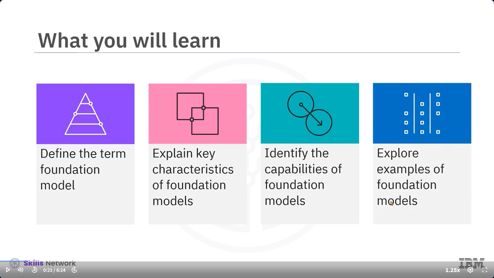

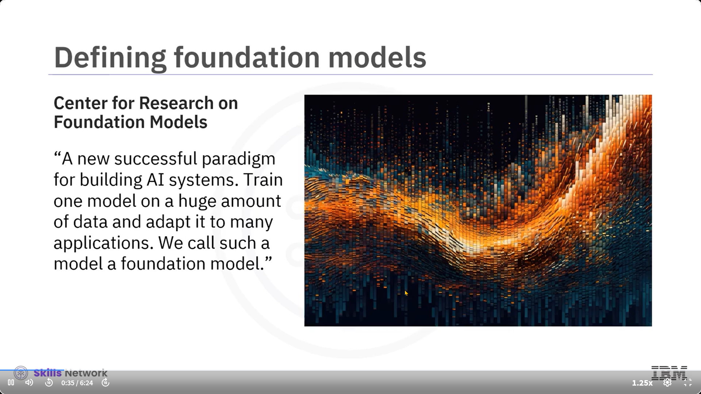

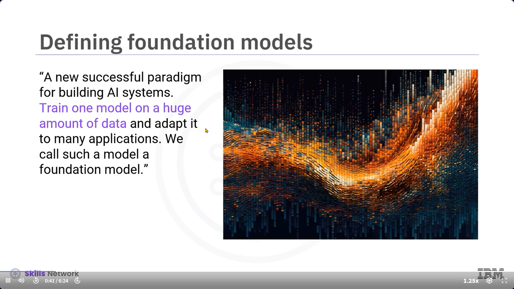

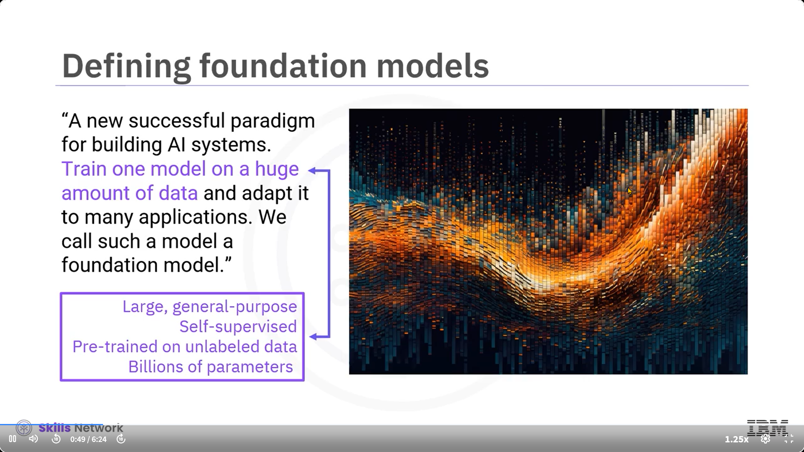

---

### 🔍 Temel Model Nasıl Eğitilir?

Tanımın ilk kısmı şöyle der: "Bir modeli büyük miktarda veriyle eğitin."

* Temel model, **genel amaçlı, öz denetimli ve önceden eğitilmiş** bir modeldir.
* Etiketlenmemiş veri ile eğitilir, milyarlarca parametre öğrenir.
* Bu süreçte, denetimsiz algoritmalara farklı bilgi parçaları arasında ilişki kurma özgürlüğü verilir.

Bu sayede, modeller:

* Metin, görsel, ses, video gibi **çoklu modal girdileri** anlayabilir
* Soru cevaplama, özetleme, makale yazma, denklem çözme, görselden bilgi çıkarma, kod yazma gibi **karmaşık ve yaratıcı görevleri** yerine getirebilir

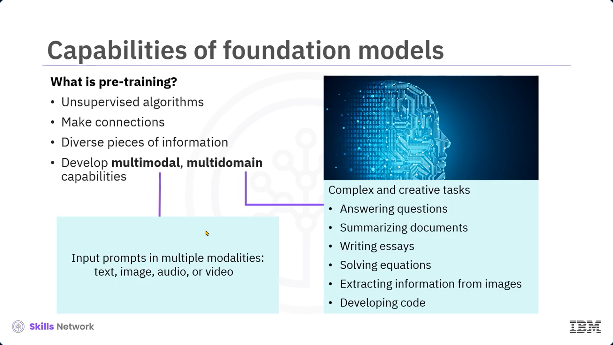

---

### 🌍 Kapsam ve Yetenek: Diğer Modellerden Farkı

Temel modeller, çok çeşitli alanlarda kullanılabilirken, küçük üretici yapay zekâ modelleri genellikle sınırlı verilerle eğitilir ve tek bir göreve odaklanır.

**Örnek:**

* *OpenAI DALL·E* çoklu görsel görevler yapabildiği için bir temel modeldir.
* *AlexNet* sadece görsel sınıflandırma yaptığı için temel model değildir.

Yani:

> Tüm temel modeller üretici yapay zekâ yeteneklerine sahiptir, ancak tüm üretici modeller temel model değildir.

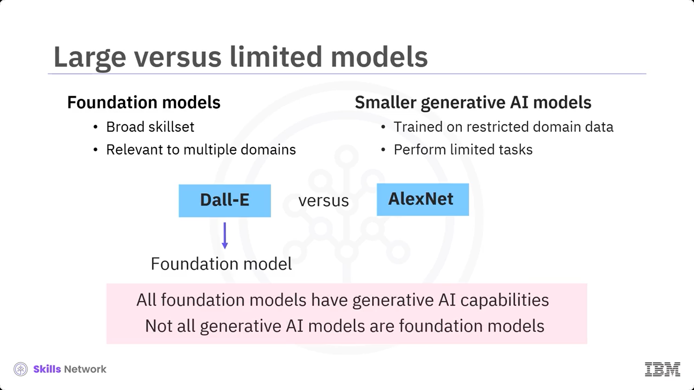

---

### 💬 LLM’ler: Temel Modellerin Dil Versiyonu

Temel modeller doğal dil verileriyle eğitildiğinde **LLM (Large Language Model)** adını alır.

Bu modeller **bağımsız akıl yürütme** yeteneği geliştirir ve kullanıcı sorgularına özgün şekilde yanıt verir.

**Örnekler:**

* *OpenAI GPT-3* : 175+ milyar parametre
* *GPT-4* : 180+ trilyon parametre (tahmini)
* *Google PaLM* : 540 milyar parametre
* *Meta LLaMA* : 65 milyar parametre
* *Google BERT* : 340 milyon parametre
* *Meta Galactica* : 48 milyon bilimsel içerikle eğitildi
* *Falcon 7B* : 1.5 trilyon token
* *Microsoft Orca* : 13 milyar parametre, dizüstü bilgisayarda çalışabilecek kadar hafif

> Bu parametre sayıları modeller geliştikçe değişebilir.

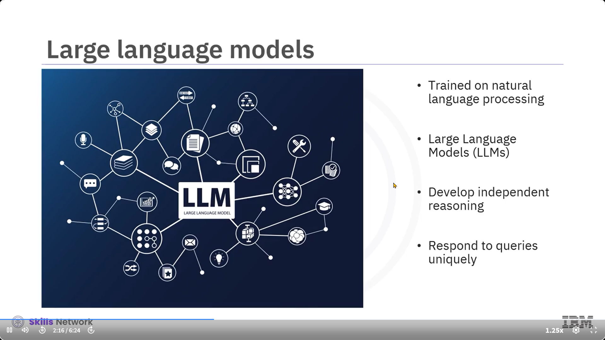

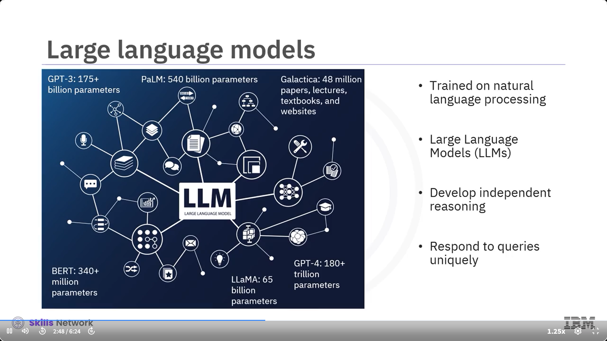

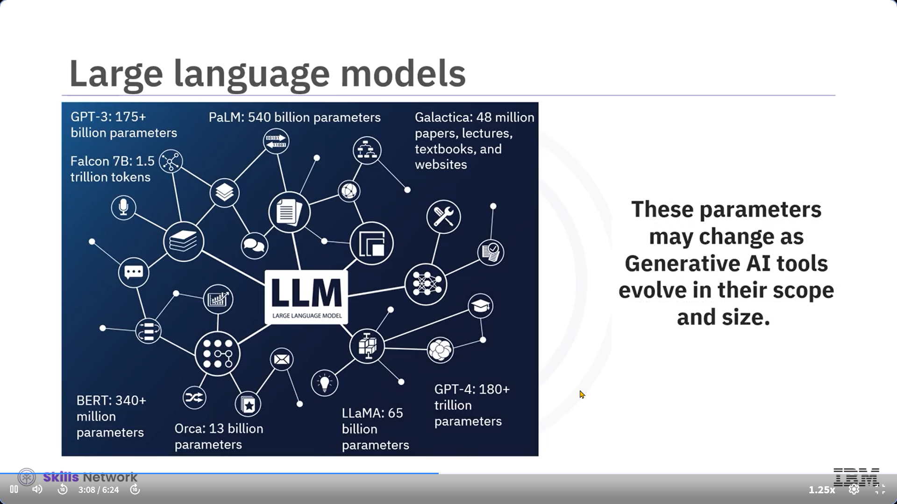

---

### 🔄 Uyum Sağlayabilme Yeteneği

Tanımın ikinci kısmı: "Birçok uygulamaya uyarlanabilir olmalı."

Bu mümkün çünkü:

* Geniş kapsamlı eğitim sayesinde yeni durumlara kolayca uyum sağlarlar.
* Küçük işletmeler bile kendi ihtiyaçlarına özel üretici modeller geliştirebilir.
* Temel model kullanmak, sıfırdan model eğitmeye kıyasla çok daha hızlı ve uygun maliyetlidir.

**Örnek:**

*ChatGPT (GPT-3/GPT-4)* ve  *Google Bard (PaLM)* , gelişmiş temel modellere dayalı sohbet botlarıdır.

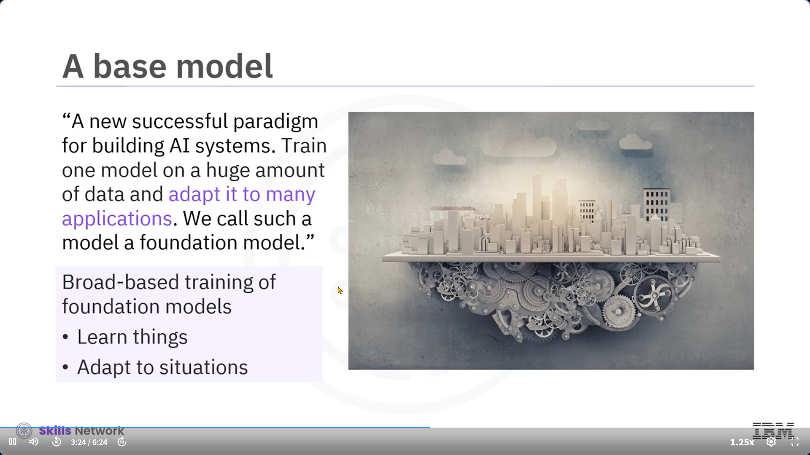

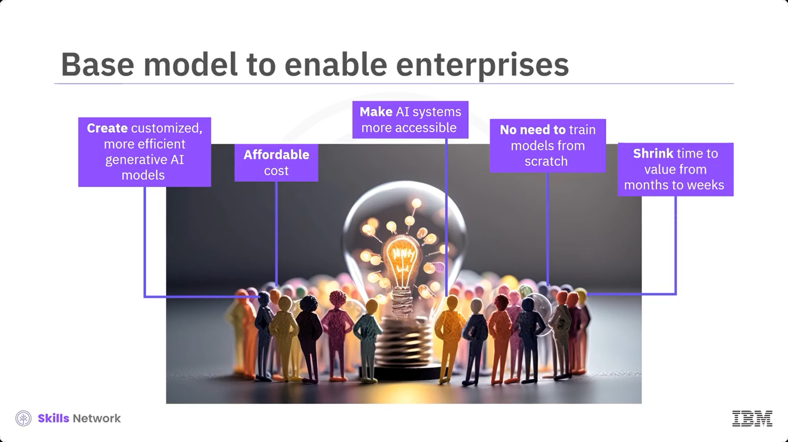

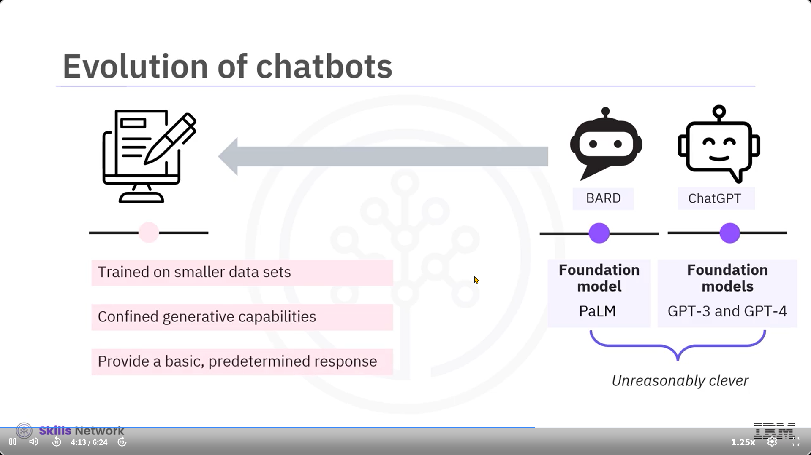

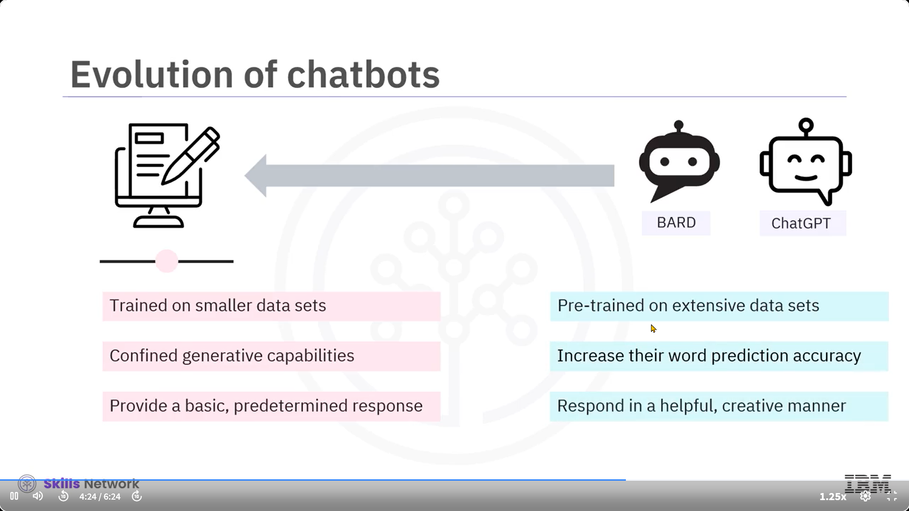

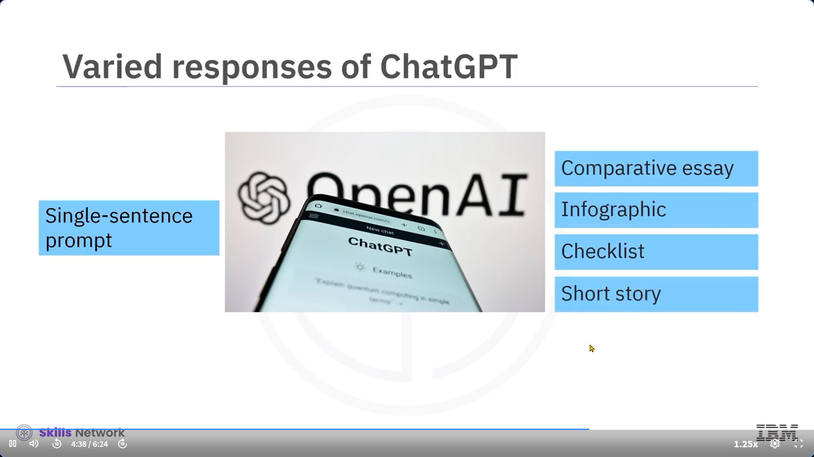

---

### 🗨️ Geleneksel Sohbet Botları vs Temel Modeller

Eskiden sohbet botları:

* Küçük veri kümeleriyle eğitilirdi
* Anahtar kelime eşleşmesine dayalı sabit yanıtlar verirdi

Bugünün sohbet botları:

* Devasa veri kümeleriyle birçok kez önceden eğitilmiştir
* Yüksek doğrulukla kelime tahmini yapar
* Yaratıcı ve yardımcı yanıtlar sunar

> Tek cümlelik bir komutla, ChatGPT sizden deneme yazabilir, infografik hazırlayabilir, kontrol listesi çıkarabilir veya kısa bir hikâye yazabilir.

---

### 🖼️ Görsel Üretim: LLM + Difüzyon = Güçlü Görseller

 *OpenAI GPT-3* ,  *DALL·E* 'nin de temel modelidir.

* Aynı metin komutuyla dört yüksek çözünürlüklü görsel üretir
* Stiller: Gerçekçi, illüstrasyon, tablo vb.

Not:

> Tüm LLM’ler temel modeldir, ancak tüm temel modeller LLM değildir.

Bazı temel modeller, **difüzyon mimarisi** kullanır.

**Örnekler:**

* *DALL·E (yeni versiyon)* : Sesli difüzyon ile görsel üretimi
* *Stable Diffusion* : Gerçekçi, çizgi film ve soyut tarzda görseller
* *Google Imagen* : LLM tabanlı kademeli difüzyon ile metinden görsele

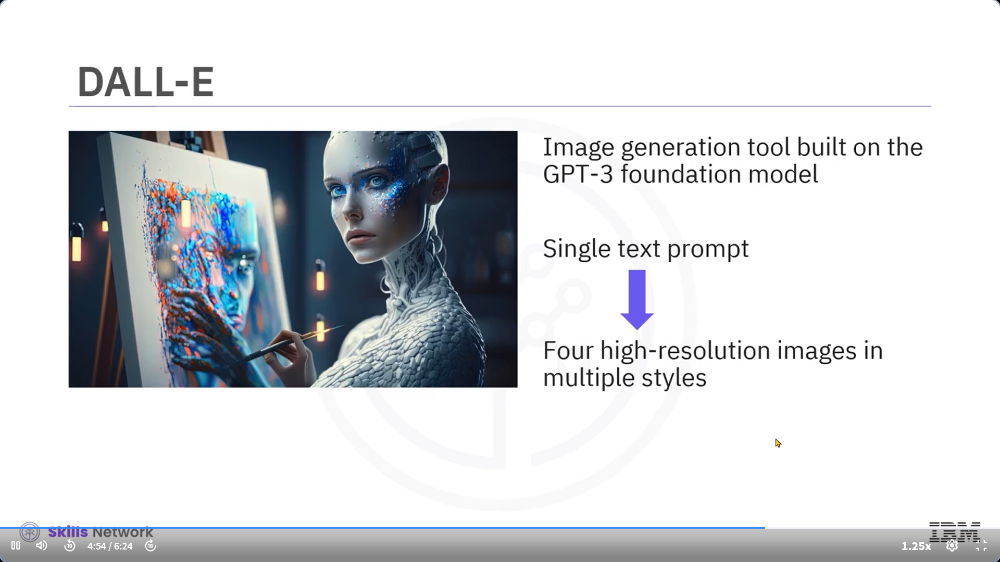

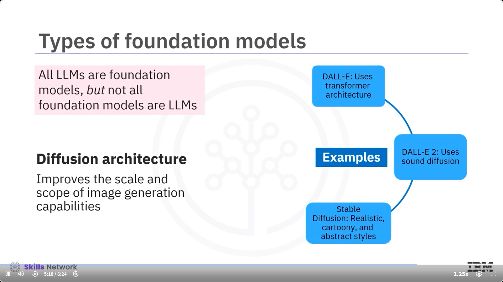

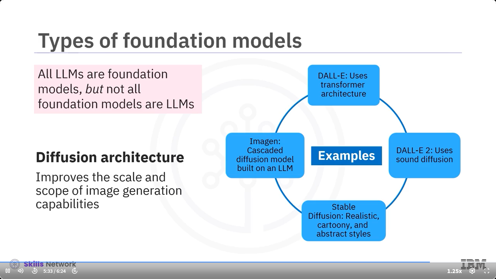

---

### ⚠️ Sınırlamalar ve Dikkat Edilmesi Gerekenler

Temel modellerin bazı kısıtlamaları vardır:

1. **Veri yanlılığı:** Eğitildiği veri yanlıysa, çıktı da yanlı olabilir
2. **Halüsinasyon (uydurma):** Bağlamı yanlış anladığında hatalı bilgi üretir

> Bu yüzden sohbet botlarının verdiği bilgileri doğrulamak önemlidir.
>
> 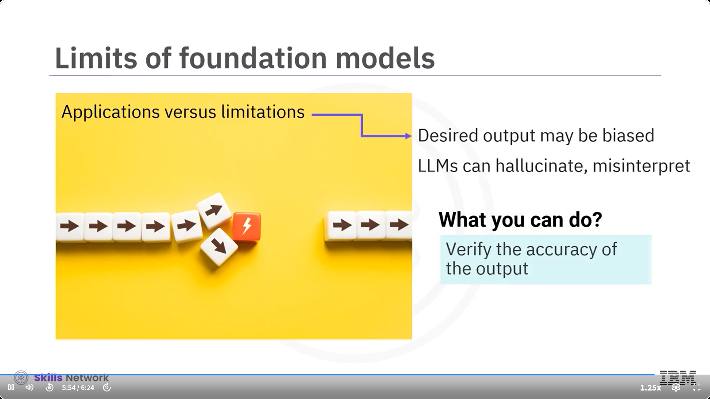

---

### 🧠 Özet: Temel Modellerin Gücü

* Milyarlarca parametreyle önceden eğitilirler
* Bağımsız akıl yürütme geliştirirler
* Çok çeşitli ve karmaşık görevleri yerine getirebilirler
* Çok modlu ve çok alanlı yetenekleriyle üretici yapay zekâ uygulamaları için temel oluştururlar

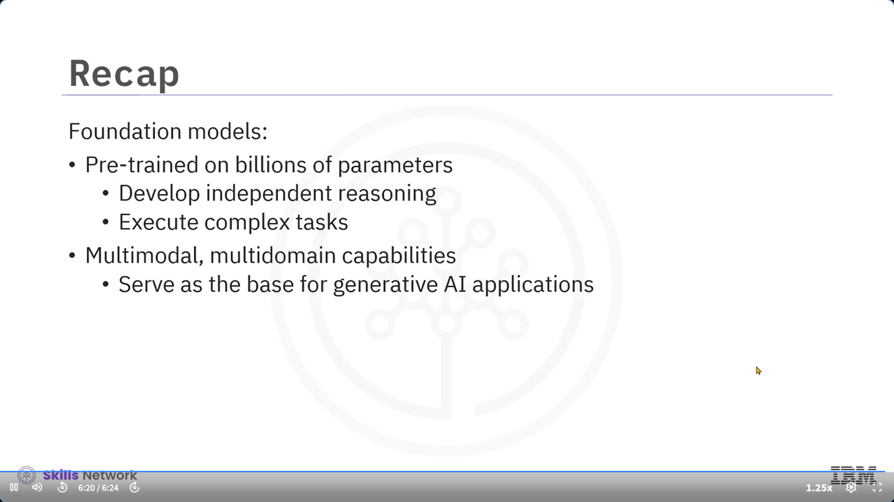

---

İstersen bu modelleri karşılaştıran bir tablo ya da grafik de hazırlayabilirim. Hazır mısın?
