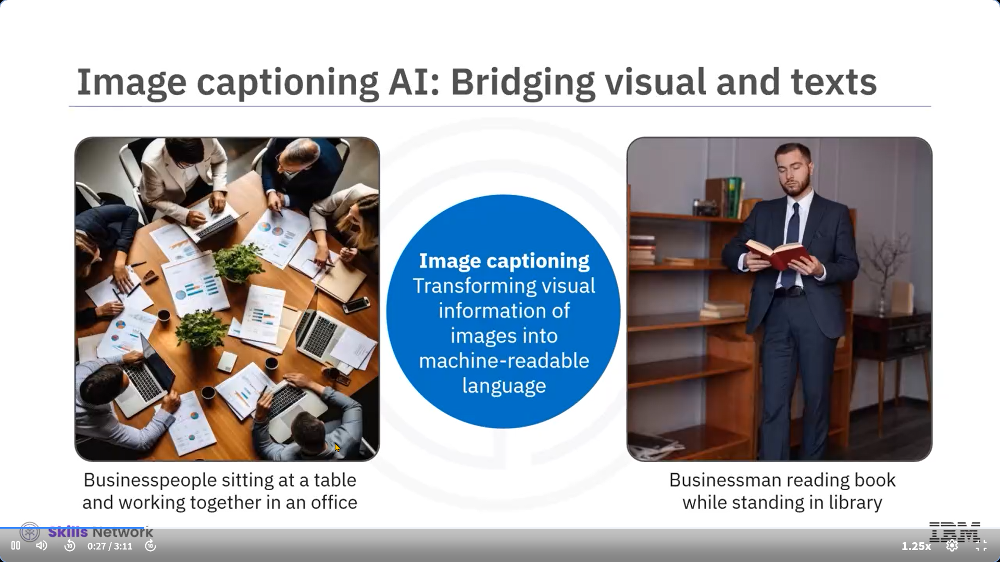
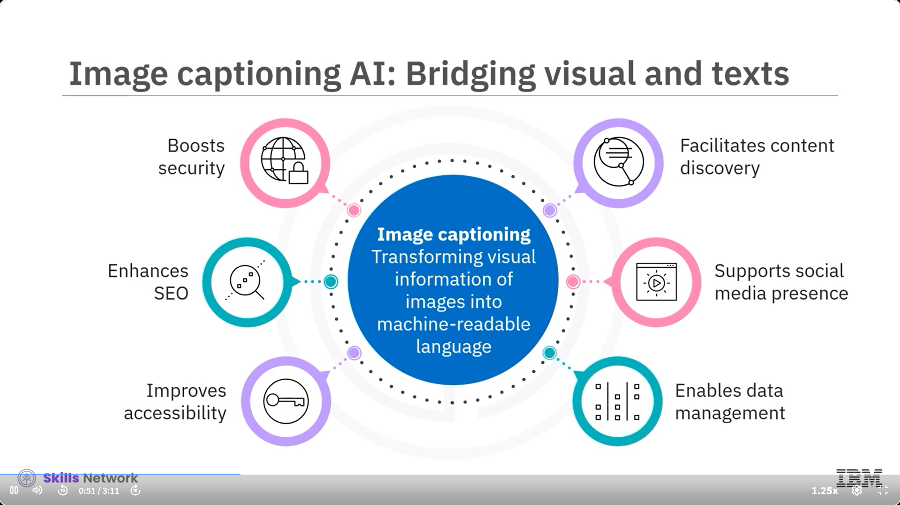
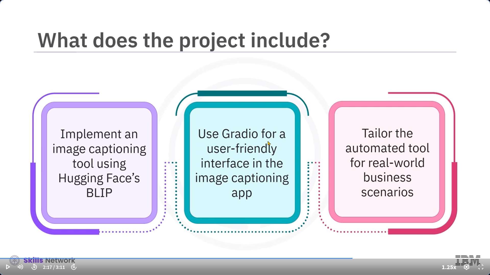
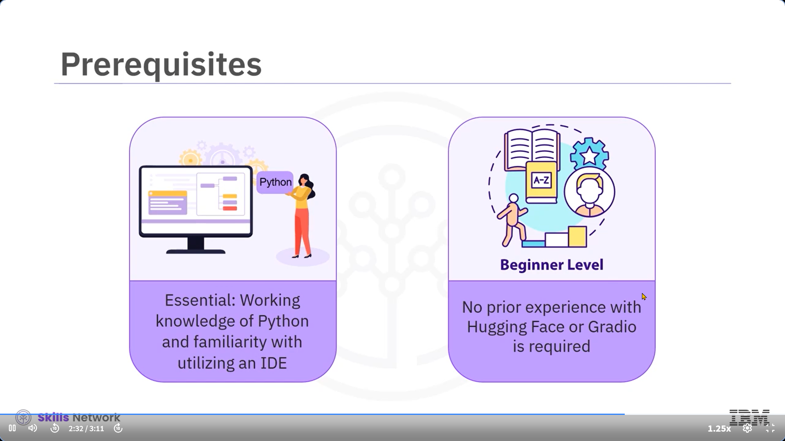
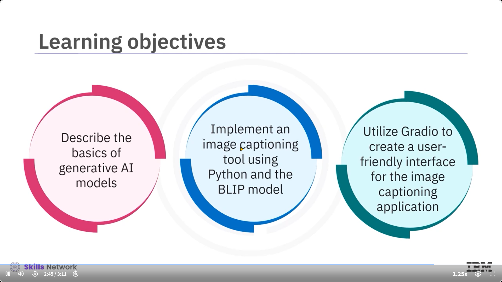
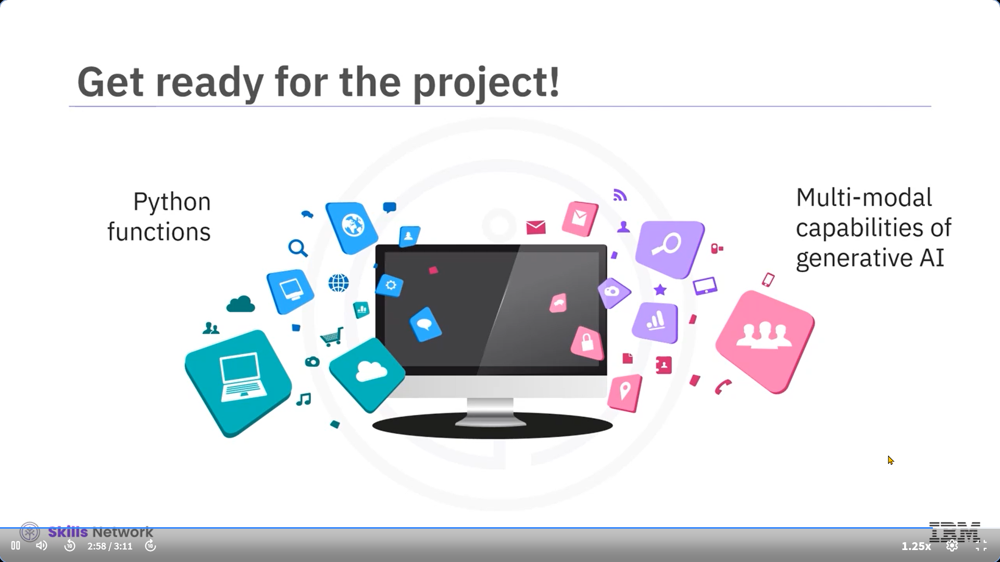

İşte metnin Türkçeye çevrilmiş hali, konu bütünlüğüne göre paragraflara ayrılmış ve her bölüme emoji içeren başlıklar eklenmiştir:

---

### 🖼️ Projeye Giriş: Fotoğraflarınıza Anlamlı İsimler Verin

Bu video, "Fotoğraflarınıza Anlamlı İsimler Verin" başlıklı projenin genel bir özetidir.

Görsellerin sessiz olmadığını hayal edin.

Fısıltılarla hikâyeler anlatan, gizli ayrıntıları ortaya çıkaran, bilgiye kapılar açan görseller…

Tüm bunlar, **görsel açıklama (image captioning) yapay zekâsı** sayesinde mümkün.

---

### 📷 Görselleri Metne Dönüştürmenin Gücü

Görsel açıklama yapay zekâsı, görüntülerdeki görsel bilgiyi makine tarafından okunabilir dile dönüştürmeyi sağlar.

Bu teknoloji;

* Görme engelli bireyler için erişilebilirliği artırabilir
* Arama sonuçlarını iyileştirebilir
* Güvenlik sistemlerini güçlendirebilir

Görsel veriyi metne çevirerek:

* İçeriğin daha derin keşfini mümkün kılar
* Sosyal medya etkileşimini artırır
* Veri yönetimini kolaylaştırır

---

### 🧑‍💻 Proje Senaryosu: Yüzlerce İsimsiz Görsel Arasında

Bu projede, otomatik çalışan bir **görsel açıklama yapay zekâsı** ile tanışacaksınız.

Hayal edin: Grafik tasarımcısınız ve binlerce isimsiz görselin arasında kayboldunuz.

Doğru görseli bulmak samanlıkta iğne aramak gibi...

Bu duruma bir çözüm geliştireceğiz.

---

### 🤖 Yapay Zekâ Gerçekten “Anlıyor”

Geliştireceğiniz araç, yalnızca görsellere bakmaz, onları  **anlar** .

Ardından, görsellerin içeriğini tanımlayan açıklamalar üretir ve bunları bir **metin dosyası** şeklinde indeksler.

Bu sayede:

* Görseller arasında arama yapmak kolaylaşır
* Verimlilik artar
* İş yükü azalır

---

### 🛠️ Proje Aşamaları: 3 Temel Adım

Bu projede üç ana faaliyet gerçekleştireceksiniz:

1. **BLIP modeli ile araç geliştirme:**

   Hugging Face’in transformer kütüphanesinden **BLIP (Bootstrapping Language-Image Pretraining)** modelini kullanarak görsel açıklama aracı oluşturacaksınız.

   BLIP; görüntü-metin eşleştirme ve görsel açıklama gibi çoklu modal görevleri yerine getirebilir.
2. **Gradio ile arayüz oluşturma:**

   Görsel açıklama uygulamanız için kullanıcı dostu bir arayüz geliştirmek amacıyla **Gradio** kütüphanesini kullanacaksınız.

   Gradio, makine öğrenimi modelleri ve Python fonksiyonları için demo/web uygulamaları oluşturmayı kolaylaştıran açık kaynaklı bir Python paketidir.
3. **Gerçek dünya uyarlaması:**

   Aracı, gerçek iş senaryolarına uygun hale getirecek ve örnek URL’lerden görselleri alıp otomatik açıklamalar üreteceksiniz.

---

### 💡 Teknik Gereksinimler

Bu projeyi tamamlamak için:

* **Python bilgisi**
* **IDE (Entegre Geliştirme Ortamı)** kullanımı konusunda temel deneyim

  gereklidir.

**Gradio** ve **Hugging Face transformers** hakkında ön bilgiye gerek yoktur — proje sırasında bu teknolojilerle tanışacaksınız.

---

### 🎯 Proje Hedefleri

Projenin sonunda aşağıdaki kazanımlara sahip olacaksınız:

* Üretici yapay zekâ modellerinin temellerini açıklayabileceksiniz
* Python ve BLIP modeli ile görsel açıklama aracı geliştirebileceksiniz
* Gradio kullanarak kullanıcı dostu bir arayüz oluşturabileceksiniz

---

### 🚀 Sonuç: Görsel Arşivinizi Akıllı Hale Getirin

Bu proje, Python fonksiyonlarını kullanarak üretici yapay zekânın çoklu-modal yeteneklerini keşfetmenizi sağlar.

Hazır olun:

Görsel kütüphanenizi dönüştürmek, anlamsız dosya adlarının yerine anlamlı açıklamalar yerleştirmek için bir yapay zekâ aracı geliştiriyorsunuz!

---

Hazırsan bu projeyi adım adım uygulamalı olarak birlikte inceleyebiliriz. Devam edelim mi?
