İşte metnin Türkçeye çevrilmiş hali, konu bütünlüğüne göre paragraflara ayrılmış ve her bölüme emoji içeren başlıklar eklenmiştir:

---

### 👋 Hugging Face’e Hoş Geldiniz

Bu videoyu izledikten sonra şunları yapabileceksiniz:

* Hugging Face platformunun amacını açıklamak
* Sunduğu araçları ve yetenekleri sıralamak
* Hugging Face ile Watsonx.ai iş birliğinin işletmelere nasıl yardımcı olduğunu anlamak

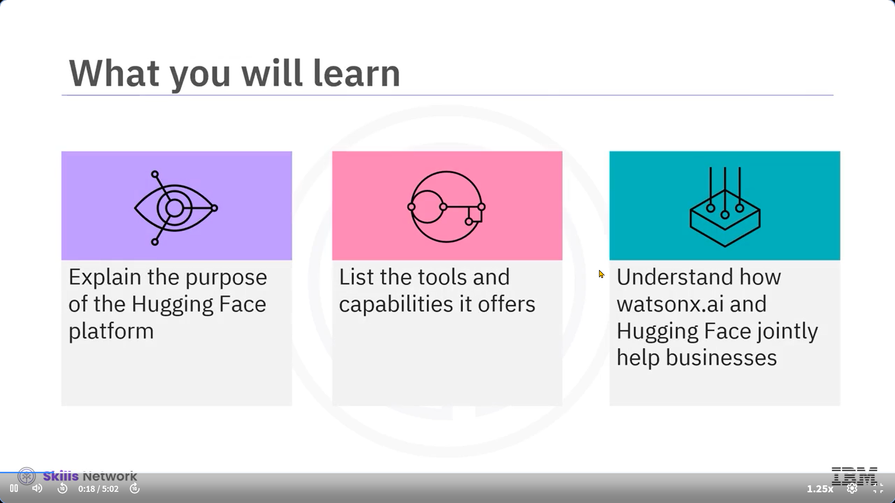

---

### 🌐 Açık Kaynak Yapay Zekâ Topluluğu için Bir Merkez

Hugging Face, bilim insanlarının, geliştiricilerin ve işletmelerin kişiselleştirilmiş makine öğrenimi araçları oluşturmak üzere iş birliği yaptığı açık kaynak bir yapay zekâ platformudur.

Platformun amacı, modellerin, veri kümelerinin ve uygulamaların paylaşıldığı bir açık kaynak AI topluluk merkezi kurmaktır.

Bu sayede, büyük bütçelere sahip olmayan kullanıcılar bile makine öğrenimi uygulamalarına erişebilir hale gelir.

> Hugging Face, yapay zekâyı demokratikleştirme çabasıyla öne çıkmıştır.

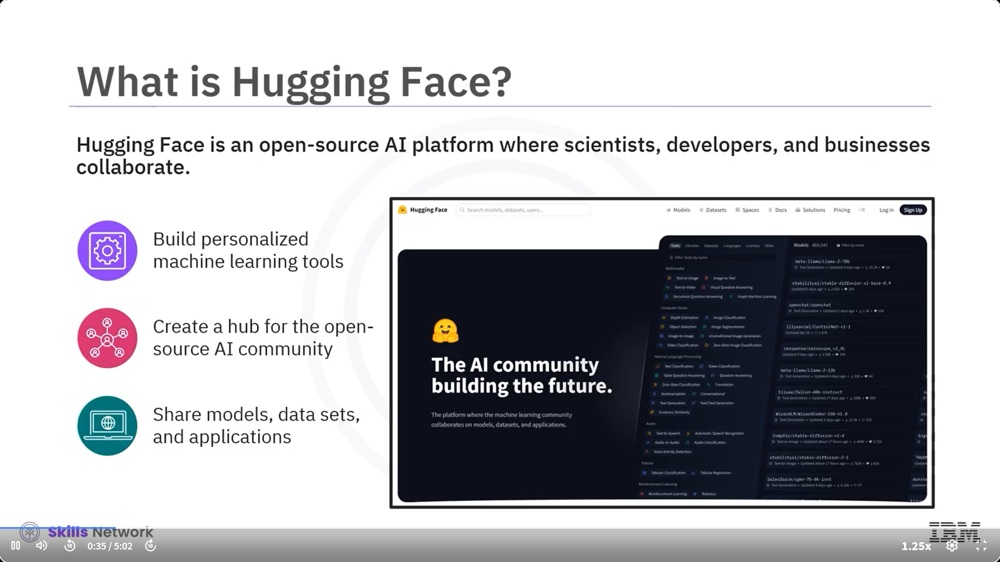

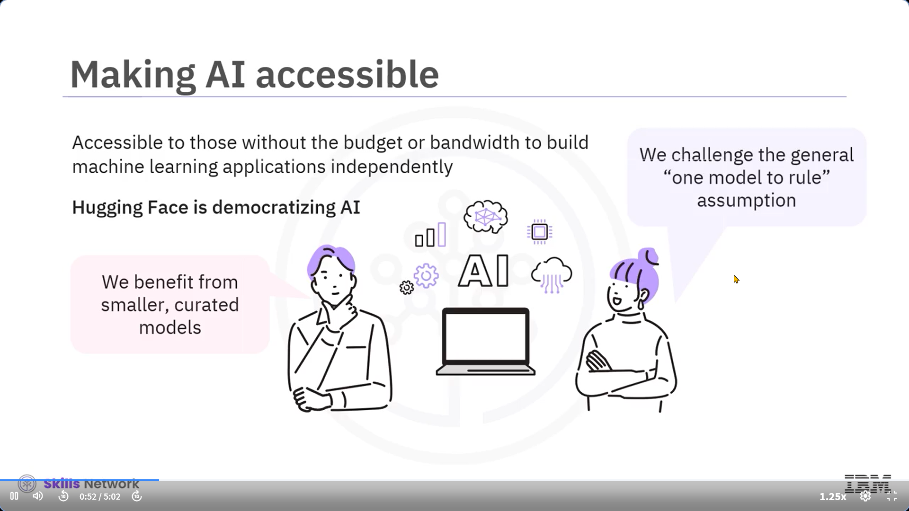

---

### 🤖 Başlangıç: NLP ve Ötesi

İlk başta Hugging Face topluluğu, doğal dil işleme (NLP) alanının yeteneklerinden yararlanmak amacıyla **transformer tabanlı modeller** oluşturmaya odaklandı.

Bugün ise platform:

* Metin
* Görsel
* Ses
* Video

oluşturma gibi birçok makine öğrenimi aracını desteklemektedir.

---

### 📊 Hugging Face'in Büyüklüğü

Şu anda platformda:

* 250.000’den fazla açık model
* 50.000 veri kümesi
* 1 milyon açık demo

bulunmakta ve bu sayı giderek artmaktadır.

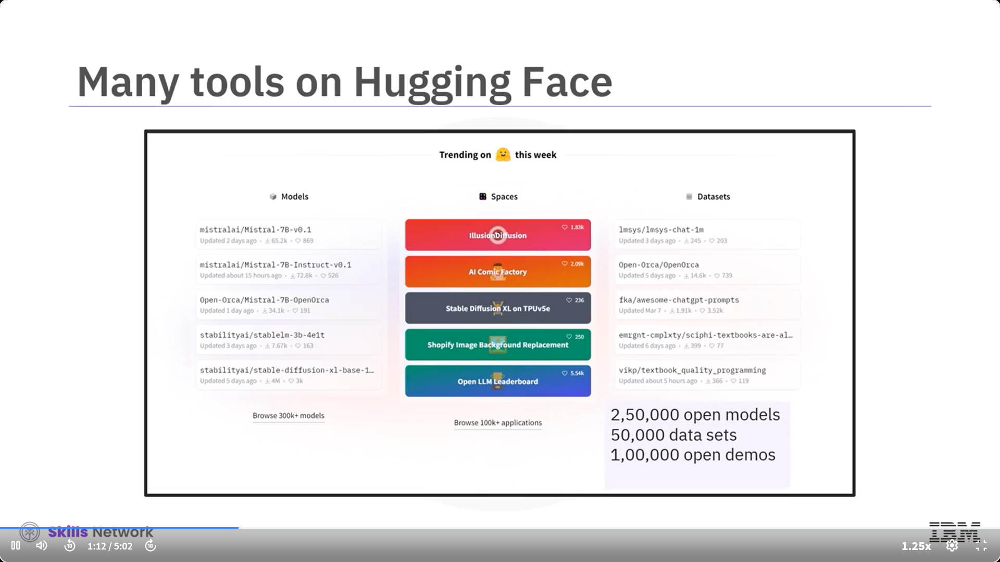

---

### 🛠️ Geliştiriciler için Araçlar

Geliştiriciler Hugging Face'i kullanarak modellerini:

* Oluşturur
* Eğitir
* Yayınlar

 **Transformer kütüphanesi** , PyTorch, TensorFlow ve Google JAX için 25.000’den fazla önceden eğitilmiş model içerir.

**Desteklenen görevler:**

* Metin üretimi
* Soru-cevap
* Özetleme
* Otomatik konuşma tanıma
* Görsel segmentasyon

Modeller ada göre filtrelenebilir veya kullanıcılar kendi modellerini paylaşabilir.

 **"Spaces" sekmesinde** , geliştiriciler üretici yapay zekâ uygulamalarının demolarını barındırabilir.

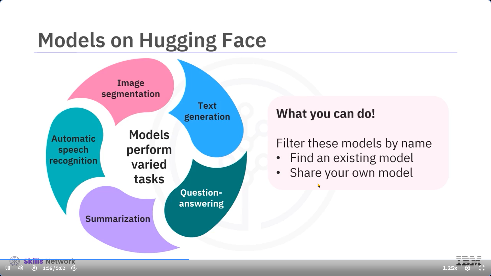

---

### 🏢 İşletmeler İçin Fırsatlar

**Enterprise Hub** üzerinden işletmeler:

* Önceden eğitilmiş modellere ve veri kümelerine erişebilir
* Sıfırdan model geliştirme ihtiyacı duymadan uygulama oluşturabilir
* Zaman, maliyet ve karbon ayak izinden tasarruf eder

Ayrıca işletmeler:

* Modellerine özellik ekleyip çıkarabilir
* Önyargılı veriyi filtreleyerek modelleri değerlendirebilir
* Metin, görsel, ses ve video üretimiyle çok modlu uygulamalar geliştirebilir

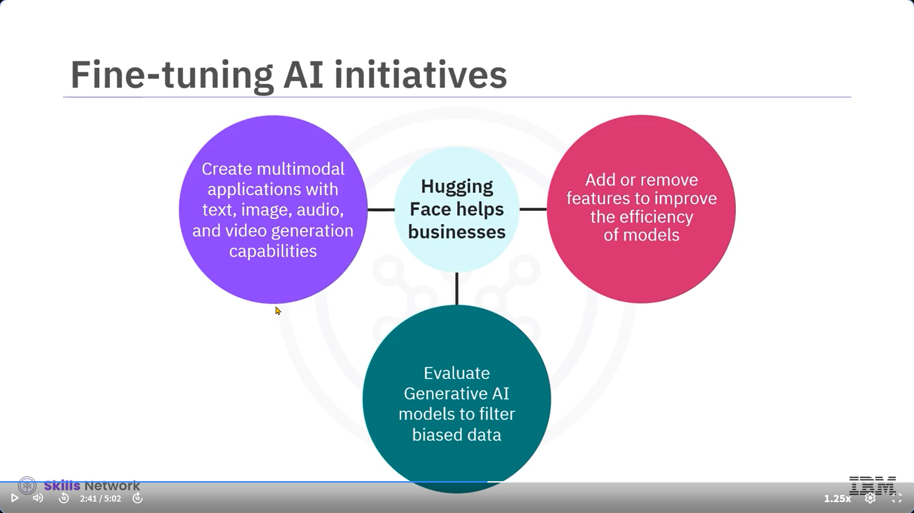

---

### 🏢 Örnek İş Birlikleri

Hugging Face'i aktif kullanan 50.000’den fazla küçük ve büyük işletme vardır. Örneğin:

* **Writer** firması, Palmera LLM modellerini Hugging Face'te barındırır.
* **Intel** , Hugging Face’in Donanım Ortağı programına katıldı ve uçtan uca AI donanım çözümleri geliştiriyor.
* Üniversiteler ve STK’lar da platformu aktif kullanmaktadır.

---

### 🧑‍🏫 Geliştirici Olmayanlar İçin Destek

Hugging Face, geliştirici olmayanları yapay zekâ modelleri konusunda yönlendiren bir **Uzman Hızlandırma Programı** sunar.

Ayrıca  **HuggingChat** , ChatGPT’ye açık kaynak bir alternatiftir.

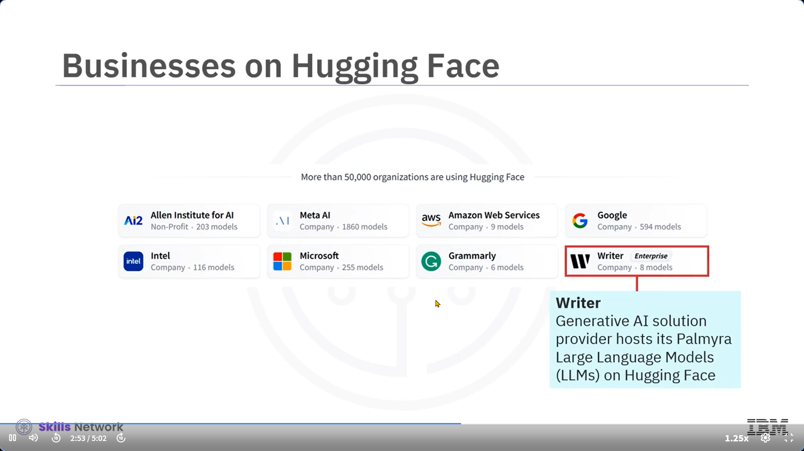

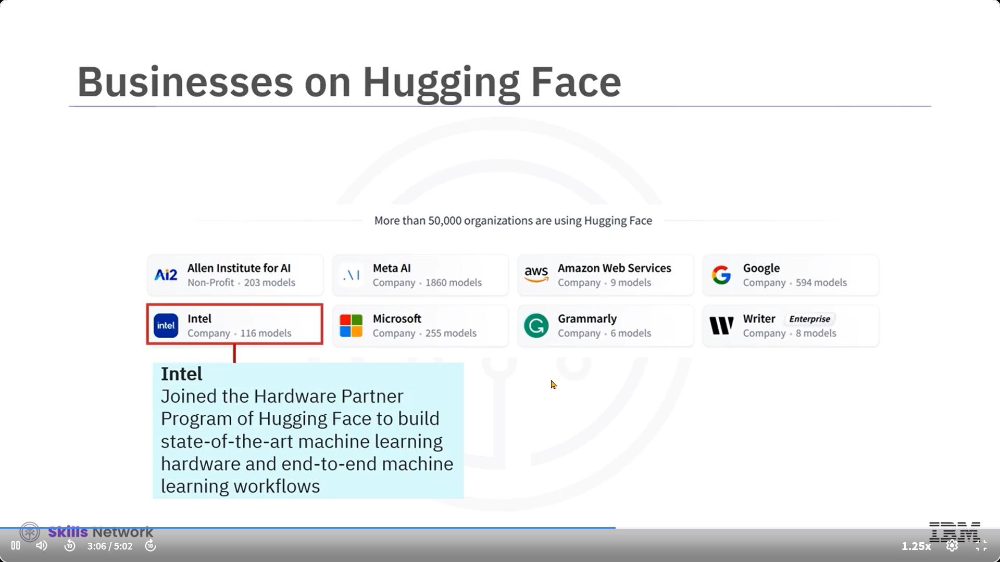

---

### 🔒 Güvenlik ve Gizlilik

Platform, kullanıcı güvenliğini sağlamak için SOC 2 standartlarına uyar.

Bu, şu güvenlik başlıklarını içerir:

* Veri güvenliği
* Erişilebilirlik
* İşlem bütünlüğü
* Gizlilik

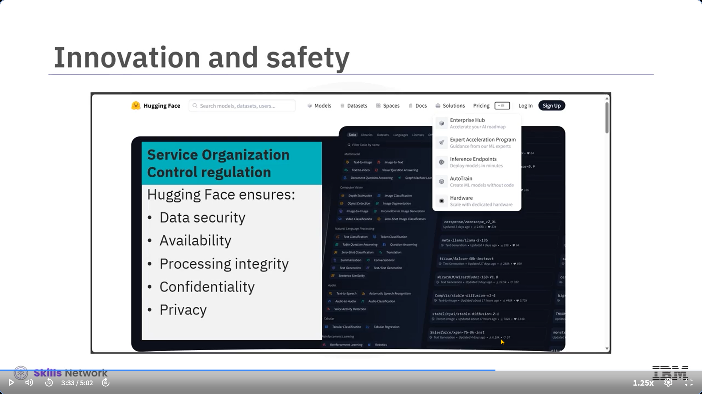

---

### 🤝 Hugging Face & Watsonx.ai İş Birliği

Hugging Face, IBM’in **watsonx.ai** platformu ile stratejik ortaklık kurmuştur.

* Watsonx.ai stüdyosu, seçili Hugging Face modellerini bünyesinde sunar.
* Hugging Face ise IBM’in LLM’lerinin açık kaynak versiyonlarını oluşturur ve kendi merkezinde yayımlar.

Bu sayede:

* IBM, açık kaynak gücünden ve topluluk çeşitliliğinden faydalanır
* Hugging Face, büyük AI şirketlerine karşı avantaj kazanır

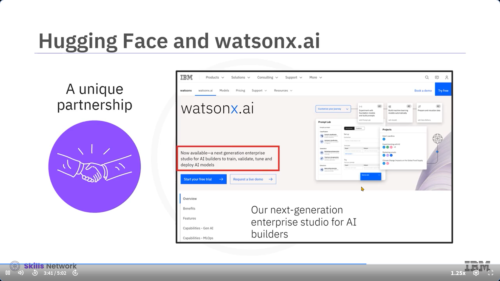

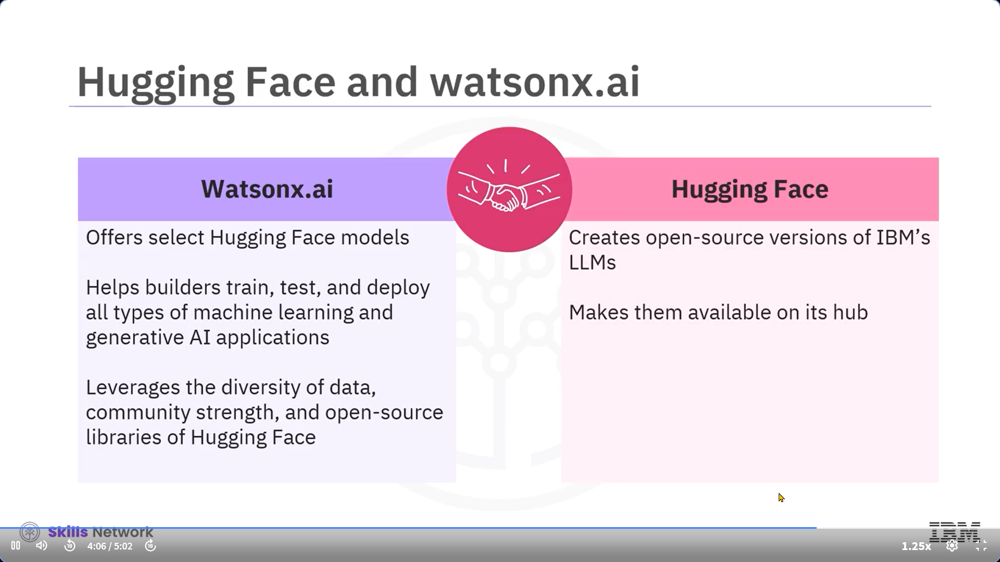

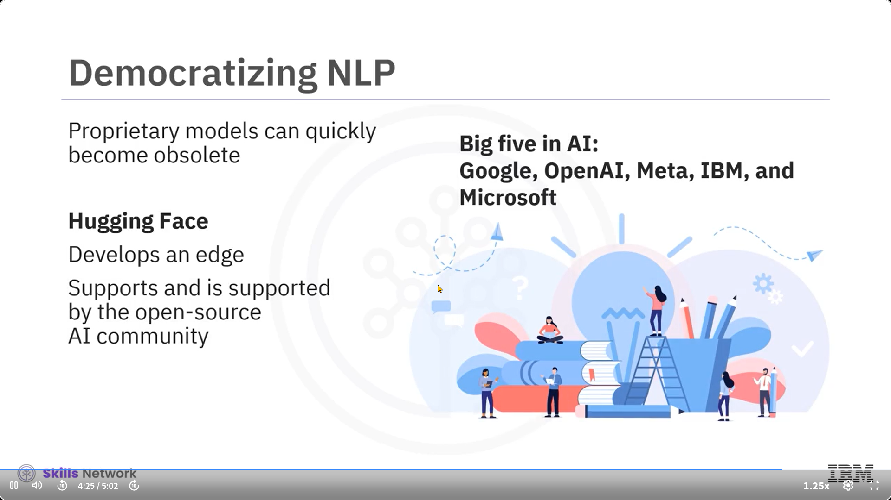

---

### 📌 Sonuç: Herkes İçin Yapay Zekâ

Bu videoda Hugging Face hakkında şunları öğrendiniz:

* Açık kaynak AI topluluğunun iş birliğini nasıl desteklediğini
* İşletmelere düşük maliyetli, hızlı ve çevre dostu çözümler sunduğunu
* Kurumlar, üniversiteler ve STK’ların da platformdan faydalandığını

> Artık üretici yapay zekâdan faydalanmak için büyük bir şirkete ihtiyacınız yok.

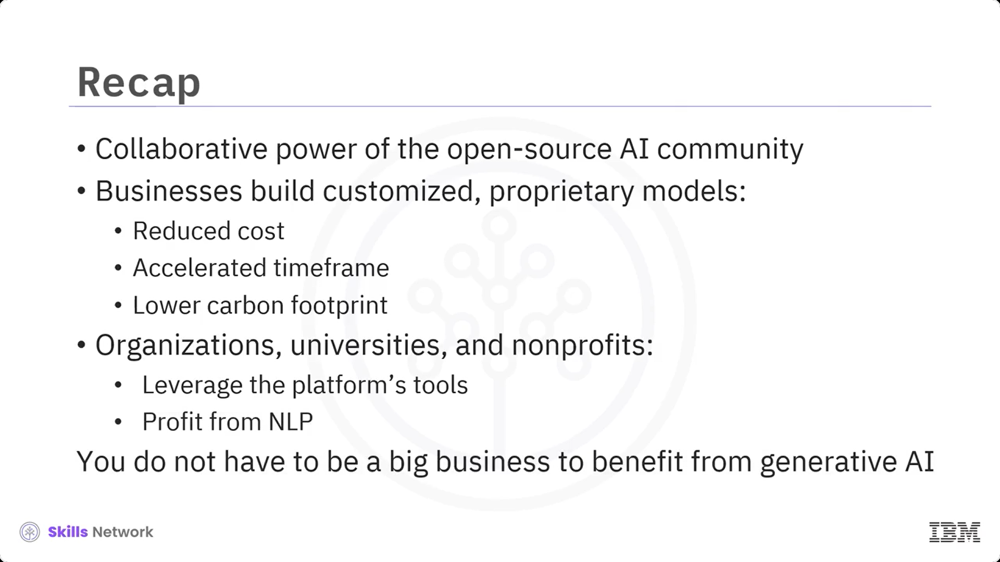

---

İstersen Hugging Face araçlarını listeleyen bir tablo veya kullanımıyla ilgili uygulamalı örnekler de oluşturabilirim. Yardımcı olayım mı?
