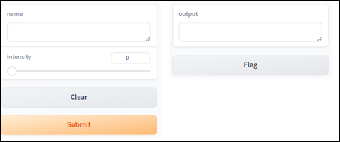
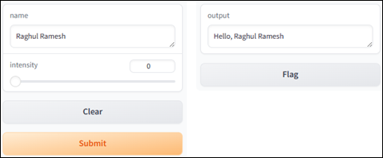
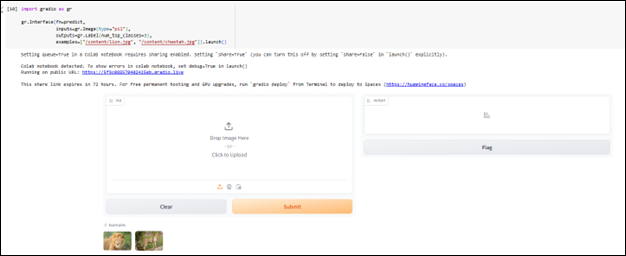
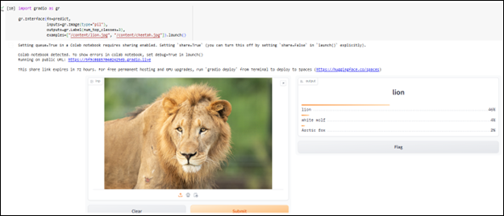

---

### 🌐 Gradio'ya Giriş

**Tahmini Okuma Süresi: 15 Dakika**

---

### 🎯 Hedefler

Bu bölümü tamamladıktan sonra şunları yapabileceksiniz:

* Gradio'nun temel kavramlarını açıklamak
* PyTorch kullanarak görsel sınıflandırma uygulamasının Gradio ile nasıl gösterileceğini örneklemek

---

### 🧩 Gradio Nedir?

 **Gradio** , makine öğrenimi modelinizi kullanıcı dostu bir web arayüzüyle sergilemenin en kolay yollarından biridir.

Gradio, açık kaynaklı bir Python paketidir ve herhangi bir Python fonksiyonu, makine öğrenimi modeli veya API için hızla demo veya web uygulaması oluşturmanıza olanak tanır.

Demo uygulamanızı Gradio’nun yerleşik paylaşım özellikleri ile kolayca bir bağlantı aracılığıyla başkalarıyla paylaşabilirsiniz.

**JavaScript, CSS veya web barındırma bilgisi gerekmez.**

---

### 💡 Neden Gradio Kullanmalıyım?

Gradio’nun avantajları:

* **Kullanım kolaylığı:** Birkaç satır kod ile modeller için arayüz oluşturmanızı sağlar.
* **Esneklik:** Metin, görsel, dosya gibi birçok giriş/çıkış türünü destekler.
* **Paylaşım ve iş birliği:** Oluşturulan arayüzler, özel bağlantılar ile kolayca başkalarıyla paylaşılabilir. Bu da geri bildirim almayı ve iş birliğini kolaylaştırır.

---

### 🚀 Gradio ile Başlarken

Gradio'yu kullanmaya başlamak için önce kütüphaneyi yüklemeniz gerekir:

```bash
pip install gradio
```

---

### 🧪 İlk Gradio Arayüzünüzü Oluşturun

Gradio uygulamalarınızı istediğiniz Python ortamında çalıştırabilirsiniz:

Kod editörünüz, Jupyter Notebook, Google Colab vb.

İşte basit bir Gradio uygulaması:

```python
import gradio as gr

def greet(name, intensity):
    return "Hello, " + name + "!" * int(intensity)

demo = gr.Interface(
    fn=greet,
    inputs=["text", "slider"],
    outputs=["text"],
)

demo.launch(server_name="127.0.0.1", server_port=7860)
```

---

### 🌍 Uygulama Nerede Görünür?

* Eğer bu kodu bir dosya içinde çalıştırırsanız:

  **[http://127.0.0.1:7860](http://127.0.0.1:7860)** adresinde tarayıcınızda açılır.
* Eğer bir Jupyter defteri içinde çalıştırırsanız:

  Demo, doğrudan defterin içinde görüntülenir.




### 👋 Uygulama Kullanımı

Adınızı soldaki metin kutusuna yazın, kaydırıcıyı hareket ettirin ve ardından **Gönder** butonuna tıklayın.

Sağ tarafta size dostça bir karşılama mesajı görünecektir.




### 🧩 Interface Sınıfını Anlamak

İlk demoyu oluşturmak için `gr.Interface` sınıfının bir örneğini oluşturdunuz.

Bu sınıf, **bir veya daha fazla giriş** alıp **bir veya daha fazla çıktı** üreten makine öğrenimi modelleri için demolar oluşturmak üzere tasarlanmıştır.

#### `Interface` sınıfının 3 temel argümanı:

* `fn`: UI (kullanıcı arayüzü) ile sarılacak Python fonksiyonu
* `inputs`: Giriş için kullanılacak Gradio bileşenleri
* `outputs`: Çıkış için kullanılacak Gradio bileşenleri

Fonksiyon (`fn`) olarak istediğiniz Python fonksiyonunu verebilirsiniz:

Bu fonksiyon basit bir selamlaşmadan, müzik üreticisine veya hazır bir makine öğrenimi modeline kadar her şey olabilir.

Gradio, `gr.Textbox()`, `gr.Image()`, `gr.HTML()` gibi **30’dan fazla yerleşik bileşen** içerir.

Fonksiyonunuz birden fazla argüman alıyorsa, `inputs` içinde bileşenleri liste olarak sırayla tanımlamalısınız.

Aynı şekilde, birden fazla değer döndüren fonksiyonlar için de `outputs` içinde bir bileşen listesi belirtilmelidir.

---

### 🖼️ BLIP ile Görsel Açıklama (Image Captioning) Arayüzü

Aşağıdaki örnek, BLIP modelini kullanarak bir görsel açıklama uygulaması için Gradio arayüzü oluşturmayı gösterir:

📦 Gereken paketleri kurun:

```bash
pip install transformers
```

📄 Uygulama Kodu:

```python
import gradio as gr
from transformers import BlipProcessor, BlipForConditionalGeneration
from PIL import Image

processor = BlipProcessor.from_pretrained("Salesforce/blip-image-captioning-base")
model = BlipForConditionalGeneration.from_pretrained("Salesforce/blip-image-captioning-base")

def generate_caption(image):
    inputs = processor(images=image, return_tensors="pt")
    outputs = model.generate(**inputs)
    return processor.decode(outputs[0], skip_special_tokens=True)

def caption_image(image):
    try:
        return generate_caption(image)
    except Exception as e:
        return f"Bir hata oluştu: {str(e)}"

iface = gr.Interface(
    fn=caption_image,
    inputs=gr.Image(type="pil"),
    outputs="text",
    title="BLIP ile Görsel Açıklama",
    description="Bir görsel yükleyin, açıklamasını üretelim."
)

iface.launch(server_name="127.0.0.1", server_port=7860)
```

📝 Bu arayüz:

* Giriş olarak görsel alır
* Çıkış olarak açıklama (metin) üretir
* Başlık ve açıklama parametreleriyle kullanıcı deneyimini zenginleştirir

---

### 📌 Kullanım Alanı: Görsel Açıklama

BLIP gibi görsel açıklama modelleri;

* Görme engelliler için içerik anlaşılabilirliğini artırabilir
* Büyük fotoğraf arşivlerinin yönetimini ve aranabilirliğini kolaylaştırabilir
* Fotoğrafçılar ve dijital varlık yöneticileri için zamandan tasarruf sağlayabilir

---

### 🖼️ PyTorch ile Görsel Sınıflandırma

Görsel sınıflandırma, bilgisayarla görme alanının merkezinde yer alır.

Uygulama alanları arasında:

* Otonom araçlar
* Tıbbi görüntüleme
* Güvenlik sistemleri

  bulunur.

---

### 🛠️ 1. Adım: Modeli Kurmak

Önceden eğitilmiş bir `ResNet-18` modeli kullanılacaktır:

```python
import torch
model = torch.hub.load('pytorch/vision:v0.6.0', 'resnet18', pretrained=True).eval()
```

---

### 🔍 2. Adım: Tahmin Fonksiyonu Tanımlamak

```python
import requests
from PIL import Image
from torchvision import transforms

response = requests.get("https://git.io/JJkYN")
labels = response.text.split("\n")

def predict(inp):
    inp = transforms.ToTensor()(inp).unsqueeze(0)
    with torch.no_grad():
        prediction = torch.nn.functional.softmax(model(inp)[0], dim=0)
        confidences = {labels[i]: float(prediction[i]) for i in range(1000)}
    return confidences
```

* Görsel → tensor formatına dönüştürülür
* Model çıktısı → `softmax` uygulanır
* Sonuç → sınıf adı ve güven skoru içeren bir sözlük olarak döner

---

### 🧪 3. Adım: Gradio Arayüzü Oluşturmak

```python
import gradio as gr

gr.Interface(
    fn=predict,
    inputs=gr.Image(type="pil"),
    outputs=gr.Label(num_top_classes=3),
    examples=["/content/lion.jpg", "/content/cheetah.jpg"]
).launch()
```

* **Giriş:** Sürükle-bırak ile resim yüklenebilir (`gr.Image`)
* **Çıkış:** En yüksek olasılıklı ilk 3 sınıfı gösteren etiket bileşeni (`gr.Label`)
* **examples:** Önceden tanımlı test görselleri

📌 Not: `"/content/lion.jpg"` gibi yolları, kendi sisteminizdeki gerçek görsel yollarıyla değiştirin.

---

### 🎯 Sonuç

* `Interface` sınıfı, Python fonksiyonlarınızı herkesin erişebileceği web arayüzlerine dönüştürür.
* BLIP modeli ile görsel açıklama, ResNet-18 ile görsel sınıflandırma gibi güçlü uygulamaları dakikalar içinde sunabilirsiniz.
* Gradio, teknik olmayan kullanıcılar için makine öğrenimi modellerine erişimi kolaylaştırır.

---






### ✅ Ve İşte Bu Kadar!

Tebrikler! Görsel sınıflandırma için web tabanlı bir demo oluşturmak adına ihtiyacınız olan tüm kod bu kadar.

Eğer uygulamanızı başkalarıyla paylaşmak isterseniz, `launch()` fonksiyonunu çağırırken **`share=True`** parametresini ekleyebilirsiniz.

---

### 🧾 Sonuç

 **Gradio** , makine öğrenimi modelleri için etkileşimli web demoları oluşturma sürecini büyük ölçüde basitleştirir.

BLIP gibi modellerle entegre edildiğinde:

* Görsel açıklama (image captioning) gibi uygulamalar geliştirilebilir
* Kullanıcı dostu, pratik çözümler oluşturulabilir
* Yapay zekânın gücü gerçek dünya problemlerine uygulanabilir

Gradio, sadece modellerinizin yeteneklerini sergilemekle kalmaz, aynı zamanda **geri bildirim toplayarak geliştirme sürecinize katkı sağlar.**
