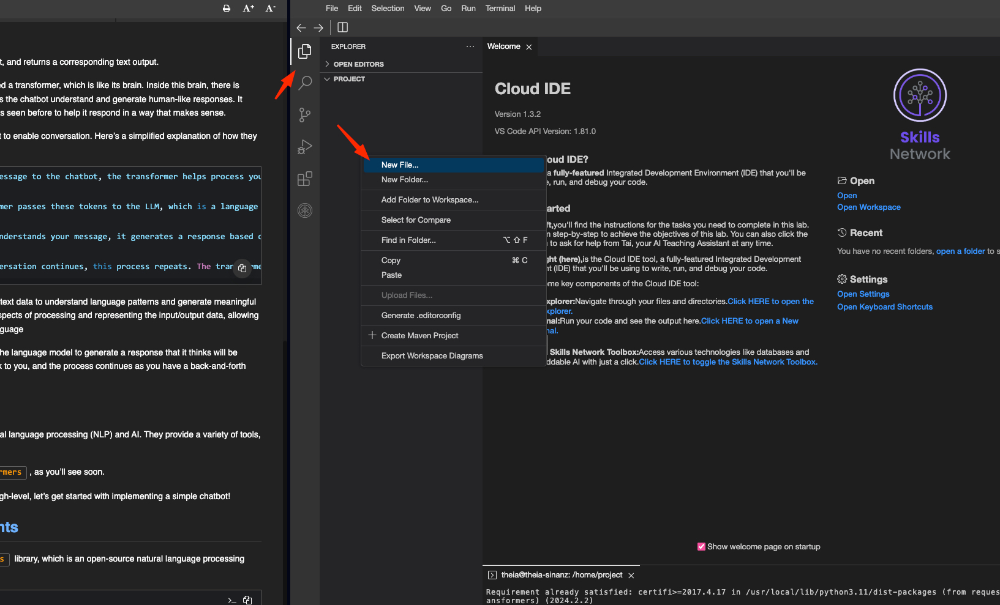
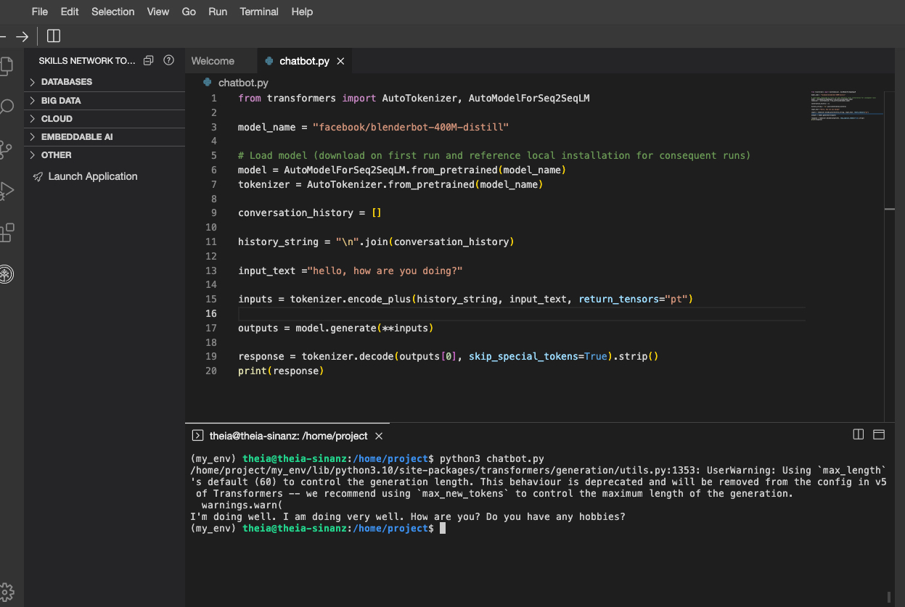
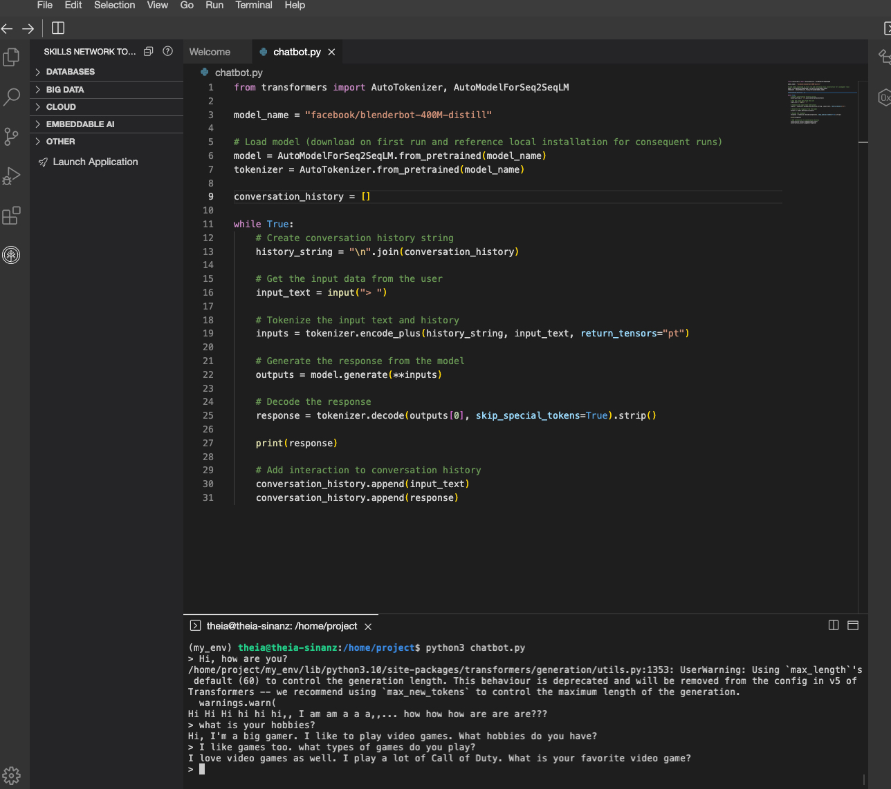

İşte metnin Türkçe çevirisi, konu başlıkları ve emojilerle yapılandırılmış şekilde:

---

### 🤖 Python ve Hugging Face ile Basit Bir Chatbot Oluşturma


**cognitiveclass.ai logosu**

Bu uygulamalı laboratuvar çalışmasında, çok basit ama işlevsel bir sohbet robotu (chatbot) oluşturacaksınız!

---

### 🎯 Öğrenme Hedefleri

Bu laboratuvarın sonunda şunları yapabileceksiniz:

* Bir sohbet robotunun ana bileşenlerini tanımlamak
* Bir LLM’in ne olduğunu açıklamak
* Uygulamanız için bir LLM seçmek
* Bir transformer’ın temelde nasıl çalıştığını açıklamak
* Girdiyi bir transformera vermek (tokenizasyon)
* Python kullanarak kendi basit chatbot’unuzu programlamak

---

### 🧠 Giriş: Bir Chatbot’un İç Yüzü

#### 💬 Bir Chatbot Nasıl Çalışır?

Chatbot, metin tabanlı bir giriş alıp buna karşılık bir metin çıktısı döndüren bir bilgisayar programıdır.

Chatbot’lar, beynine benzeyen “transformer” adlı özel bir bilgisayar programı kullanır. Bu beynin içinde, chatbot’un insan benzeri yanıtlar üretmesine ve anlamasına yardımcı olan bir dil modeli (LLM) bulunur. Bu model, geçmişte gördüğü birçok insan sohbeti örneğini analiz ederek mantıklı cevaplar vermeyi öğrenmiştir.

Chatbot içinde transformer ve LLM birlikte çalışarak sohbeti mümkün kılar. İşte bu etkileşimin basitleştirilmiş açıklaması:

* **Girdi işleme** : Sohbet robotuna bir mesaj gönderdiğinizde, transformer bu girişi işler. Mesajınızı daha küçük parçalara ayırır ve chatbot’un anlayabileceği bir biçime dönüştürür. Bu parçalara “token” denir.
* **Bağlamı anlama** : Transformer bu token'ları büyük miktarda metin verisiyle eğitilmiş olan LLM’ye iletir. LLM bu verilerden desenleri ve anlamları öğrenmiştir, dolayısıyla mesajınızın bağlamını anlamaya çalışır.
* **Yanıt üretme** : LLM mesajınızı anladıktan sonra, anladıklarına dayanarak bir yanıt üretir. Transformer bu yanıtı uygun formata dönüştürür ve size geri gönderir.
* **Yinelenen sohbet** : Sohbet devam ettikçe bu işlem her mesaj için tekrar eder. Transformer ve LLM, her yeni girişi işleyip anlamlandırarak alakalı bir yanıt üretmek için birlikte çalışırlar.

Önemli olan, LLM’in büyük miktarda metin verisinden dil kalıplarını öğrenmesi ve anlamlı yanıtlar üretebilmesidir. Transformer ise giriş/çıkış verilerinin teknik işlemesini yöneterek LLM’in anlamaya ve üretmeye odaklanmasını sağlar.

Chatbot mesajınızı anladıktan sonra, yardımcı veya ilginç olacağını düşündüğü bir yanıt üretmek için dil modelini kullanır. Yanıt size gönderilir ve bu şekilde sohbet karşılıklı olarak devam eder.

---

### 🤗 Hugging Face’e Giriş

Hugging Face, doğal dil işleme (NLP) ve yapay zekâ konularına odaklanan bir organizasyondur. NLP görevlerini desteklemek için çeşitli araçlar, kaynaklar ve hizmetler sağlarlar.

Bu projede onların **transformers** adlı Python kütüphanesini kullanacaksınız.

Chatbot’un nasıl çalıştığını artık genel hatlarıyla bildiğinize göre, basit bir chatbot’u uygulamaya koymaya başlayalım!

---

### 🛠️ Adım 1: Gereksinimlerin Kurulumu

Yeni bir terminal açın ve aşağıdaki adımları takip ederek bir Python sanal ortamı oluşturun ve gerekli kütüphaneleri kurun.

#### 🔧 Sanal Ortam Kurulumu:

```bash
pip3 install virtualenv 
virtualenv my_env  # my_env adında bir sanal ortam oluşturun
source my_env/bin/activate  # sanal ortamı etkinleştirin
```

#### 📦 Gerekli Kütüphanelerin Kurulumu:

Bu örnekte, doğal dil işleme için açık kaynaklı bir araç takımı olan `transformers` kütüphanesini ve `torch` kütüphanesini kullanacaksınız.

```bash
python3 -m pip install transformers==4.30.2 torch
```

Paketlerin yüklenmesi birkaç dakika sürebilir.


---

### 📄 Yeni Python Dosyası Oluşturma

Yeni bir Python dosyası oluşturmak için şu adımları izleyin:

1. **Dosya Gezgini’ni Açın** : Sol taraftaki **File Explorer (Dosya Gezgini)** simgesine tıklayın.
2. **Sağ Tıklayın** : Dosya gezgini alanında herhangi bir boş alana sağ tıklayın.
3. **Yeni Dosya Seçin** : Açılan menüden **New File (Yeni Dosya)** seçeneğine tıklayın.
4. **Dosyayı İsimlendirin** : Yeni dosyanıza `chatbot.py` adını verin.

Bu dosya, Python ile yazacağınız sohbet robotunun ana dosyası olacak.

To create a new Python file, Click on `File Explorer`, then right-click in the explorer area and select `New File`. Name this new file `chatbot.py`.





İşte verdiğiniz adımların Türkçeye çevrilmiş ve başlıklarla yapılandırılmış hali:

---

### 🧰 Adım 2: Gerekli Araçları İçe Aktarma

Bu örnekte, `transformers` kütüphanesinden iki sınıf kullanacağız:

* `AutoTokenizer`
* `AutoModelForSeq2SeqLM`

Bu sınıfları içe aktarmak için aşağıdaki kodu `chatbot.py` dosyanıza ekleyin:

```python
from transformers import AutoTokenizer, AutoModelForSeq2SeqLM
```

---

### 🧠 Adım 3: Bir Model Seçmek

Sohbet robotu geliştirirken amacınıza uygun doğru LLM modelini seçmek çok önemlidir. Hugging Face'in web sitesinde farklı model türlerini inceleyebilirsiniz:

🔗 [https://huggingface.co/models](https://huggingface.co/models)

#### 📚 Farklı Kullanım Senaryoları ve Önerilen Modeller:

* **Metin üretimi** :

  Genel amaçlı metin üretimi için GPT-2 veya GPT-3 kullanabilirsiniz.

   **Örnek** : Yaratıcı ve anlamlı yanıtlar üreten bir sohbet robotu.

* **Duygu analizi** :

  Duygu analizi için BERT veya RoBERTa gibi modeller popülerdir.

   **Örnek** : Müşteri geri bildirimlerinin olumlu mu olumsuz mu olduğunu analiz etmek.

* **Varlık tanıma (NER)** :

  BERT, GPT-2 veya RoBERTa modelleriyle kişi, yer, kuruluş gibi özel adları tespit edebilirsiniz.

   **Örnek** : Bir metinden kişi ve yer isimlerini çıkartan sistem.

* **Soru-cevap sistemleri** :

  BERT, GPT-2 veya XLNet gibi modeller soruları anlayıp doğru yanıtlar verebilir.

   **Örnek** : Belirli belgelerden bilgi çekip soru yanıtlayan bir chatbot.

* **Dil çevirisi** :

  MarianMT veya T5 gibi modeller çeviri görevleri için uygundur.

   **Örnek** : İngilizce metni Fransızcaya çeviren bir araç.

#### 🔍 Dikkate Alınması Gereken Diğer Faktörler:

* **Lisanslama** : Modelin kullanım amacınıza uygun bir lisansa sahip olması
* **Model boyutu** : Daha büyük modeller daha doğru olabilir, ancak daha fazla kaynak tüketir
* **Eğitim verisi** : Modelin eğitildiği verinin sizin alanınıza uygun olması
* **Performans ve doğruluk** : Doğruluk, çalışma süresi ve benzeri metrikler uygulamanız için önemlidir

Bu örnekte kullanacağımız model:

```python
model_name = "facebook/blenderbot-400M-distill"
```

Bu model açık kaynak lisanslıdır ve görece hızlı çalışır. Bu satırı da `chatbot.py` dosyanıza ekleyin.

---

### 📦 Adım 4: Modeli ve Tokenizer’ı Yüklemek

Kod ilk kez çalıştırıldığında, Hugging Face API'si üzerinden model indirilecektir. Sonraki çalıştırmalarda, yerel olarak indirilen model kullanılır.

Bu adımda iki kavramla çalışacağız:

* `model`: Seçilen dil modeli ile etkileşim kurmanızı sağlar. `AutoModelForSeq2SeqLM` sınıfının bir örneğidir.
* `tokenizer`: Girdiyi optimize eder ve modele aktarır. `AutoTokenizer` sınıfının bir örneğidir. Girdiyi "token"lara dönüştürerek modelin anlayacağı forma sokar.

Aşağıdaki kodu da `chatbot.py` dosyanıza ekleyin:

```python
# İlk çalıştırmada modeli indir, sonraki çalışmalarda yerel sürümü kullan
model = AutoModelForSeq2SeqLM.from_pretrained(model_name)
tokenizer = AutoTokenizer.from_pretrained(model_name)
```


---

### 💬 Adım 5: Sohbet Başlasın!

Artık kurulum tamamlandığına göre sohbet etmeye başlayabiliriz!

Etkili bir sohbet için aşağıdaki işlemler gerçekleştirilmelidir:

1. Sohbet geçmişini saklamak için bir nesne başlatılır
2. Bu nesneyle her etkileşimde:
   * Sohbet geçmişi bir metin olarak kodlanır
   * Kullanıcıdan giriş alınır
   * Girdi tokenize edilir
   * Modelden çıktı üretilir
   * Çıktı detokenize edilir (orijinal metne çevrilir)
   * Sohbet geçmişi güncellenir

---

### 📝 Adım 5.1: Sohbet Geçmişini Saklama

Sohbet geçmişi, chatbot’un önceki konuşmaları hatırlaması açısından önemlidir. Bu örnekte, bir `list` (liste) kullanacağız:

```python
conversation_history = []
```

---

### 🔡 Adım 5.2: Sohbet Geçmişini Kodlama

Her etkileşimde, sohbet geçmişini modelle birlikte iletmeliyiz. Bunun için `join()` yöntemiyle tüm geçmişi satır satır birleştiriyoruz:

```python
history_string = "\n".join(conversation_history)
```

---

### 👤 Adım 5.3: Kullanıcıdan Girdi Alma

Başlangıç için sabit bir giriş kullanacağız:

```python
input_text = "hello, how are you doing?"
```

---

### 🧩 Adım 5.4: Tokenizasyon

Girdileri tokenize etmek için `encode_plus()` metodunu kullanıyoruz:

```python
inputs = tokenizer.encode_plus(history_string, input_text, return_tensors="pt")
print(inputs)
```

Modelin önceden eğitilmiş sözcük dağarcığı dosyalarını görmek için:

```python
print(tokenizer.pretrained_vocab_files_map)
```

---

### ⚙️ Adım 5.5: Modelden Çıktı Üretme

Tokenize edilmiş girdileri modele vererek çıktı üretiyoruz:

```python
outputs = model.generate(**inputs)
print(outputs)
```

---

### 🔁 Adım 5.6: Çıktıyı Detokenize Etme (Yorumlanabilir Hâle Getirme)

Model çıktısını okunabilir hâle getirmek için `decode()` metodunu kullanıyoruz:

```python
response = tokenizer.decode(outputs[0], skip_special_tokens=True).strip()
print(response)
```

---




---

### 🔁 Adım 5.7: Sohbet Geçmişini Güncelle

Chatbot'tan bir yanıt aldıktan sonra, sonraki etkileşimlerde kullanılabilmesi için hem kullanıcı girdisini hem de chatbot’un verdiği yanıtı `conversation_history` listesine eklemelisiniz:

```python
conversation_history.append(input_text)
conversation_history.append(response)
print(conversation_history)
```

---

### 🔂 Adım 6: Sohbeti Döngüye Al

Artık tüm adımları tamamladığınıza göre, bu işlemleri bir döngü içerisine alarak tam bir sohbet deneyimi oluşturabilirsiniz:

```python
while True:
    # Sohbet geçmişini metne dönüştür
    history_string = "\n".join(conversation_history)
  
    # Kullanıcıdan girdi al
    input_text = input("> ")

    # Girdi ve geçmişi tokenize et
    inputs = tokenizer.encode_plus(history_string, input_text, return_tensors="pt")

    # Modelden yanıt üret
    outputs = model.generate(**inputs)

    # Yanıtı metne dönüştür (detokenize)
    response = tokenizer.decode(outputs[0], skip_special_tokens=True).strip()

    # Yanıtı yazdır
    print(response)

    # Girdi ve yanıtı geçmişe ekle
    conversation_history.append(input_text)
    conversation_history.append(response)
```

---

### ✅ Artık Her Şey Hazır!

Bu kodu `chatbot.py` dosyanıza ekleyin ve çalıştırmak için terminalde şunu yazın:

```bash
python3 chatbot.py
```

Artık chatbot’unuzla kesintisiz bir şekilde sohbet edebilirsiniz!

Hazırsan istersen tüm kodun birleşik hâlini de sana sunabilirim. İster misin?




🎉 **Voila! Basit ve İşlevsel Chatbot’un Hazır!**

Artık terminal üzerinden sohbet edebileceğin basit ama çalışan bir chatbot oluşturmuş oldun!

Sana yanıt verebiliyor, geçmiş konuşmaları hatırlayabiliyor ve etkileşim kurabiliyor.

💡 **Çıkmak için:**

Sohbeti sonlandırmak istersen, terminalde **Ctrl + C** tuşlarına basman yeterli.

Hazırsan, tüm `chatbot.py` dosyasını birleştirilmiş ve eksiksiz şekilde aşağıda paylaşabilirim.

İstiyor musun?

---

### 🏁 Sonuç

Tebrikler! Bu uygulamalı laboratuvar çalışmasını başarıyla tamamladınız! 🎉

Bu çalışmada, **Python** ve **Hugging Face’in açık kaynaklı dil modelleri** kullanılarak basit bir chatbot oluşturmayı öğrendiniz. Proje, chatbot’larla ilgili temel kavramları — özellikle **transformer’lar** ve **tokenizasyon** — anlama ve kullanma sürecinde size rehberlik etti.

Bu uygulama:

* Ortam kurulumu,
* Uygun model seçimi,
* Bir sohbet robotu kodlama gibi adımları adım adım izleyerek,

  sohbet edebilen işlevsel bir chatbot geliştirmenizi sağladı.

👨‍🏫  **Bu proje** , Dr. **Sina Nazeri** tarafından hazırlanmış olup; yapay zekâ ve chatbot geliştirmeye ilgi duyan yeni başlayanlar için erişilebilir ve etkileyici bir kaynak niteliğindedir.

Artık sen de kendi sohbet botunu yazabilecek bilgiye sahipsin! 🚀
