İşte bu bölümün Türkçeye çevrilmiş ve başlıklarla yapılandırılmış hâli:

---

### 🌐 Chatbot’unuzu Web Arayüzüne Entegre Etme

**cognitiveclass.ai logosu**

---

### 📘 Giriş

Bu laboratuvarda, bir **arka uç sunucusu (backend)** kurmayı ve chatbot’unuzu bir **web uygulamasına entegre etmeyi** öğreneceksiniz.

---

### 🎯 Öğrenme Hedefleri

Bu laboratuvarı tamamladıktan sonra şunları yapabileceksiniz:

* Arka uç sunucusunu kurmak
* Chatbot’unuzu Flask sunucusuna entegre etmek
* Web sayfası üzerinden arka uçla iletişim kurmak

---

### 🧠 Ön Bilgiler

Bu bölüm, bir önceki laboratuvardaki terminal üzerinden çalışan basit chatbot’u oluşturmayı bildiğinizi varsayar.

Bir ChatGPT benzeri web sitesi oluşturmak için iki temel bileşen gerekir:

1. Chatbot’u barındıran bir **arka uç sunucusu**
2. Arka uç sunucusuyla iletişim kuran bir **ön yüz (web sayfası)**

Haydi başlayalım! 🚀

---

### 🖥️ Adım 1: Chatbot’unuzu Bir Arka Uç Sunucusunda Barındırma

#### 🧩 Arka Uç Sunucusu Nedir?

Bir arka uç sunucusu, bir web sitesinin veya uygulamanın **beyni** gibidir.
Bu durumda sunucu, web sitesinden gelen istemleri alır, chatbot’a iletir ve chatbot’un ürettiği çıktıyı tekrar siteye gönderir.

---

### 🔧 Flask ile Basit Bir Arka Uç Sunucusu Kurma

#### 💡 Not: `requirements.txt` Dosyası Kullanmanız Önerilir

**Flask**, Python ile web uygulamaları geliştirmek için kullanılan bir çatı (framework)’dır.
Gelen istekleri yönetmek, verileri işlemek ve yanıt üretmek için çeşitli araçlar sağlar.

---

### 📦 Gerekli Kurulumlar

Tüm terminal işlemleri için IDE’nin yerleşik terminalini kullanmalısınız. Terminali şu şekilde açabilirsiniz:

* **Ctrl + \`** tuş kombinasyonu
* Veya üst araç çubuğundan: **Terminal → New Terminal**

Terminale şu komutları yazın:

```bash
python3.11 -m pip install flask
python3.11 -m pip install flask_cors
```

---

### 📁 Sunucu Dosyasını Oluşturma

Yeni bir Python dosyası oluşturmak için:

1. **File Explorer (Dosya Gezgini)**’ni açın
2. Boş bir alana sağ tıklayın
3. **New File** seçeneğine tıklayın
4. Dosyanın adını `app.py` olarak belirleyin

---

### 🧪 Flask Sunucu Kodunu Ekleyin

Aşağıdaki kodu `app.py` dosyasına yapıştırın ve kaydedin:

```python
from flask import Flask

app = Flask(__name__)

@app.route('/')
def home():
    return 'Hello, World!'

if __name__ == '__main__':
    app.run()
```

---

### 🧾 Açıklamalar

* `Flask` sınıfını içe aktarıyorsunuz.
* `app` adında bir Flask uygulama örneği oluşturuyorsunuz.
* Ana sayfa (`/`) için bir rota tanımlıyorsunuz. Bu rota ziyaret edildiğinde, `'Hello, World!'` döndürülür.
* `if __name__ == '__main__'` koşulu, dosya doğrudan çalıştırıldığında sunucunun başlatılmasını sağlar.
* `app.run()` komutu ile Flask sunucusu çalıştırılır.

---

### ▶️ Sunucuyu Çalıştırma

Aşağıdaki komutla sunucuyu çalıştırın:

```bash
python3.11 app.py
```

Varsayılan olarak Flask sunucusu şu adreste çalışır:
[http://127.0.0.1:5000/](http://127.0.0.1:5000/) veya [http://localhost:5000/](http://localhost:5000/)

---

### 🌐 Skills Network Cloud Üzerinde Sunucuya Erişim

Bu laboratuvarı Skills Network Cloud ortamında çalıştırdığınız için:

1. Soldaki araç çubuğunda **Skills Network Toolbox**’a gidin
2. Yan menüden **Launch Application** butonuna tıklayın
3. **5000** numaralı portu girin
4. Uygulamayı yeni bir sekmede başlatın

---

Hazırsan, bir sonraki adımda chatbot’unuzu bu Flask sunucusuna entegre etmeye geçebiliriz. İster misin?

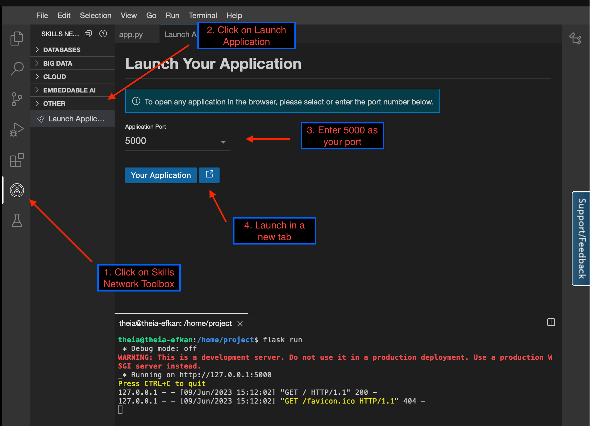


### 🌍 Yerel Sunucuya Erişim ve  Tanımı

Yukarıdaki adımları uygulayarak, **bulut sunucusunun yerel (localhost) adresine** başarıyla erişmiş oldunuz.

---

### ⚠️ ÖNEMLİ: `<HOST>` Tanımı

Bu laboratuvarın geri kalan kısmında, eriştiğiniz bu URL'yi **`<HOST>`** olarak adlandıracağız.

> Örneğin, tarayıcıda şu adresi gördüyseniz:
>
> `https://abcdef-5000.preview.app.cloud.skills.network`
>
> o zaman:
>
> **`<HOST>` = `https://abcdef-5000.preview.app.cloud.skills.network`**

Kodlarda ve açıklamalarda bu URL'yi `<HOST>` ile temsil edeceğiz.

---

### ✅ Beklenen Görüntü

Tarayıcınızda `<HOST>` adresini ziyaret ettiğinizde şu mesajı görmelisiniz:

```
Hello, World!
```

Bu mesaj, Flask sunucusunun başarıyla çalıştığını ve düzgün bir şekilde yanıt verdiğini gösterir. 🎉

Hazırsan bir sonraki adımda chatbot’u bu sunucuya entegre edelim! Devam edelim mi?

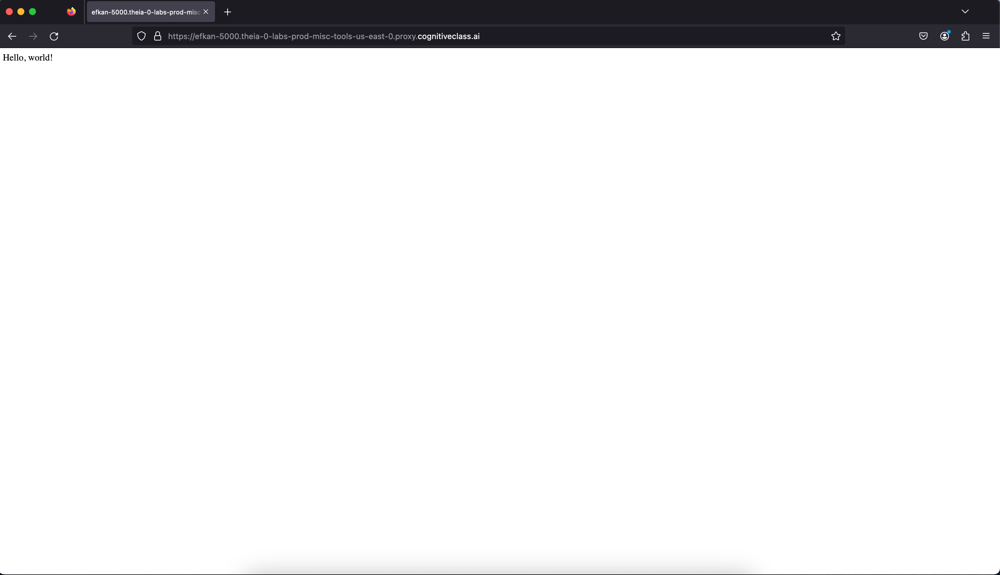


### 🍌 Yeni Rotalar Ekleyelim

Aşağıdaki rotaları `app.py` dosyanıza ekleyin, böylece farklı sayfalardan farklı yanıtlar alabiliriz:

```python
@app.route('/bananas')
def bananas():
    return 'This page has bananas!'

@app.route('/bread')
def bread():
    return 'This page has bread!'
```

---

### ▶️ Sunucuyu Yeniden Başlat

1. Terminalde çalışan Flask uygulamasını **Ctrl + C** ile durdurun.
2. Ardından tekrar başlatmak için şu komutu çalıştırın:

```bash
flask run
```

*Not: `python3.11 app.py` yerine `flask run` komutu da kullanılabilir, ancak Flask doğru ortamda kurulu ve tanımlı olmalıdır.*

---

### 🌐 Yeni Rotaları Ziyaret Et

Tarayıcıda aşağıdaki adresleri ziyaret edin:

* 🍌 Muz sayfası: `http://<HOST>/bananas`

  → Görmeniz gereken çıktı:

  ```
  This page has bananas!
  ```
* 🍞 Ekmek sayfası: `http://<HOST>/bread`

  → Görmeniz gereken çıktı:

  ```
  This page has bread!
  ```

---

Her şey doğru çalışıyorsa, artık Flask ile yeni rotalar tanımlayabiliyor ve bunları tarayıcıda görüntüleyebiliyorsun.

Hazırsan bir sonraki adımda chatbot entegrasyonuna geçebiliriz! 🚀 Devam edelim mi?

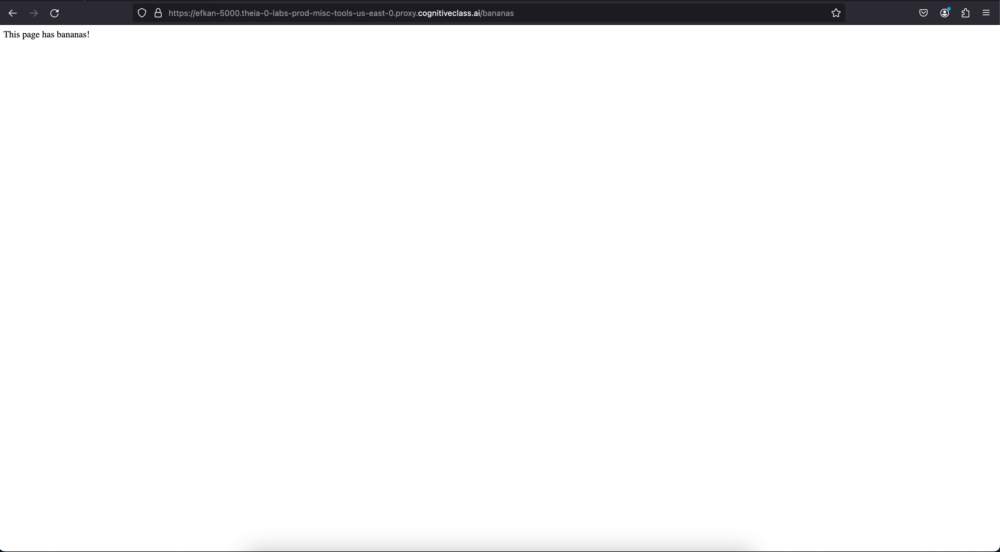

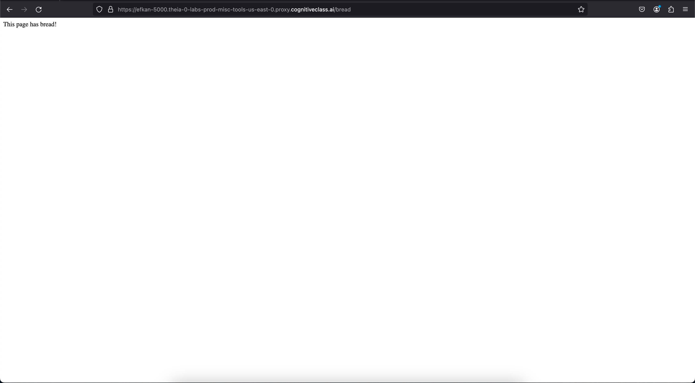


---

### 🔁 Önceki Rotaları Temizleyelim

Artık rotaların nasıl çalıştığını öğrendiğimize göre, `app.py` dosyanızdaki `/bananas` ve `/bread` rotalarını silebilirsiniz. Onlara artık ihtiyacımız yok.

---

### 🛡️ CORS Hatalarını Önlemek

Farklı kaynaklardan (örneğin frontend sayfanızdan) Flask sunucunuza istek yapılırken **CORS (Cross-Origin Resource Sharing)** hatası alabilirsiniz. Bunu önlemek için şu iki satırı ekleyin:

```python
from flask_cors import CORS  # Yeni satır
CORS(app)  # Yeni satır
```

---

### 🤖 Chatbot’u Flask Sunucunuza Entegre Etme

Artık Flask sunucumuz hazır olduğuna göre, ilk laboratuvarda oluşturduğunuz chatbot'u bu sunucuya entegre edelim.

---

### 📦 Gerekli Kütüphaneleri Kurun

Terminalde şu komutları çalıştırarak gerekli kütüphaneleri yükleyin:

```bash
python3.11 -m pip install transformers==4.38.2
python3.11 -m pip install torch==2.2.1
```

---

### 🧠 Chatbot Kodlarını Ekleme

`app.py` dosyanızın en üstüne aşağıdaki satırları ekleyin:

```python
from transformers import AutoModelForSeq2SeqLM, AutoTokenizer

model_name = "facebook/blenderbot-400M-distill"
model = AutoModelForSeq2SeqLM.from_pretrained(model_name)
tokenizer = AutoTokenizer.from_pretrained(model_name)
conversation_history = []
```

---

### 📥 Ek Kütüphaneler (İstekleri Okumak İçin)

```python
from flask import request
import json
```

---

### 📄 Beklenen HTTP Yapısı

Chatbot’a gönderilen POST isteği şu yapıda olmalıdır:

```json
{
  "prompt": "mesaj"
}
```

---

### 🧩 Chatbot Rota Fonksiyonunu Tanımla

Chatbot mantığını içeren `/chatbot` rotasını ekleyin:

```python
@app.route('/chatbot', methods=['POST'])
def handle_prompt():
    # HTTP istek gövdesinden veriyi al
    data = request.get_data(as_text=True)
    data = json.loads(data)
    input_text = data['prompt']
  
    # Sohbet geçmişini oluştur
    history = "\n".join(conversation_history)
  
    # Tokenize et
    inputs = tokenizer.encode_plus(history, input_text, return_tensors="pt")
  
    # Modelden yanıt al
    outputs = model.generate(**inputs, max_length=60)
  
    # Yanıtı çözümle (detokenize)
    response = tokenizer.decode(outputs[0], skip_special_tokens=True).strip()
  
    # Sohbet geçmişini güncelle
    conversation_history.append(input_text)
    conversation_history.append(response)
  
    return response
```

---

### ✅ Final `app.py` Kodu (Tümü)

```python
from flask import Flask, request, render_template
from flask_cors import CORS
import json
from transformers import AutoModelForSeq2SeqLM, AutoTokenizer

app = Flask(__name__)
CORS(app)

model_name = "facebook/blenderbot-400M-distill"
model = AutoModelForSeq2SeqLM.from_pretrained(model_name)
tokenizer = AutoTokenizer.from_pretrained(model_name)
conversation_history = []

@app.route('/chatbot', methods=['POST'])
def handle_prompt():
    data = request.get_data(as_text=True)
    data = json.loads(data)
    input_text = data['prompt']
    history = "\n".join(conversation_history)
    inputs = tokenizer.encode_plus(history, input_text, return_tensors="pt")
    outputs = model.generate(**inputs, max_length=60)
    response = tokenizer.decode(outputs[0], skip_special_tokens=True).strip()
    conversation_history.append(input_text)
    conversation_history.append(response)
    return response

if __name__ == '__main__':
    app.run()
```

---

### 🧪 Uygulamanızı Test Etme

Yeni bir terminal açın ve aşağıdaki `curl` komutunu çalıştırın:

```bash
curl -X POST -H "Content-Type: application/json" -d '{"prompt": "Hello, how are you today?"}' 127.0.0.1:5000/chatbot
```

🔄 Beklenen çıktı örneği:

```
I am doing very well today as well. I am glad to hear you are doing well.
```

Benzer bir yanıt aldıysanız, **tebrikler!** 🎉

Başarıyla **chatbot’unuzu Flask sunucunuza entegre ettiniz.**

---

📌 Bitirdiğinizde terminali kapatmak veya sunucuyu durdurmak için:

```bash
Ctrl + C
```


---

### 🌐 Web Sayfası ile Arka Uç Sunucunuza İstek Gönderme

Bu bölümde, bir **şablon chatbot web sayfası** indirip yapılandıracak ve bu sayfa üzerinden Flask tabanlı arka uç sunucunuza istek göndereceksiniz.

---

### 🧪 Adım 1: Şablon Web Sitesini İndirme ve Gerekli Kütüphaneleri Kurma

Eğer Flask uygulamanız çalışıyorsa **Ctrl + C** ile durdurun. Ardından aşağıdaki komutları terminale yazın:

```bash
git clone https://github.com/ibm-developer-skills-network/LLM_application_chatbot
python3.11 -m pip install -r LLM_application_chatbot/requirements.txt
```

✅ Eğer hata almadan kurulumlar tamamlarsanız, şablon deposunu başarıyla edinmişsiniz demektir.

---

### 📁 Klasör Yapısı

Depoyu klonladıktan sonra, klasör yapısı şöyle olmalıdır:

```
LLM_application_chatbot/
│
├── static/
│   └── script.js
│   └── < diğer dosyalar >
│
├── templates/
│   └── index.html
```

---

### 🚚 Adım 2: `app.py` Dosyanızı Şablon Klasöre Taşıyın

Flask uygulamanızın HTML sayfasını düzgün bir şekilde sunabilmesi için `app.py` dosyanızı `LLM_application_chatbot/` klasörüne taşımalısınız.

Her iki dosya da `/home/project` dizininde olmalıdır.

Terminalde şu komutu çalıştırın:

```bash
mv app.py LLM_application_chatbot/
```

---

### 🖱️ Alternatif Yöntem: IDE Üzerinden Taşıma

IDE’yi kullanarak da taşıma yapabilirsiniz:

1. Sol kenar çubuğundaki **Explorer** (Dosya Gezgini) sekmesine tıklayın
2. `app.py` dosyasını bulun
3. Fareyle sürükleyip `LLM_application_chatbot/` klasörünün üstüne bırakın

   ⚠️ **Dikkat:** `static/` veya `templates/` gibi bir alt klasöre bırakmayın!

---

Her şey doğru yerleştirildiyse, bir sonraki adımda HTML ve JavaScript ile frontend tarafında backend API’ye istek göndereceğiz. Devam etmek ister misin?


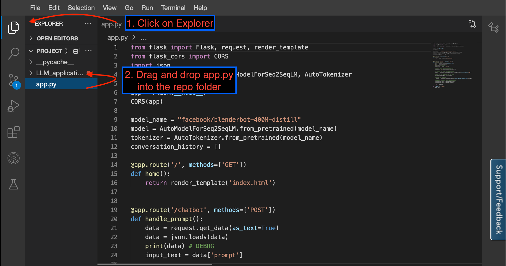


### 📂 Dosya Yapısını Doğrulama

`app.py` dosyasını doğru klasöre taşıdıktan sonra, proje klasörünüz aşağıdaki gibi görünmelidir:

```
LLM_application_chatbot/
├── app.py
├── static/
│   └── script.js
│   └── < diğer varlıklar >
├── templates/
│   └── index.html
```

---

### ✅ Test Etmek İçin Komutlar

Terminalde aşağıdaki komutları çalıştırarak doğru konumda olup olmadığınızı kontrol edin:

```bash
cd LLM_application_chatbot/
ls
```

---

### 🧾 Beklenen Çıktı

Komutu çalıştırdığınızda, şu gibi bir çıktı almalısınız:

```
app.py  static  templates
```

Eğer `app.py` görünüyorsa, her şey doğru konumlandırılmış demektir! 🎉

Hazırsan bir sonraki adımda bu web sayfasını Flask sunucusunda çalıştırabiliriz. Devam edelim mi?

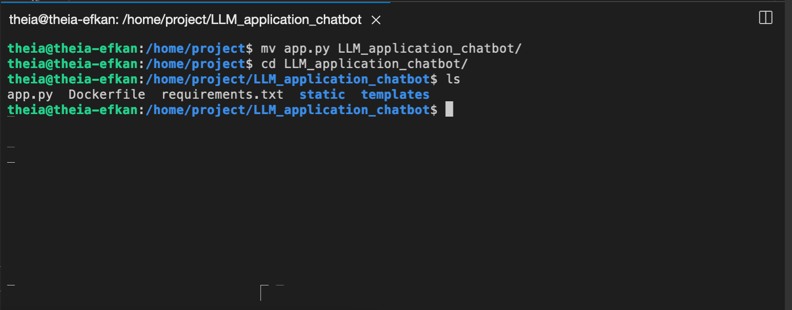


### 📝 `app.py` Dosyasını Yeniden Açma

`app.py` dosyasını başka bir klasöre taşıdığınız için, editörde açık olan sekme artık geçersiz bir dosya yoluna işaret eder.

Bu nedenle:

---

### 🔄 Yapmanız Gerekenler

1. **Mevcut `app.py` sekmesini kapatın** :

   Üstteki sekmede sağ tıklayıp `Close` (Kapat) seçeneğine tıklayın.

1. **Yeni konumdan tekrar açın** :

   Sol taraftaki  **Explorer (Dosya Gezgini)** ’nden

   `LLM_application_chatbot/` klasörüne gidin

   ve `app.py` dosyasına tıklayarak yeniden açın.

---


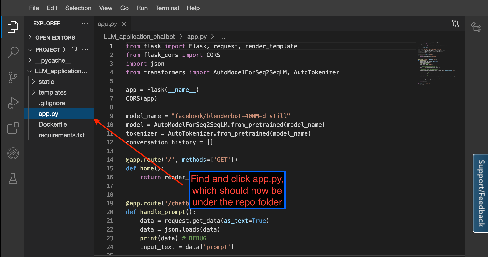


### 🏠 `index.html` Sayfasını Ana Sayfa Olarak Sunma

Artık web arayüzünüzü Flask sunucusunun kök (`/`) rotasında göstermek istiyoruz. Bunu yapmak için `app.py` dosyanıza aşağıdaki route'u eklemeniz yeterlidir:

---

### ➕ Flask Koduna Eklenecek Yeni Route

```python
@app.route('/', methods=['GET'])
def home():
    return render_template('index.html')
```

> Bu kod, `/` adresine (`<HOST>/`) gelen HTTP GET isteklerinde, `templates/index.html` dosyasını kullanıcıya döndürür.

---

### ▶️ Sunucuyu Çalıştır

Artık Flask uygulamanızı şu komutla başlatabilirsiniz:

```bash
flask run
```

---

### 🌐 Web Sayfasını Görüntüle

Sunucunuz çalıştıktan sonra tarayıcıdan şu adresi ziyaret edin:

```
http://<HOST>/
```

> `<HOST>` senin Skills Network bulut ortamındaki sunucu URL’indir.
>
> Örnek: `https://abcdef-5000.preview.app.cloud.skills.network`

---

### ✅ Beklenen Görüntü

Tarayıcıda `index.html` sayfasının arayüzü yüklenmiş şekilde görüntülenmelidir.

Artık web arayüzünüz üzerinden chatbot ile etkileşim kurmaya bir adım daha yaklaştınız! 🚀

İstersen bir sonraki adımda bu sayfanın JavaScript kısmına geçebiliriz. Devam edelim mi?

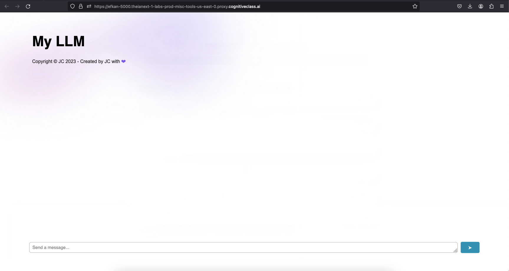


### 💬 Web Sayfası JavaScript Mantığı

Bu şablon web sayfası, halihazırda bir **chatbot arayüzünü taklit eden** JavaScript koduna sahiptir. Aşağıdaki işlemleri otomatik olarak yapar:

1. Kullanıcının mesajını bir **konuşma baloncuğu** olarak gösterir
2. Bu mesajı, **bir HTTP isteği** ile belirtilen bir API adresine gönderir
3. Gelen yanıtı alır ve yine bir **baloncuk** içinde kullanıcıya gösterir

---

### ⚠️ Varsayılan Ayar: Yanlış Endpoint

JavaScript dosyasında, bu istekler varsayılan olarak şu adrese gider:

```
https://www.example.com
```

Ancak bu adres  **çalışmaz** , çünkü biz kendi Flask sunucumuzdaki `/chatbot` rotasını kullanıyoruz.

---

### 🔧 Yapılacak İşlem: `script.js` Dosyasını Düzenle

1. Sol taraftaki  **Explorer (Dosya Gezgini)** ’nden şu dosyaya git:
   ```
   LLM_application_chatbot/static/script.js
   ```
2. Dosyayı aç ve `"https://www.example.com"` şeklinde tanımlanmış olan  **endpoint URL'sini bul** .
3. Bu URL'yi şu şekilde değiştir:

```javascript
const API_URL = "http://127.0.0.1:5000/chatbot";
```

> Eğer `<HOST>` üzerinden çalışıyorsan (örneğin Skills Network Cloud), bu adresi şu şekilde ayarlaman gerekebilir:

```javascript
const API_URL = "<HOST>/chatbot";
```

Yerine:

```javascript
const API_URL = "https://abcdef-5000.preview.app.cloud.skills.network/chatbot";
```

---

### ✅ Sonuç

Artık sayfa üzerinden gönderilen mesajlar doğrudan **Flask tabanlı chatbot API'nize** yönlendirilecek.


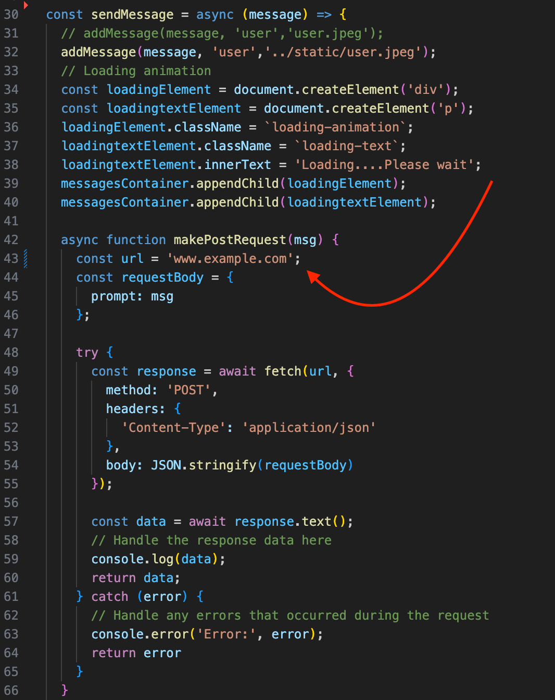


### 🔁 JavaScript'teki Endpoint’i Chatbot Rotanıza Güncelleyin

Şu anda `script.js` dosyasındaki endpoint (API adresi) varsayılan olarak:

```javascript
"https://www.example.com"
```

şeklindedir. Bu adresi **kendi Flask uygulamanızın çalıştığı URL'ye** yönlendirmeniz gerekiyor.

---

### 🛠️ Doğru Endpoint’i Belirleyin

1. **Flask uygulamanızı başlattıktan sonra** "Launch Application" butonuyla açtığınız sayfanın adresini kopyalayın.
2. Bu adresin sonuna `/chatbot` ekleyin.

🔸 Örnek:

```javascript
const API_URL = "https://sinanz-5000.theianext-0-labs-prod-misc-tools-us-east-0.proxy.cognitiveclass.ai/chatbot";
```

 **Senin URL’in farklı olabilir** , şu şekilde görünebilir:

```javascript
const API_URL = "https://<senin-özel-url’in>.proxy.cognitiveclass.ai/chatbot";
```

---

### 📄 `script.js` Dosyasında Değişiklik

1. Şu dosyayı aç:

   `LLM_application_chatbot/static/script.js`
2. Şu satırı bul:

```javascript
const API_URL = "https://www.example.com";
```

3. Onu kendi `<HOST>/chatbot` adresinle değiştir:

```javascript
const API_URL = "https://sinanz-5000.theianext-0-labs-prod-misc-tools-us-east-0.proxy.cognitiveclass.ai/chatbot";
```

---

### ✅ Artık Hazırsınız!

Bu değişiklikle birlikte, web sayfası üzerinden yazılan mesajlar Flask sunucunuzdaki `/chatbot` rotasına gidecek ve bot’tan yanıt alacaksınız.

Tarayıcıdan `<HOST>/` adresine gidip test edebilirsin.

Mesaj yaz → Gönder → Bot yanıtını göstersin. 🚀

Yardıma devam edeyim mi?

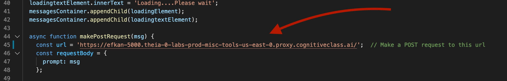


### 🧾 Final `app.py` Dosyası (Özet Görünüm)

Kodun son hâli tamamen doğru yapılandırılmış durumda ve şu adımları içeriyor:

* Flask uygulamasını oluşturma
* CORS sorunlarını önleme
* Chatbot modelini yükleme (`facebook/blenderbot-400M-distill`)
* Ana sayfa (`index.html`) rotası
* `/chatbot` POST API’si ile kullanıcıdan gelen mesajı alıp yanıt üretme
* Sohbet geçmişini saklama
* Yanıtı JSON formatında döndürme

---

### ▶️ Uygulamayı Test Etme Zamanı!

1. Eğer sunucu hâlâ çalışıyorsa, **Ctrl + C** ile durdurun.
2. Aşağıdaki komutla Flask sunucusunu tekrar başlatın:

```bash
flask run
```

---

### 🖥️ Terminalde Beklenen Çıktı

Terminalde şuna benzer bir çıktı görmelisiniz:

```
 * Running on http://127.0.0.1:5000 (Press CTRL+C to quit)
```

Eğer Skills Network Cloud ortamındaysanız, URL şu şekilde olabilir:

```
 * Running on https://sinanz-5000.theianext-0-labs-prod-misc-tools-us-east-0.proxy.cognitiveclass.ai (Press CTRL+C to quit)
```

---

### 🌐 Tarayıcıdan Test Et

1. Yukarıdaki URL’yi tarayıcınızda açın (`<HOST>/`)
2. Açılan sayfa `index.html` olacak ve chatbot arayüzünü gösterecek
3. Bir mesaj yazın ve “Send” tuşuna basın
4. Yanıt sohbet baloncuğunda görüntülenecek

---

✅  **Her şey doğru çalışıyorsa** , tebrikler!

Web tabanlı, Flask destekli bir **chatbot uygulamasını başarıyla tamamladınız.** 🎉

Bir sonraki adımda projeyi nasıl genişletebileceğinizi görmek ister misiniz? Örneğin:

* Yanıt süresini ölçmek
* Sohbet geçmişini sınırlamak
* Farklı LLM’leri entegre etmek
* Veritabanı bağlantısı kurmak

Hazırsanız birlikte ilerleyebiliriz!

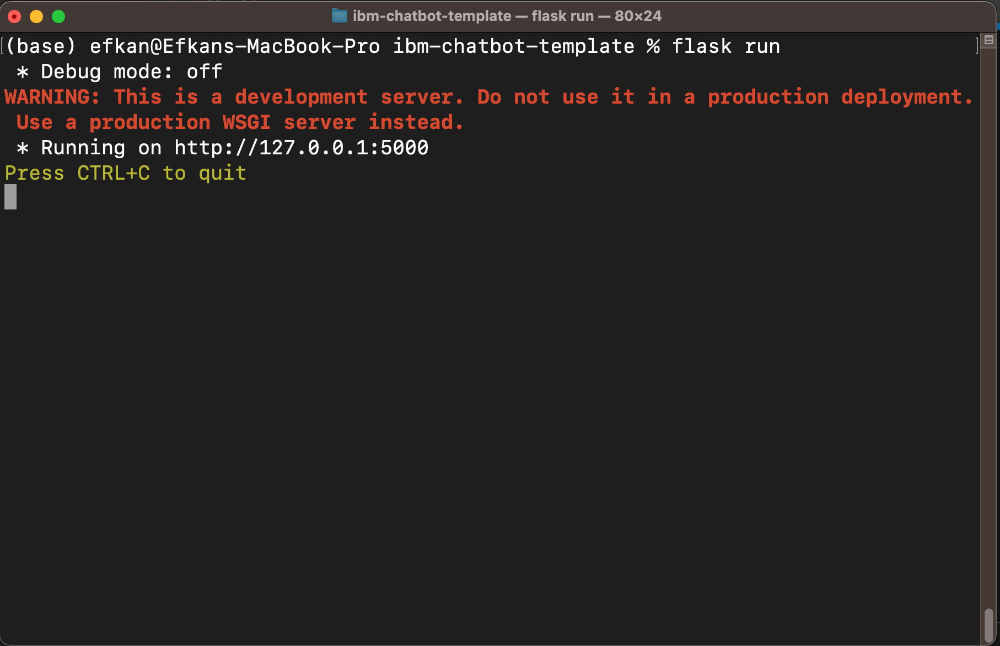


### 🌐 Chatbot'unuzu Tarayıcıda Deneyin!

Her şey hazır olduğuna göre artık tarayıcınızdan web arayüzünü açarak chatbot’unuzu test edebilirsiniz 🚀

---

### 🧭 Adım Adım

1. Flask uygulamanızın çalıştığından emin olun:

   ```bash
   flask run
   ```
2. Tarayıcınızda aşağıdaki adresi ziyaret edin:

   ```
   http://127.0.0.1:5000/
   ```

   Ya da Skills Network Cloud kullanıyorsanız:

   ```
   https://<senin-kendi-HOST-adresin>.proxy.cognitiveclass.ai/
   ```

   > Bu URL genellikle terminalde **"Running on"** satırında belirtilir.
   >

---

### 💬 Chatbot’u Test Et

1. Sayfa yüklendiğinde chatbot arayüzünü göreceksiniz.
2. “Type your message here...” alanına bir mesaj yazın:

   **Örneğin:** `Hello, how are you?`
3. **Send** butonuna tıklayın.
4. Birkaç saniye içinde, chatbot’un yanıtı ekranda bir konuşma balonu olarak görüntülenecek.

---

### ✅ İşte Bu Kadar!

Artık tam işlevli, web tabanlı bir **ChatGPT benzeri chatbot** uygulamanız var:

* Python + Flask → Sunucu tarafı
* Hugging Face LLM → Yapay zekâ
* HTML + JS → Kullanıcı arayüzü

İstersen bir sonraki adımda:

* Arayüzü geliştirebilir
* Cevapları özelleştirebilir
* Gelişmiş özellikler ekleyebilirsin

Devam edelim mi? 😎

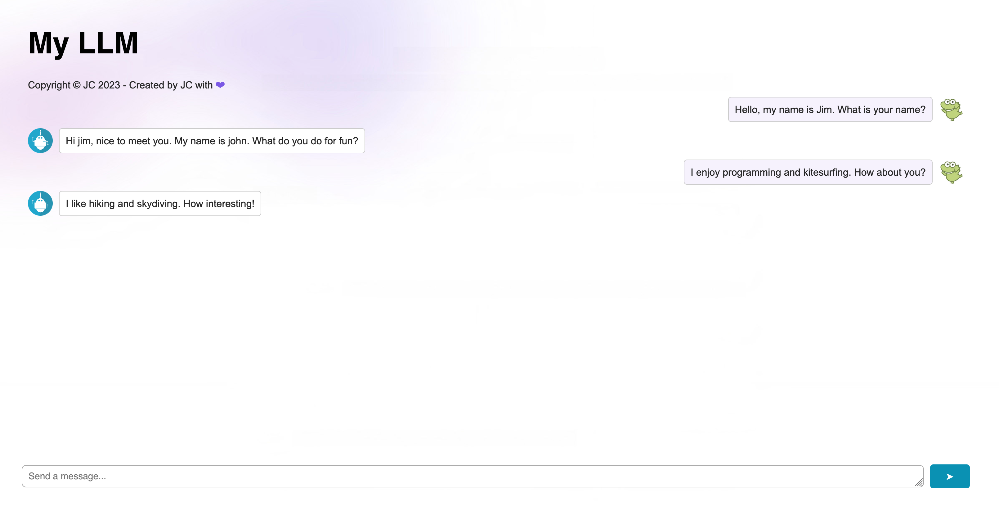


🎉 **Tebrikler!**

Eğer çıktıların benzer şekilde çalıştıysa, **kendi chatbot web siteni başarıyla oluşturmuş oldun!** 🚀

---

### ✅ Neler Başardın?

* Python ve Flask ile bir **web sunucusu** kurdun
* Hugging Face’in açık kaynaklı LLM modelini entegre ederek bir **chatbot** geliştirdin
* Web arayüzü ile backend’i bağlayarak mesaj gönderip yanıt alabildin
* JavaScript üzerinden HTTP POST istekleri ile gerçek zamanlı sohbet deneyimi sundun

---

### 🛠️ Sonraki Adımlar (İsteğe Bağlı)

İstersen projeni daha da geliştirebilirsin:

* 🧠 Sohbet geçmişini sınırlama veya sıfırlama
* 💾 Yanıtları veritabanına kaydetme
* 🎨 Arayüzü özelleştirme (stil, animasyonlar)
* 🌍 Çok dilli destek
* 🤖 Farklı modeller (örneğin Mistral, Phi, Zephyr) ile test etme

---
