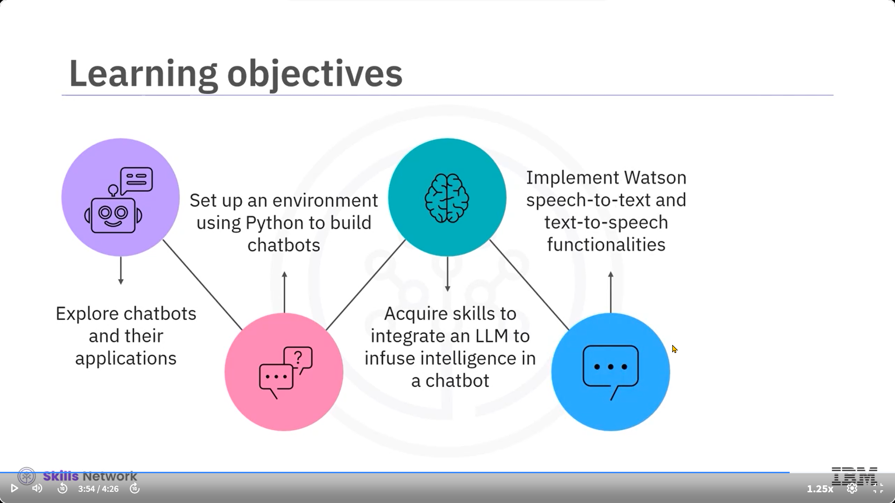
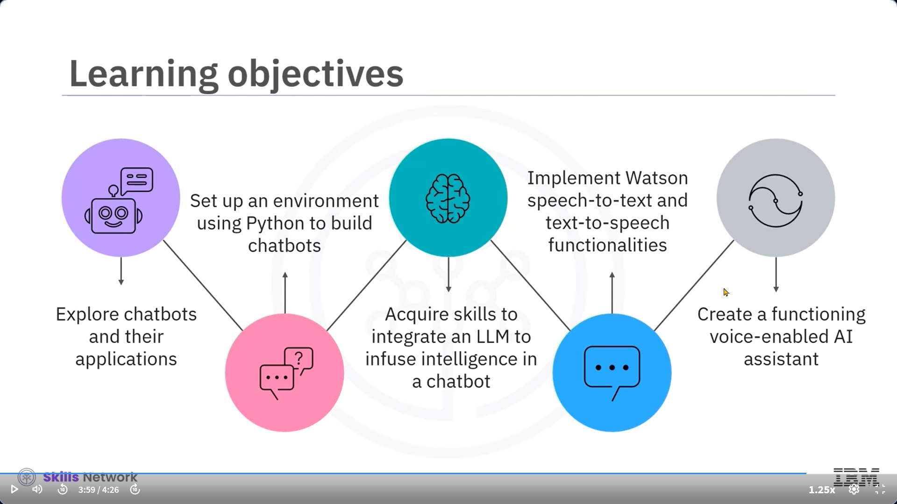

---

### 🧠 Proje Tanıtımı

Bu projeye genel bakış videosuna hoş geldiniz: OpenAI'nin GPT-3’ü ve IBM Watson ile Sesli Asistan Oluşturma. Ses tabanlı yapay zekâ alanı, teknolojiyle etkileşim biçimimizi hızla dönüştürüyor. Özellikle umut vaat eden bir uygulama alanı, akıllı sesli asistanlardır.

---

### 👩‍💼 Gerçek Hayattan Bir Senaryo

Yoğun bir şekilde sunum hazırlamaya çalışan bir profesyoneli düşünün. Elleri doluyken bilgisayarına erişemez. Ancak yapay zekâ asistanına sesli bir sorgu göndererek, “Elektrikli araçlarda yapay zekâ kullanımındaki temel eğilimleri özetle,” diyebilir ve böylece hem bilgi sahibi olup hem de üretken kalabilir.

---

### 🎙️ Sesli Asistanın Gücü

Sesli yapay zekâ asistanları, doğal konuşmalarla etkileşim kurmanıza, bilgiye erişmenize ve sadece sesinizin gücüyle yanıtlar bulmanıza imkân tanır. Bu projede OpenAI’nin GPT-3 modeli ve IBM Watson Embeddable AI kullanılarak bir sesli asistan oluşturacağız.

---

### 🧩 Kullanılacak Bileşenler

GPT-3 modeli, asistanın kullanıcı girişini anlamasını ve yanıt vermesini sağlar. Watson Speech to Text (STT), asistanın kullanıcı yanıtlarını duymasını ve anlamasını sağlar. Watson Text to Speech (TTS) ise asistanın yanıtları kullanıcıya sesli şekilde okumasını sağlar.

---

### 🛠️ IBM Watson Özellikleri

IBM Watson, Embed adı verilen ve konuşmayı metne, metni konuşmaya çeviren konteyner tabanlı kütüphaneleri barındırır. Bu kütüphaneler insan konuşmasına yanıt vermeyi, verileri işlemeyi ve bireylerin ya da şirketlerin sorunlarına çözüm bulmayı destekler.

---

### 🤖 Proje Kapsamı

Bu proje, sohbet robotlarını ve bunların uygulamalarını inceler. Sesli giriş alarak sesli yanıt veren yüksek zekâ seviyesine sahip çalışan bir asistan oluşturacaksınız.

---

### 🧪 Proje Adımları

Projeye Python ile asistan geliştirme ortamı oluşturarak başlayacaksınız. Ardından GPT-3 ile kendi asistanınızı oluşturup, IBM Watson’ı sesli girişleri anlaması için entegre edeceksiniz. Son olarak asistanı herkese açık bir sunucuya dağıtmayı öğreneceksiniz.

---

### 🎬 Demo Tanıtımı

Geliştireceğiniz sesli asistanın arayüzü “Voice Assistant” başlığını gösterir. Açık ve koyu mod arasında geçiş yapılabilir. Hem metin hem de sesle çalışır. Sorularınızı metin kutusuna yazarak ya da kayıt simgesine tıklayıp konuşarak sorabilirsiniz.

---

### 🔊 Yanıtlar ve Etkileşim

Örneğin, “Shakespeare’in trajedileri nelerdir?” sorusuna detaylı bir yanıt verir. Metni gösterir ve sesli olarak da yanıtlayarak metinden sese entegrasyonu sergiler. Konuşmayı yazarak veya sesli devam ettirebilirsiniz. “Hayır” veya “Teşekkürler” gibi komutlarla sohbeti sonlandırabilirsiniz.

---

### 🌐 Teknik Yapı

Sesli asistanın arayüzü HTML, CSS ve JavaScript ile oluşturulacak ve asistanla iletişim kuracaktır. Arka uç için Python ve Flask kullanılacak. Flask, web uygulamaları geliştirmek için bir çerçevedir ve proje kapsamında Docker ile desteklenir.

---

### 🧠 GPT-3 ve Watson Entegrasyonu

İlk olarak Watson Speech to Text entegrasyonu yaparak chatbot’un kullanıcıdan sesli giriş almasını sağlayacaksınız. Daha sonra GPT-3 ile chatbot’a zekâ kazandıracaksınız. Sonrasında Watson Text to Speech ile chatbot’un sesli yanıtlar verebilmesini sağlayacaksınız.

---

### 🧑‍💻 Gereken Bilgiler

Bu proje üzerinde çalışmak için Python ve Flask hakkında bilgi sahibi olmanız gerekir. Ayrıca HTML, CSS ve JavaScript hakkında temel düzeyde bilgi sahibi olmanız önerilir ama zorunlu değildir.

---

### 🎓 Öğrenecekleriniz

Bu proje sayesinde şu kazanımları elde edeceksiniz: sohbet robotlarını ve uygulamalarını keşfetmek, Python ile bir geliştirme ortamı kurmak, bir LLM ile zekâ kazandırmak, Watson’un sesli giriş/çıkış özelliklerini uygulamak ve çalışan bir sesli AI asistanı oluşturmak.

---

### 🏁 Sonuç

Bu proje, güçlü bir asistan geliştirme sürecine derinlemesine dalmanızı sağlayacak. Chatbot'lar ve Flask/Python ile web geliştirme konularında bilgi sahibi olacaksınız. GPT-3 ve IBM Watson yeteneklerini entegre ederek ses tanıma özellikli bir asistan oluşturacaksınız. Sonunda, API’leri kullanarak LLM’lerle çalışma konusunda uzmanlığınızı sergileyen tamamen işlevsel bir AI asistanı yaratmış olacaksınız.
