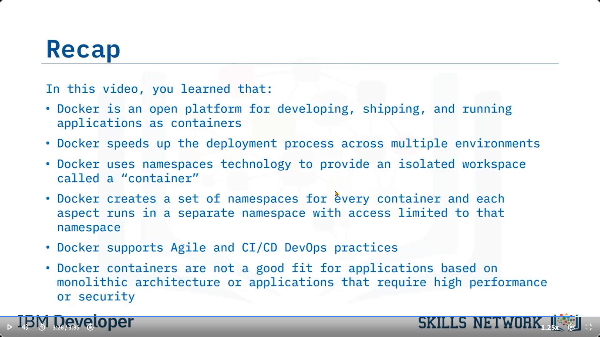

---

### 🚀 Docker’a Giriş

“Docker’a Giriş” videosuna hoş geldiniz. Bu videoyu izledikten sonra şunları yapabileceksiniz: Docker’ın ne olduğunu tanımlamak, Docker sürecini ve altında yatan teknolojiyi açıklamak, Docker konteynerlerinin faydalarını sıralamak ve bu konteynerlerle ilgili zorlukları tanımlamak.

---

### 📦 Docker Nedir?

2013’ten beri kullanılabilir olan Docker, resmi tanımıyla (parafraz edilmiştir): Uygulamaları konteynerler olarak geliştirmek, dağıtmak ve çalıştırmak için açık bir platformdur.

---

### 🌍 Neden Popüler?

Docker, basit mimarisi, yüksek ölçeklenebilirliği ve farklı platformlarda, ortamlarda ve konumlarda taşınabilirliği sayesinde geliştiriciler arasında popüler hale gelmiştir.

---

### 🔒 İzolasyon Özelliği

Docker, uygulamaları altyapıdan yalıtır; bu altyapıya donanım, işletim sistemi ve konteyner çalışma zamanı da dahildir.

---

### 🧬 Docker'ın Teknik Temeli

Docker, Go programlama diliyle yazılmıştır. İşlevlerini sunmak için Linux çekirdek özelliklerini kullanır. Ayrıca, “container” (konteyner) olarak adlandırılan izole bir çalışma alanı sağlamak için namespaces (isim alanları) kullanır.

---

### 🧱 Namespace Yapısı

Docker her konteyner için bir dizi namespace oluşturur. Her bileşen kendi namespace içinde çalışır ve erişim bu alanla sınırlıdır.

---

### 🛠️ Docker’ın İlham Verdiği Teknolojiler

Docker metodolojisi, şu gibi birçok yeniliğe ilham olmuştur:

* Tamamlayıcı araçlar: Docker CLI, Docker Compose, Prometheus,
* Eklentiler: Depolama eklentileri vb.,
* Orkestrasyon teknolojileri: Docker Swarm, Kubernetes,
* Geliştirme metodolojileri: Mikroservisler ve sunucusuz yapılar.

---

### ✅ Docker’ın Faydaları

Docker şu avantajları sunar:

* Tutarlı ve izole ortamlar sayesinde stabil uygulama dağıtımı.
* Dağıtımlar saniyeler içinde gerçekleşir.
* Küçük ve tekrar kullanılabilir Docker imajları geliştirme sürecini hızlandırır.
* Otomasyon özellikleri sayesinde hatalar azaltılır ve bakım kolaylaşır.
* Agile ve CI/CD DevOps uygulamalarını destekler.
* Sürümleme kolaydır; testler, geri alımlar ve yeniden dağıtımlar hızlanır.
* Uygulamalar bölümlere ayrılabilir, böylece yenileme, temizlik ve onarım kolaylaşır.
* Geliştiriciler daha hızlı iş birliği yapar ve gerektiğinde konteynerleri ölçeklendirir.
* Docker imajları platformdan bağımsızdır, bu da taşınabilirliği artırır.

---

### ⚠️ Docker’ın Uygun Olmadığı Durumlar

Docker şu özellikleri taşıyan uygulamalar için uygun değildir:

* Yüksek performans veya güvenlik gerektirenler,
* Monolitik mimariye sahip olanlar,
* Gelişmiş grafik arayüz kullananlar,
* Standart masaüstü ya da sınırlı işlevli uygulamalar.

---

### 📝 Özet

Bu videoda şunları öğrendiniz:

* Docker, uygulamaları konteynerler olarak geliştirmek, dağıtmak ve çalıştırmak için açık bir platformdur.
* Docker, dağıtım sürecini birçok ortamda hızlandırır.
* Docker, izole çalışma alanı sağlamak için namespaces teknolojisini kullanır.
* Agile ve CI/CD DevOps uygulamalarını destekler.
* Monolitik mimariye ya da yüksek güvenlik-performans gereksinimlerine sahip uygulamalar için uygun değildir.

