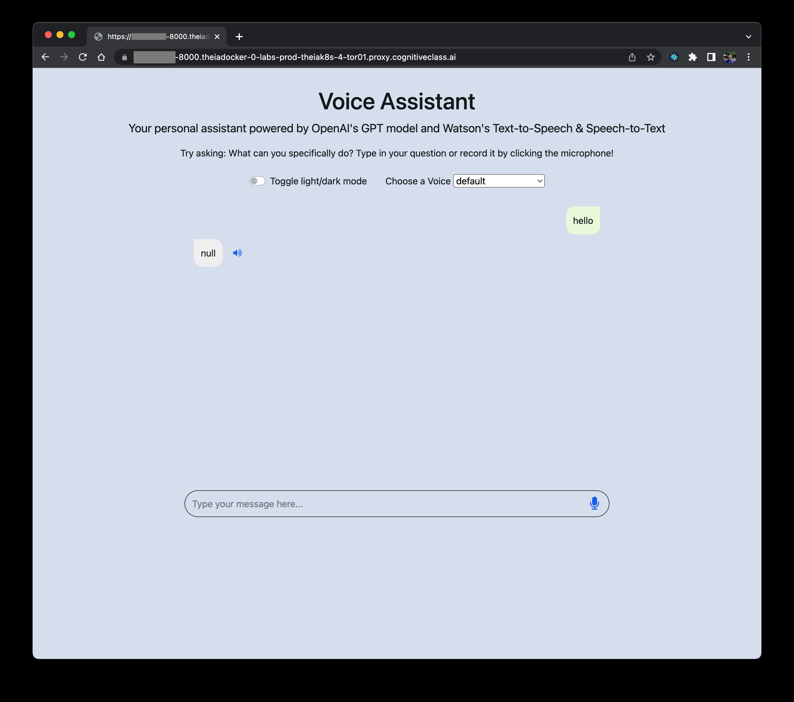
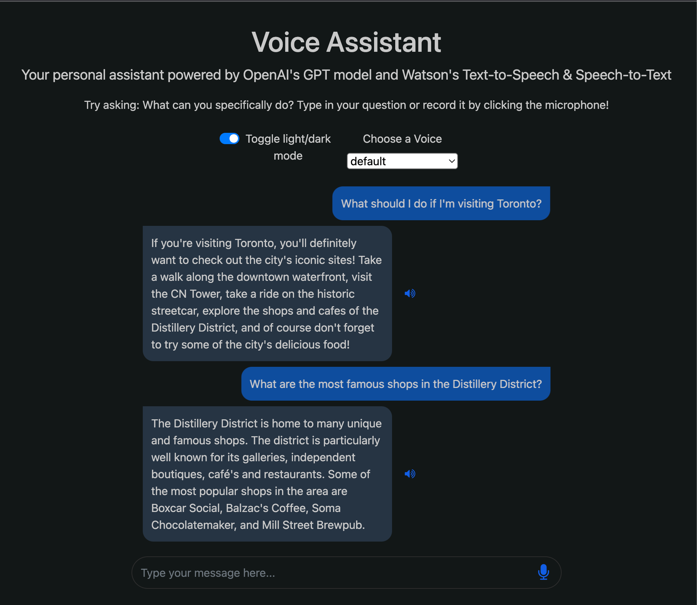

---

### 🤖 OpenAI GPT-3 ve IBM Watson ile Sesli Asistan Oluşturma

**Tahmini süre: 1 saat**

---

### 👋 Giriş

OpenAI ve IBM Watson Speech Libraries for Embed kullanarak bir sesli asistan oluşturma konulu bu rehberli projeye hoş geldiniz. Bu proje boyunca, sesli giriş alabilen, bu sesi konuşmadan metne teknolojisiyle yazıya çeviren, yazıyı OpenAI'nin GPT-3 modeline gönderen, modelden gelen yanıtı metinden sese çevirerek tekrar kullanıcıya sesli olarak sunan bir sanal asistan geliştireceksiniz. Asistan, HTML, CSS ve JavaScript ile oluşturulan duyarlı bir ön yüze ve Flask tabanlı güvenilir bir arka uca sahip olacak.

👉 [Buraya tıklayarak](#) oluşturacağınız uygulamanın demosunu inceleyebilirsiniz!

Bu kursun sonunda, sesli asistanlar hakkında derin bir anlayış kazanacak ve sesli giriş-çıkış yoluyla iletişim kurabilen yapay zekâ destekli kendi asistanınızı oluşturma becerisine sahip olacaksınız. Ayrıca Python, Flask, HTML, CSS ve JavaScript kullanarak web geliştirme konusunda sağlam bir temel edinmiş ve tamamlanmış bir full-stack uygulama yaratmış olacaksınız!

---

### 🧠 Konulara Genel Bakış

Başlamadan önce, her konunun bağlamına kısaca bakalım:

---

### 🌐 OpenAI

OpenAI, tüm insanlık için fayda sağlayacak dost yapay zekânın geliştirilmesini teşvik eden bir araştırma kuruluşudur. En önemli projelerinden biri olan  **GPT-3** , son derece gelişmiş bir doğal dil işleme (NLP) modelidir. Asistanınızda bu modeli kullanarak çeşitli kullanıcı girdilerini anlayıp yanıtlayabileceksiniz.

---

### 🗣️ IBM Watson Konuşma Kütüphaneleri (Embed)

 **IBM Watson® Speech Libraries for Embed** , konuşmadan metne (STT) ve metinden konuşmaya (TTS) dönüşüm sağlayan konteyner tabanlı kütüphanelerdir. Bu teknolojiler, IBM ortaklarının, sesli transkripsiyon ve ses sentezleme uygulamaları geliştirerek hibrit ve çoklu bulut ortamlarında hızla dağıtım yapmalarını sağlar. Bu kütüphaneler sayesinde asistan, kullanıcılarla sesli olarak iletişim kurabilir.

---

### 🎧 Sesli Asistanlar

Sanal asistan, özellikle internet üzerinden doğal insan sesiyle konuşmayı simüle edecek şekilde tasarlanmış bir programdır. Müşteri hizmetleri, e-ticaret ve eğitim gibi birçok sektörde kullanılabilir.

---

### 🐍 Python (Flask)

Python, web geliştirme ve veri bilimi alanında yaygın olarak kullanılan popüler bir programlama dilidir. **Flask** ise Python ile kolayca web uygulamaları geliştirmeyi sağlayan bir web framework’tür. Bu projede sesli asistanın arka ucunu Python ve Flask kullanarak oluşturacaksınız. Python, öğrenmesi kolay ve büyük bir kütüphane ekosistemine sahip güçlü bir dildir.

---

### 🌐 HTML - CSS - JavaScript

* **HTML** (Hypertext Markup Language): Web içeriğini yapılandırmak için kullanılır.
* **CSS** (Cascading Style Sheets): HTML belgelerinin görünümünü ve biçimlendirmesini tanımlar.
* **JavaScript** : Web sayfalarına etkileşim kazandırmak için yaygın olarak kullanılan bir programlama dilidir.

Bu teknolojiler bir araya gelerek asistan için görsel olarak çekici ve etkileşimli bir ön yüz oluşturmanızı sağlar. Kullanıcılar bu arayüz üzerinden sesli asistanla iletişim kurabilecek.

---

### 🎯 Öğrenme Hedefleri

Bu projenin sonunda aşağıdakileri yapabiliyor olacaksınız:

* Sesli asistanların temellerini ve kullanım alanlarını açıklamak
* Python, Flask, HTML, CSS ve JavaScript kullanarak geliştirme ortamı kurmak
* Kullanıcılardan sesli giriş almak için konuşmadan metne işlevselliğini uygulamak
* GPT-3 modeliyle entegrasyon yaparak asistanın kullanıcı isteklerine akıllıca yanıt vermesini sağlamak
* Yanıtları sesli olarak iletebilmek için metinden konuşmaya dönüşümü uygulamak
* Tüm bileşenleri birleştirerek sesli giriş alıp sesli yanıt verebilen işlevsel bir asistan oluşturmak
* (İsteğe bağlı) Asistanı daha geniş bir kitleye sunmak için bir web sunucusuna dağıtmak

---

### 📚 Ön Bilgiler

HTML/CSS, JavaScript ve Python hakkında temel bilgi sahibi olmak faydalı olacaktır; ancak bu bilgiler zorunlu değildir. Her adımı ve gösterilen kodları açıklamak için elimizden geleni yapacağız.


İşte metnin Türkçeye tam çevirisi, anlam bütünlüğüne göre paragraflara ayrılmış ve her bölüme uygun emoji başlıkları eklenmiştir:

---

### 🧭 Adım 1: Arayüzü Anlama

Bu projede amaç, bir sesli asistanla iletişimi mümkün kılan bir arayüz ve yanıtların gönderilip alınmasını yöneten bir arka uç oluşturmaktır.

---

### 💻 Kullanılan Teknolojiler

Ön yüz, **HTML, CSS ve JavaScript** kullanılarak geliştirilecektir. Temel stil vermek için  **Bootstrap** , ikonlar için  **Font Awesome** , işlemleri verimli bir şekilde yönetmek için **JQuery** gibi popüler kütüphaneler kullanılacaktır. Kullanıcı arayüzü, Google Asistan gibi diğer sesli asistan uygulamalarına benzer olacak şekilde tasarlanmıştır.

---

### 📁 Sağlanan Kod ve Hedef

Arayüz için gerekli kodlar sağlanmıştır. Bu kursun ana odağı, sesli asistanın oluşturulması ve çeşitli servisler ve API’lerle entegre edilmesidir. Sağlanan kod, ön yüz ve arka uç arasındaki etkileşimi anlamanıza yardımcı olacak; bu kodlar üzerinde çalıştıkça, hangi bölümlerin önemli olduğunu ve nasıl çalıştıklarını öğrenerek basit bir web sayfasının nasıl oluşturulduğunu kavrayacaksınız.

---

### 🔧 Proje Yapısını Klonlama

Aşağıdaki komutları çalıştırarak proje yapısını edinebilir, ismini değiştirerek farklı bir adla kaydedebilir ve ardından bu dizine geçebilirsiniz:

```bash
git clone https://github.com/ibm-developer-skills-network/bkrva-chatapp-with-voice-and-openai-outline.git
mv bkrva-chatapp-with-voice-and-openai-outline chatapp-with-voice-and-openai-outline
cd chatapp-with-voice-and-openai-outline
```

---

### 🌐 HTML, CSS ve JavaScript Yapısı

* **index.html** : Web arayüzünün yapısını ve düzenini tanımlar. JQuery, Bootstrap, FontAwesome gibi harici kütüphanelerin yanı sıra style.css ve script.js dosyalarının dahil edildiği ana HTML dosyasıdır.
* **style.css** : Sayfa bileşenlerinin görsel görünümünü özelleştirir. CSS keyframe animasyonları ile yükleme animasyonlarını yönetir. Keyframe’ler, zaman içinde animasyon değerlerini tanımlayarak stil geçişlerini yumuşak ve dinamik hale getirir.
* **script.js** : Sayfanın etkileşimini ve işlevselliğini sağlar. Çoğu işlev bu dosyada yer alır. Aydınlık/Karanlık mod arasında geçiş, mesaj gönderme ve yeni mesajları ekranda gösterme gibi işlevleri içerir. Ayrıca kullanıcıların ses kaydı yapmasını da sağlar.

---

### 🖼️ Arayüz Görselleri

Aşağıda, size sağlanan ön yüzün bazı görselleri bulunmaktadır:

#### ☀️ Aydınlık Mod

Bu, temel kodun nasıl çalıştığını gösterir. Yanıt olarak yalnızca “null” döndürür, çünkü henüz asistan işlevi eklenmemiştir.

---




### 🌙 Karanlık Mod

Projeyi tamamladığınızda, asistanınız net yanıtlar verebilecek hale gelecektir. Aşağıda gösterildiği gibi bu yanıtlar, karanlık mod arayüzünde de düzgün şekilde görüntülenecektir:

**Karanlık Mod**





İşte metnin Türkçeye çevirilmiş hali, konu bütünlüğüne uygun paragraflar ve başlıklarla:

---

### 🖥️ Adım 2: Sunucuyu Anlama

Uygulamanın çalışmasını ve tüm servislerle iletişim kurmasını sağlayan yapı  **sunucudur** . Flask, Python için geliştirilmiş bir web uygulama çatısıdır ve bu proje kapsamında uygulamanın arka ucu olarak kullanılacaktır. Hafif ve basit yapısıyla, web uygulamaları geliştirmeyi hızlı ve kolay hale getirir.

---

### 🛠️ Flask ile Neler Yapılabilir?

Flask ile karmaşık kodlara veya ek araçlara ihtiyaç duymadan web sayfaları ve uygulamaları oluşturabilirsiniz. Kendi rotalarınızı (routes) tanımlayabilir, kullanıcı isteklerini (requests) işleyebilir ve harici API’lerle veri alışverişi yapabilirsiniz.

---

### 🧩 Bu Projede Flask’ın Rolü

Bu rehberli projede Flask, sesli asistanın arka ucunu yönetmek için kullanılır. Yani Flask ile uygulama rotaları oluşturacak, HTTP isteklerini ve yanıtlarını işleyeceksiniz. Kullanıcı ön yüzde sesli asistanla etkileşime geçtiğinde, bu istek Flask sunucusuna gönderilir. Flask bu isteği işleyip ilgili servise yönlendirir.

---

### 📄 server.py Dosyasına Genel Bakış

**server.py** dosyasında sunucunun temel yapısını oluşturan kodlar yer alır.

* Dosyanın en üst kısmında çeşitli **import** ifadeleri bulunur. Bunlar, dış kütüphane ve modülleri içe aktarmak içindir.
  * Örneğin `speech_to_text`, **worker.py** dosyasında yer alan bir fonksiyondur.
  * `openai` ise GPT-3 modelini kullanabilmek için yüklenmesi gereken bir pakettir.

Bu kütüphaneler sayesinde konuşmadan metne ve GPT-3 modeline kolayca erişebilir, sundukları işlevleri kullanabilirsiniz.

---

### 🚦 Flask Uygulamasının Başlatılması

Import işlemlerinin hemen ardından, Flask uygulaması başlatılır ve **CORS politikası** ayarlanır.

CORS, web sayfalarının farklı alan adlarına istek göndermesine izin vermek veya bunu engellemek için kullanılır. Şu anda `*` olarak ayarlanmıştır, yani tüm isteklere izin verilir.

---

### 🔁 server.py İçeriği

**server.py** dosyasında üç adet rota (route) fonksiyonu ve sunucuyu başlatan kod yer alır.

İlk rota şu şekildedir:

```python
@app.route('/', methods=['GET'])
def index():
    return render_template('index.html')
```

Kullanıcı uygulamayı yüklemeye çalıştığında, önce `/` yoluna bir istek gönderir. Bu istek, yukarıdaki `index` fonksiyonunu tetikler ve `index.html` dosyası (ön yüz arayüzü) tarayıcıya gönderilir.

---

### 🔄 Diğer Rotalar

İkinci ve üçüncü rotalar ise tüm isteklerin işlenmesini ve uygulamalar arası veri alışverişini sağlayacaktır. Bu rotalar, kullanıcıdan gelen veriyi işler, ilgili servise yönlendirir ve cevabı döner.

---

### 🚀 Sunucunun Başlatılması

Uygulama, şu komutla başlatılır:

```python
app.run(host='0.0.0.0', port=8080)
```

Bu komut, uygulamanın 8080 portunda ve `0.0.0.0` (yani localhost) adresinde çalışmasını sağlar.

---

### 🔜 Sıradaki Adım

Bir sonraki bölümlerde, bu dosyada yer alan **`process_prompt_route`** ve **`speech_to_text_route`** fonksiyonlarının nasıl tamamlanacağını öğreneceksiniz. Ayrıca bu paketlerin ve uç noktaların (endpoint) nasıl kullanılacağını detaylıca anlayacaksınız.

---

### 🧪 Adım 3: Uygulamayı Çalıştırmak

 **Docker** , bir uygulamayı ve onun bağımlılıklarını birlikte paketleyen “konteynerler” oluşturmanıza imkân tanır. Bu sayede uygulama, hangi ortamda çalıştırılırsa çalıştırılsın tutarlı bir şekilde çalışır. Docker imajları kullanılarak uygulama oluşturmak ve çalıştırmak, dağıtım sürecini oldukça kolaylaştırır. Docker yüklü herhangi bir makinede aynı imaj çalıştırılabilir. Bu, uygulamanın geliştirme, test ve üretim ortamlarında aynı şekilde çalışmasını sağlar.

---

### 📂 Gerekli Dosyalar Hazır

1. adımda `git clone` ile indirdiğiniz proje, Dockerfile ve requirements.txt dosyalarını içermektedir. Bu dosyalar, bağımlılıkların yüklü olduğu bir Docker imajı oluşturmak için kullanılır.

**Dockerfile** incelendiğinde yapısının oldukça basit olduğu görülür:

* Bir Python ortamı oluşturur,
* Yerel dizindeki dosyaları konteynere taşır,
* Gerekli paketleri kurar,
* Uygulamayı çalıştırır.

---

### 🧱 3 Farklı Konteyner Gerekli

Uygulamanın çalışabilmesi ve Sesli-Giriş (STT) ile Sesli-Çıkış (TTS) özelliklerinin kullanılabilmesi için üç ayrı konteynerin aynı anda çalıştırılması gerekir.

#### 🔹 Küçük Ön Hazırlık

Aşağıdaki komutlar, bazı ön koşulları hızlıca yerine getirmek için çalıştırılmalıdır:

```bash
mkdir /home/project/chatapp-with-voice-and-openai-outline/certs/
cp /usr/local/share/ca-certificates/rootCA.crt /home/project/chatapp-with-voice-and-openai-outline/certs/
```

---

### 🚀 1. Uygulamayı Başlatmak

Uygulama küçük olduğu için imaj oldukça hızlı derlenir. Aşağıdaki komutlar:

* Dockerfile’daki talimatlarla uygulamayı derler,
* Konteynere `voice-chatapp-powered-by-openai` etiketi verir,
* Uygulamayı 8000 portunda ön planda çalıştırır.

```bash
docker build . -t voice-chatapp-powered-by-openai
docker run -p 8000:8000 voice-chatapp-powered-by-openai
```

🧠 Not:

* Uygulama, yeni bir sekmede açılmalıdır çünkü bu ortamın mini tarayıcısı bazı özellikleri desteklememektedir.
* Tarayıcınız “açılır pencere” isteğini engellerse, izin vermeniz gerekir.

⏹️ Uygulama çalışırken her girdi için şimdilik "null" döner. Çalıştırmayı durdurmak için **Ctrl + C** tuş kombinasyonunu kullanın.

⚠️ Uygulama sadece konteyner çalışırken aktif olur. Dosyalarda bir değişiklik yaptıysanız test edebilmek için imajı yeniden oluşturmalısınız.

---

### 🎤 2. Konuşmadan Metne Servisini Başlatmak

 **Skills Network** , ortamda otomatik olarak çalışan kendi Watson STT (Speech-to-Text) imajını sağlar. Bu servise şu uç nokta (endpoint) ile erişebilirsiniz:

```python
base_url = "https://sn-watson-stt.labs.skills.network"
```

Test etmek için:

```bash
curl https://sn-watson-stt.labs.skills.network/speech-to-text/api/v1/models
```

Yanıt olarak, tanıyabildiği dillerin bir listesi gelecektir:

```json
{
  "models": [
    {
      "name": "en-US_Multimedia",
      "language": "en-US",
      "description": "US English multimedia model for broadband audio (16kHz or more)"
    },
    {
      "name": "fr-FR_Multimedia",
      "language": "fr-FR",
      "description": "French multimedia model for broadband audio (16kHz or more)"
    }
  ]
}
```

---

### 🔊 3. Metinden Konuşmaya Servisini Başlatmak

 **Skills Network** , aynı zamanda Watson TTS (Text-to-Speech) imajını da otomatik olarak sağlar. Bu servise şu uç nokta (endpoint) ile erişebilirsiniz:

```python
base_url = "https://sn-watson-tts.labs.skills.network"
```

Test etmek için:

```bash
curl https://sn-watson-tts.labs.skills.network/text-to-speech/api/v1/voices
```

Yanıt olarak kullanılabilecek seslerin listesi dönecektir:

```json
{
  "voices": [
    {
      "name": "en-US_EmilyV3Voice",
      "language": "en-US",
      "gender": "female",
      "description": "Emily: American English female voice. Dnn technology."
    },
    {
      "name": "en-GB_JamesV3Voice",
      "language": "en-GB",
      "gender": "male",
      "description": "James: British English male voice. Dnn technology."
    },
    {
      "name": "fr-CA_LouiseV3Voice",
      "language": "fr-CA",
      "gender": "female",
      "description": "Louise: French Canadian female voice. Dnn technology."
    }
  ]
}
```


---

### 🧠 Adım 5: OpenAI API Entegrasyonu

Şimdi sesli asistanınıza bir **beyin** verme zamanı! OpenAI’nin **GPT-3.5 API** gücüyle, yazıya dökülmüş metni modele gönderip, sorularınıza yanıtlar alabileceksiniz.

📝  **Not** : Normalde OpenAI API kullanımı için bir API anahtarı gerekir. Ancak bu laboratuvar ortamında bu işlem sizin yerinize zaten yapılmıştır, dolayısıyla doğrudan projeye devam edebilirsiniz.

---

### 🔁 openai_process_message Fonksiyonu

Bu adımda `worker.py` dosyasında yer alan `openai_process_message` adlı fonksiyonu güncelleyeceksiniz. Bu fonksiyon, kullanıcıdan gelen mesajı OpenAI GPT-3.5 API'sine iletir ve yanıt alır — ChatGPT’de “gönder” düğmesine basmak gibi düşünebilirsiniz.

📄 `worker.py` dosyasına aşağıdaki kodu ekleyin:

```python
def openai_process_message(user_message):
    # OpenAI API için sistem mesajı tanımlanıyor
    prompt = "Act like a personal assistant. You can respond to questions, translate sentences, summarize news, and give recommendations."
  
    # OpenAI API çağrısı
    openai_response = openai_client.chat.completions.create(
        model="gpt-3.5-turbo",
        messages=[
            {"role": "system", "content": prompt},
            {"role": "user", "content": user_message}
        ],
        max_tokens=4000
    )
  
    print("openai response:", openai_response)
  
    # API yanıtından içerik alınır
    response_text = openai_response.choices[0].message.content
    return response_text
```

---

### 🧩 Açıklama

Bu fonksiyonun yapısı oldukça basittir ve OpenAI kütüphanesinin kolay kullanımı sayesinde anlaşılması rahattır.

#### 🗣️ Kişilik Kazandırma

Modelin nasıl davranacağını belirlemek için sistem mesajı tanımlanır:

> "Act like a personal assistant..."

Bu mesajda, modelin bir kişisel asistan gibi davranması istenir ve görevleri belirtilir:

* Soruları yanıtlamak
* Cümleleri çevirmek
* Haberleri özetlemek
* Önerilerde bulunmak

Kullanıcı mesajı daha sonra `user` rolünde modele iletilir. Bu yapı, modelin yanıtlarının daha anlamlı ve insana yakın olmasını sağlar.

---

### 🧪 Parametreler

Fonksiyonun içinde kullanılan `openai_client.chat.completions.create` metoduna üç önemli parametre verilir:

* **`model`** : Kullanılacak OpenAI modeli. Burada `"gpt-3.5-turbo"` kullanılıyor.
* **`messages`** : Konuşma akışını tanımlar. `system` mesajı modeli yönlendirir, `user` mesajı kullanıcıdan gelen girdidir.
* **`max_tokens`** : Modelin oluşturacağı maksimum yanıt uzunluğudur. 30 token yaklaşık 1-2 cümle eder. Burada 4000 olarak ayarlanmış — modelin desteklediği maksimum uzunluk.

Bu parametreleri ihtiyacınıza göre özelleştirebilir, denemek isterseniz OpenAI Playground’da test edebilirsiniz.

---

### 📦 Yanıtın Yapısı

API'den gelen yanıt aşağıdaki gibi bir JSON formatındadır:

```json
{
  "choices": [
    {
      "message": {
        "content": "Modelin verdiği yanıt"
      }
    }
  ]
}
```

Dolayısıyla, modeli çağırdıktan sonra `openai_response.choices[0].message.content` ile yanıt alınır ve bu yanıt `response_text` değişkenine atanarak döndürülür.


---

### 🔊 Adım 6: Watson Metinden Konuşmaya (Text-to-Speech) Entegrasyonu

Şimdi asistanınıza  **bir ses verelim** ! OpenAI tarafından oluşturulan metin yanıtını, Watson Text-to-Speech teknolojisiyle sese dönüştüreceğiz. Böylece kişisel asistanınız, yanıtı size sesli okuyacak ve deneyimi daha gerçekçi hale getirecek — tıpkı Google Asistan, Alexa ya da Siri gibi.

---

### 🗣️ Metinden Konuşmaya Fonksiyonu

`worker.py` dosyasında yer alacak olan `text_to_speech` fonksiyonu, veriyi Watson’un Text-to-Speech API’sine göndererek sesli çıktı elde eder.

Bu fonksiyon, daha önce kullandığınız `speech_to_text` fonksiyonuna oldukça benzeyecek çünkü yine `requests` kütüphanesini kullanarak bir HTTP isteği göndereceğiz.

🔁  **Not** : `base_url` değişkenindeki `...` kısmını kendi Watson TTS model URL’inizle değiştirin (örneğin: `https://sn-watson-tts.labs.skills.network`).

📄 `worker.py` dosyasına aşağıdaki kodu ekleyin:

```python
def text_to_speech(text, voice=""):
    # Watson Text-to-Speech API URL’si
    base_url = 'https://sn-watson-tts.labs.skills.network'
    api_url = base_url + '/text-to-speech/api/v1/synthesize?output=output_text.wav'
  
    # Tercih edilen ses varsa URL’ye eklenir
    if voice != "" and voice != "default":
        api_url += "&voice=" + voice
  
    # HTTP isteği için başlıklar
    headers = {
        'Accept': 'audio/wav',
        'Content-Type': 'application/json',
    }

    # HTTP isteği gövdesi (body)
    json_data = {
        'text': text,
    }

    # Watson TTS servisine HTTP POST isteği gönder
    response = requests.post(api_url, headers=headers, json=json_data)
    print('text to speech response:', response)
    return response.content
```

---

### 📄 Açıklama

Bu fonksiyon şu parametreleri alır:

* `text`: Sesli olarak okunacak metin
* `voice`: Tercih edilen ses (boş veya “default” değilse API’ye eklenir)

#### 🧱 Kullanılan Yapılar:

1. **API URL** : `api_url` değişkeninde tanımlıdır. Eğer kullanıcı özel bir ses tercih ettiyse, `voice` parametresi URL’ye eklenir.
2. **Header (Başlık)** :

* `'Accept': 'audio/wav'` ⇒ Ses verisinin wav formatında olacağını belirtir.
* `'Content-Type': 'application/json'` ⇒ Gönderilecek verinin JSON formatında olduğunu belirtir.

1. **Body (Gövde)** :

* `json_data = {'text': text}` ⇒ API’ye gönderilecek metin burada yer alır.

---

### 📤 API Çağrısı ve Yanıt

`requests.post()` metodu ile HTTP POST isteği gönderilir.

* `api_url`, `headers` ve `json_data` parametre olarak verilir.
* API’nin yanıtı `response.content` ile alınır. Bu içerik, oluşturulan ses verisini (wav) içerir.

📦 API yanıt yapısı aşağıdaki gibidir:

```json
{
  "response": {
    "content": "İşlenmiş metnin ses verisi"
  }
}
```

Bu nedenle, işlenmiş ses verisini almak için sadece `response.content` döndürülür.


---

### 🔗 Adım 7: Her Şeyi Birleştirme – Flask API Uç Noktalarını Oluşturma

Artık önceki adımlarda tanımladığımız fonksiyonları kullanarak tüm bileşenleri bir araya getirme ve sesli asistanımızı tamamlama zamanı geldi.

Bu adımda değişiklikler `server.py` dosyasında yapılacaktır.

---

### 📥 Fonksiyonların İçe Aktarılması

`server.py` dosyasına `worker.py` içindeki fonksiyonlar zaten içe aktarılmış durumda:

```python
from worker import speech_to_text, text_to_speech, openai_process_message
```

Bu sayede `server.py`, bu fonksiyonlara erişebilir.

---

### 🎙️ Speech-to-Text Uç Noktası

Bu rota, kullanıcının ses kaydını alır ve onu yazıya çevirir.

📄 Kod:

```python
@app.route('/speech-to-text', methods=['POST'])
def speech_to_text_route():
    print("processing speech-to-text")
    audio_binary = request.data  # Ses verisini al
    text = speech_to_text(audio_binary)  # Metne çevir
    response = app.response_class(
        response=json.dumps({'text': text}),
        status=200,
        mimetype='application/json'
    )
    print(response)
    print(response.data)
    return response
```

📌 Açıklama:

* `request.data` ile gelen ses alınır.
* Bu veri `speech_to_text()` fonksiyonuna gönderilir.
* Sonuç JSON formatında kullanıcıya döndürülür.

---

### 💬 process-message Uç Noktası

Bu rota, kullanıcının metin mesajını alır, GPT-3.5 ile işleyip yazılı yanıt alır ve Watson TTS ile bu yanıtı ses dosyasına çevirir.

📄 Kod:

```python
@app.route('/process-message', methods=['POST'])
def process_message_route():
    user_message = request.json['userMessage']  # Kullanıcının metni
    print('user_message', user_message)
    voice = request.json['voice']  # Kullanıcının seçtiği ses
    print('voice', voice)

    # OpenAI ile işlenmiş metni al
    openai_response_text = openai_process_message(user_message)

    # Boş satırları temizle
    openai_response_text = os.linesep.join([s for s in openai_response_text.splitlines() if s])

    # Metni sese çevir
    openai_response_speech = text_to_speech(openai_response_text, voice)

    # Ses dosyasını base64'e çevir
    openai_response_speech = base64.b64encode(openai_response_speech).decode('utf-8')

    # JSON yanıt oluştur
    response = app.response_class(
        response=json.dumps({
            "openaiResponseText": openai_response_text,
            "openaiResponseSpeech": openai_response_speech
        }),
        status=200,
        mimetype='application/json'
    )
    print(response)
    return response
```

---

### 📌 Açıklama

1. `request.json['userMessage']` → Kullanıcının mesajı alınır.
2. `request.json['voice']` → Seçilen ses profili alınır.
3. `openai_process_message()` → GPT-3.5 ile mesaj işlenir.
4. Boş satırlar temizlenir.
5. `text_to_speech()` ile metin sese çevrilir.
6. Ses dosyası base64 formatına çevrilir (JSON uyumlu hale getirilir).
7. JSON yanıt içinde hem metin hem de ses formatında kullanıcıya döndürülür.

---

Bu adım ile uygulamanız artık tam işlevsel bir **sesli asistan** haline gelir: kullanıcı sesli konuşur, sistem metne çevirir, GPT-3 yanıtlar üretir, ve Watson bu yanıtı sesli olarak geri iletir. 🎉


---

### 🧪 Adım 8: Kişisel Asistanınızı Test Etme

Asistanınız artık **tamamlandı** ve kullanıma hazır! 🎉

Bu noktada kodda oldukça fazla değişiklik yaptığınız için Docker imajını **yeniden derlemek** ve uygulamanın doğru çalışıp çalışmadığını test etmek en uygun zamandır.

---

### 🔄 Docker İmajını Yeniden Oluşturma ve Çalıştırma

Text-to-Speech ve Speech-to-Text model URL’lerinin doğru şekilde ayarlandığını varsayarsak, aşağıdaki komutları kullanarak uygulamanın Docker imajını yeniden oluşturup çalıştırabilirsiniz:

📦 **Çalışan bir konteyner varsa önce durdurun:**

**Ctrl + C** tuşlarına aynı anda basarak konteyneri sonlandırın.

🔧 **İmajı yeniden oluşturun ve çalıştırın:**

```bash
docker build . -t voice-chatapp-powered-by-openai
docker run -p 8000:8000 voice-chatapp-powered-by-openai
```

---

### 🌐 Uygulamayı Açma

Uygulamanızı yeni bir sekmede açın (veya daha önceden açık bir sekme varsa sayfayı yenileyin).

🧠  **Unutmayın** : Tarayıcınız yeni sekmenin açılmasını engelleyebilir. Uygulamanın düzgün çalışması için açılır pencerelere izin verin.

---

### 🧪 Test Etmeyi Unutmayın

Uygulamanın tüm giriş türlerini ve işlevlerini test edin:

* Mesaj kutusuna yazarak metin gönderin
* Mikrofona tıklayarak sesli mesaj gönderin
* Yanıtların hem metin hem ses olarak geldiğini kontrol edin

---


---

### 🎉 Sonuç

OpenAI ile kendi sesli asistanınızı oluşturduğunuz bu rehberli projeyi başarıyla tamamladığınız için  **tebrikler** ! Bu süreçte asistan teknolojileri ve web geliştirme konularında bilgi edinmiş olmanızı ve artık bu projeyi daha da ileri taşımak için gerekli becerilere sahip olmanızı umuyoruz.

---

### 🧩 Neler Öğrendiniz?

Bu proje boyunca bir sesli asistanı oluşturan birçok bileşeni öğrendiniz:

* **Konuşmadan metne (Speech-to-Text)** teknolojisi
* **GPT-3 ile doğal dil işleme (NLP)**
* **Metinden konuşmaya (Text-to-Speech)** teknolojisi
* **Python, Flask, HTML, CSS ve JavaScript** ile web geliştirme

---

### 🤖 Gelecek İçin İlham

Bu yolculuğa bizimle çıktığınız için teşekkür ederiz. Yapay zekâ alanında öğrenmeye ve keşfetmeye devam etmenizi teşvik ediyoruz. Öğrendiğiniz becerilerle **sorumlu, etik ve topluma faydalı** asistanlar geliştirebilirsiniz. Gelecekte ortaya koyacağınız harika projeleri sabırsızlıkla bekliyoruz!

---

### 🚀 Sonraki Adımlar

Artık Speech-to-Text ve Text-to-Speech yetenekleriyle bir uygulama geliştirdiğinize göre, bu teknolojileri kendi uygulamalarınızda kullanmak istiyorsanız aşağıdaki bağlantılar aracılığıyla IBM Watson Embed sürümüne ücretsiz olarak kaydolabilirsiniz:

* [Speech-to-Text (Konuşmadan Metne)](#)
* [Text-to-Speech (Metinden Konuşmaya)](#)

---

### ✨ Prompt Engineering ile Gücü Katlayın

Bu rehberli projenin en güzel yanı, oluşturduğunuz sesli asistanın **prompt engineering** yoluyla çok daha fazlasını yapabilecek hale gelmesidir.

> **Prompt Engineering** : Doğal dil işleme modeline (örneğin GPT-3) istenen türde yanıtlar alabilmek için uygun girdi ("prompt") hazırlama sürecidir.

---

### 🎭 Kullanım Senaryoları Örnekleri

#### 🧘‍♀️ Terapi Asistanı

Kullanıcılara duygusal destek veren bir asistan oluşturmak için şu şekilde başlayabilirsiniz:

**“Merhaba, bugün çok stresliyim ve bunalmış hissediyorum. Duygularımla nasıl başa çıkabilirim?”**

Model, empatik ve cesaretlendirici yanıtlar verebilir.

#### 🔧 Mekanik Asistan

Araç arızalarını analiz eden bir asistan için örnek prompt:

**“Aracım hızlanırken garip bir ses çıkarıyor. Sebebi ne olabilir?”**

Model, olası nedenleri açıklayabilir ve çözüm önerileri sunabilir.

#### 📖 Hikâye Anlatıcısı

Orijinal hikâyeler oluşturan bir asistan için başlangıç:

**“Bir zamanlar bir kalede yaşayan genç bir prenses vardı. Bir gün hayatını sonsuza dek değiştiren sihirli bir hediye aldı. Bu hediye neydi ve hayatı nasıl değişti?”**

Model, yaratıcı ve özgün hikâyeler üretebilir.

#### 🎓 Profesör

Eğitici bir asistan için örnek prompt:

**“Bu derste madde özelliklerini öğreneceğiz. Maddenin üç hali nedir?”**

Model, hem açıklama sunabilir hem de kısa bir quiz hazırlayabilir.

---

### 💡 Sonuç ve Potansiyel

Yalnızca doğru şekilde kurgulanmış prompt’larla, GPT-3’ü kullanarak çok amaçlı ve yüksek değerli bir sesli asistan oluşturabilirsiniz. Geriye sadece bu deneyimi güzel bir kullanıcı arayüzü (UI/UX) ile sarmak kalıyor…

Ve işte karşınızda:  **milyon dolarlık bir fikir** ! 💸

---

İstersen bu projeyi nasıl ürünleştireceğini, dağıtacağını ya da daha fazla özellik ekleyerek nasıl geliştireceğini de birlikte planlayabiliriz. Hazır mısın? 🚀
