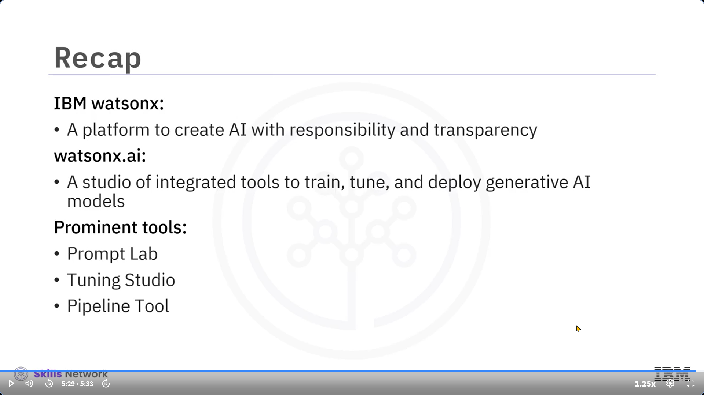

---

### 🎬 Giriş: IBM watsonx.ai'ye Hoş Geldiniz

[MÜZİK] IBM watsonx.ai’ye hoş geldiniz. Bu videoyu izledikten sonra, IBM watsonx.ai'nin yeteneklerini ve özelliklerini açıklayabilecek ve watsonx.ai'de mevcut olan yaygın araçları tanımlayabileceksiniz.

---

### 🤖 Eğlenceden İşe: Yapay Zeka'nın Ciddiyeti

Yapay zekayla şiir, sanat ya da şarkı üretmek eğlencelidir, ancak AI iş dünyasına uygulandığında daha büyük düşünmeniz gerekir. İşletmeler için yapay zeka, gereksinimlere ve daha yüksek standartlara dayanarak inşa edilmelidir. İşinizin merkezine AI yerleştirdiğinizde, güvenilir, güvenli, ölçeklenebilir ve uyarlanabilir olmalıdır.

---

### 🧩 watsonx Platformu ve Bileşenleri

IBM watsonx, işletmelerin yapay zekadan faydalanmasına yardımcı olan entegre bir AI ve veri platformudur. Platform üç üründen oluşur:

1. **watsonx.ai** – Yeni temel modeller (foundation models), üretken yapay zeka ve makine öğrenimi için bir stüdyo.
2. **watsonx.data** – Veri deposu.
3. **watsonx.governance** – İzleme ve yönetişim araç takımı.

Bu videoda odak noktamız **watsonx.ai** olacaktır.

---

### 🛠 watsonx.ai Nedir ve Neler Yapabilirsiniz?

watsonx.ai, temel modellerle desteklenen entegre araçların bulunduğu bir stüdyodur. Üretken yapay zeka ile çalışmak ve makine öğrenimi modelleri oluşturmak için kullanılır.

watsonx.ai ile:

* Temel modelleri eğitebilir, ayarlayabilir (tune), dağıtabilir ve yönetebilirsiniz.
* Makine öğrenimi modelleri oluşturabilir, temel modellerle deney yapabilir ve AI yaşam döngüsünü yönetebilirsiniz.

---

### 📚 AI Yaşam Döngüsü ile Uyumlu Görevler ve Araçlar

Amaçlarınıza göre watsonx.ai üzerindeki görevleri seçebilirsiniz. Bu görevler platformdaki araçlar ile gerçekleştirilir. AI yaşam döngüsünün adımlarına paralel olarak:

* Verilerinizi hazırlarsınız,
* Deneyler oluşturur ve modelleri eğitirsiniz,
* Modelleri dağıtır ve uygulamalarınızı oluşturmaya başlarsınız,
* Son olarak bu modelleri ve süreçleri yönetirsiniz.

---

### 🧠 Modeller, Deneyler ve Prompt Lab

watsonx.ai, Hugging Face’ten seçilmiş açık kaynak modellerin yanı sıra IBM tarafından eğitilmiş çeşitli boyut ve mimarilerde temel modeller sunar. Kendi modellerinizi ve verilerinizi de platforma getirebilirsiniz.

**Prompt Lab** aracı ile, üretken yapay zeka görevleri (soru-cevap, içerik üretimi, özetleme, metin sınıflandırma ve çıkarım gibi) için özel istemler oluşturabilir ve deneyler yapabilirsiniz.

---

### 🎯 Özelleştirme ve Tuning Studio

Kendi verilerinize göre modelleri özelleştirmek istiyorsanız, **Tuning Studio** aracı ile bunu yapabilirsiniz. Bu araç, az sayıda örnekle (örneğin 100 veri) model ayarlaması yapmanıza olanak tanır. Gelişmiş tuning yöntemleri birkaç tıklama ile uygulanabilir.

---

### 🔄 Otomasyon: Pipeline Aracı

Modeli bir ürüne dönüştürmek çok adımlı bir süreçtir. Bu süreci yönetmek ve otomatikleştirmek için **Pipeline aracı** kullanılır. Bu araç ile veri yükleme, model eğitimi, dağıtımı ve değerlendirme işlemlerini otomatikleştirebilirsiniz. Bu sayede üretime geçiş süresi kısalır ve modelin doğruluğu ile güvenilirliği artar.

---

### 🧑‍💻 İşbirliği ve Güvenlik

watsonx.ai’nin farklı araçları, işbirlikçi bir ortam yaratarak AI modelleri için iş akışlarını kolaylaştırır. Artık modeller yalnızca belirli görevler için değil, güçlü AI uygulamaları oluşturmak için daha az veriyle daha kısa sürede eğitilebilir.

* **Prompt Laboratory** : İhtiyacınıza uygun istemler oluşturmak ve geliştirmek için kullanımı kolay bir araçtır.
* **Tuning Studio** : İşletmeniz için modeli özelleştirmenizi sağlar.
* **Enterprise Deployment** : Modelinizi kurumsal ölçekte dağıtarak uygulamanızı oluşturmaya başlayabilirsiniz.

---

### 🔐 Veri Gizliliği ve Güvenliği

IBM watsonx.ai, çalıştığınız veri ve modellerin güvenliğini garanti eder. Verileriniz ve oluşturduğunuz modeller yalnızca size özeldir. Verileriniz şifrelenmiş formatta saklanır ve oluşturduğunuz modeller hesabınıza özeldir. IBM, verilerinize veya modellerinize erişemez ve izniniz olmadan hiçbir şekilde kullanılamaz.

---

### ✅ Genel Değerlendirme

Bu videoda şunları öğrendiniz:

* IBM watsonx.ai’nin yapay zekayı sorumlu ve şeffaf şekilde üretmek için tasarlandığını,
* watsonx.ai’nin üretken yapay zeka modellerini eğitmek, ayarlamak ve dağıtmak için entegre araçlar sunduğunu,
* Öne çıkan araçlar arasında  **Prompt Lab** , **Tuning Studio** ve **Pipeline Tool** olduğunu.

