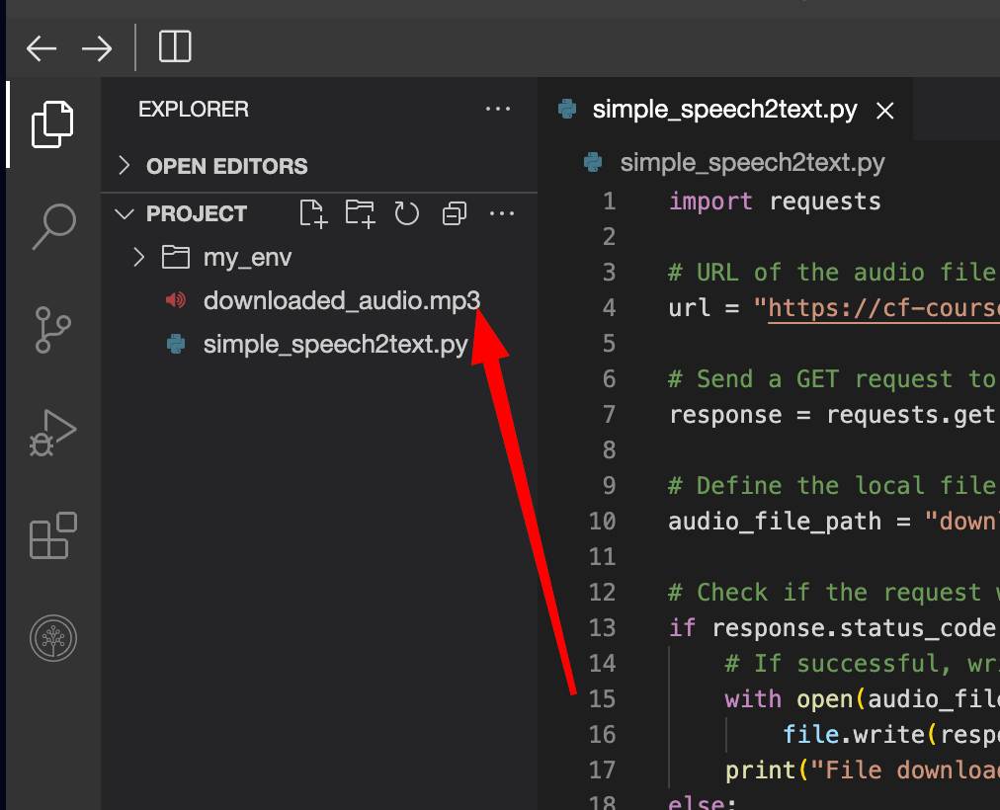
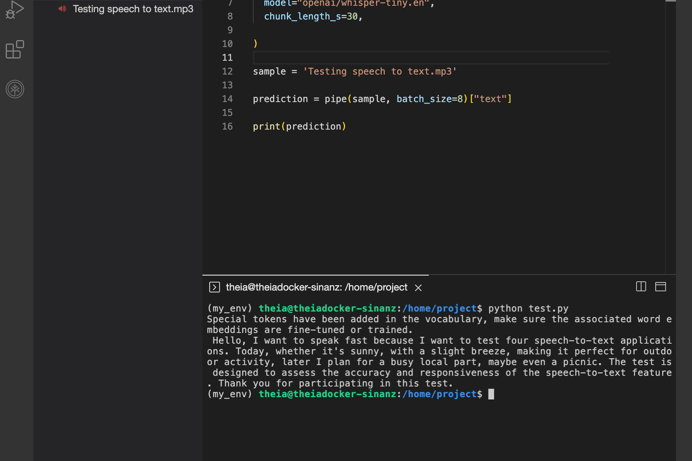
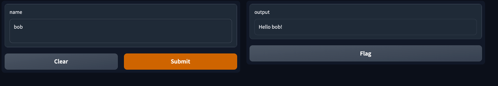
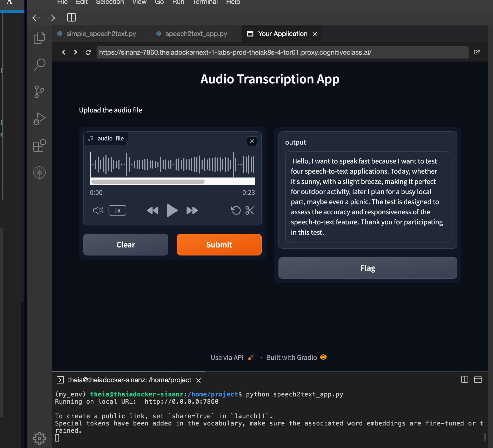
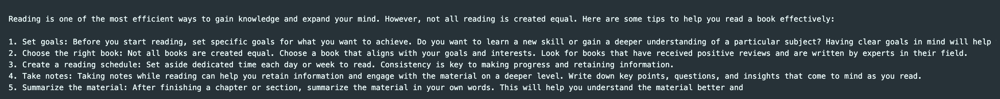
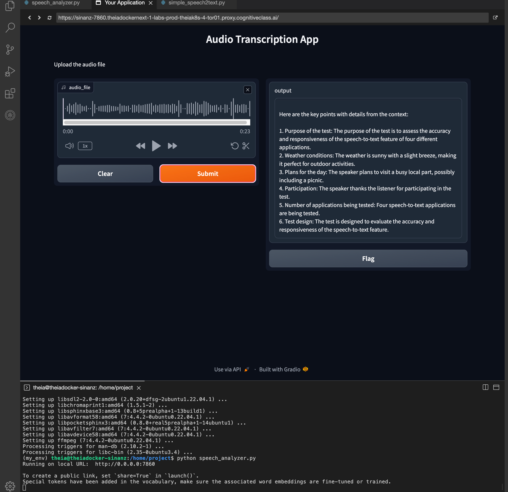

İşte metnin Türkçeye çevrilmiş ve konu başlıklarına göre düzenlenmiş hali:

---

### 🤖 Giriş: İş Dünyası İçin Yapay Zeka Toplantı Asistanı

Bir iş toplantısına katıldığınızı hayal edin; tüm konuşmalar gelişmiş bir yapay zeka uygulaması tarafından kaydediliyor. Bu uygulama yalnızca konuşmaları yüksek doğrulukla metne dönüştürmekle kalmıyor, aynı zamanda toplantının özetini çıkarıyor ve alınan kararlar ile önemli noktaları vurguluyor.

Bu projede:

* **Konuşmayı metne dönüştürmek** için **OpenAI Whisper** kullanacağız.
* Ardından **IBM Watson AI** yardımıyla metni özetleyip kilit noktaları çıkaracağız.
* Kullanıcı arayüzü için ise **Hugging Face Gradio** ile bir uygulama geliştireceğiz.

---

### 🎯 Öğrenme Hedefleri

Bu uygulamalı laboratuvar çalışmasını tamamladıktan sonra şunları yapabileceksiniz:

* Hugging Face Hub üzerinden bir model kullanarak Python betiği oluşturmak, modelin çıktısını etkileyen bazı temel parametreleri tanımlamak ve farklı LLM modelleri arasında nasıl geçiş yapılacağını temel düzeyde kavramak.
* OpenAI’nin Whisper teknolojisini kullanarak ders kayıtlarını doğru bir şekilde metne dönüştürmek.
* IBM Watson AI ile transkripte edilmiş ders içeriklerini etkili bir şekilde özetlemek ve anahtar noktaları çıkarmak.
* Hugging Face Gradio ile sezgisel ve kullanıcı dostu bir arayüz oluşturmak, böylece öğrenciler ve eğitmenler için kullanım kolaylığı sağlamak.


---

### 🧪 Ortam Hazırlığı

Python sanal ortamı oluşturarak ve gerekli kütüphaneleri kurarak ortama hazırlıkla başlayalım. Terminalde aşağıdaki komutları çalıştırın:

```bash
pip3 install virtualenv 
virtualenv my_env # my_env adında sanal ortam oluştur
source my_env/bin/activate # my_env ortamını etkinleştir
```

---

### 📦 Gerekli Kütüphanelerin Kurulumu

Sanal ortam etkinleştirildikten sonra, proje için gerekli olan kütüphaneleri yükleyin. Bu işlem biraz zaman alabilir ☕️☕️:

```bash
# my_env ortamında gerekli kütüphanelerin kurulumu
pip install transformers==4.36.0 torch==2.1.1 gradio==5.23.2 langchain==0.0.343 ibm_watson_machine_learning==1.0.335 huggingface-hub==0.28.1
```

⏳ Bir fincan kahve hazırlayın, yükleme birkaç dakika sürebilir.

```
      )  (
     (   ) )
      ) ( (
    _______)_
 .-'---------|  
( C|/\/\/\/\/|
 '-./\/\/\/\/|
   '_________'
    '-------'
```

---

### 🎧 ffmpeg Kurulumu

Python ile ses dosyaları üzerinde çalışabilmek için `ffmpeg` adlı yardımcı yazılımın kurulması gerekir.

İlk olarak sistem paketlerini güncelleyin:

```bash
sudo apt update
```

Ardından `ffmpeg` paketini yükleyin:

```bash
sudo apt install ffmpeg -y
```

---

### 📄 Ek Bilgi: Whisper Lisansı

OpenAI tarafından geliştirilen **Whisper** projesi GitHub üzerinden erişilebilir durumdadır. Kod ve model ağırlıkları **MIT Lisansı** altında paylaşılmıştır. Ayrıntılı bilgi için `LICENSE` dosyasını inceleyebilirsiniz.


İşte metnin Türkçeye çevrilmiş ve başlıklandırılmış hali:

---

### 🗣️ Adım 1: Sesten Metne (Speech-to-Text)

İlk olarak, **OpenAI Whisper** kullanarak basit bir sesten metne dönüştürme dosyası oluşturalım.

📁 **Örnek ses dosyasını** test etmek için indirmeniz gerekiyor:

 **Bağlantı** : [Sample voice link](https://cf-courses-data.s3.us.cloud-object-storage.appdomain.cloud/IBMSkillsNetwork-GPXX04C6EN/Testing%20speech%20to%20text.mp3)

Bir Python dosyası oluşturun ve adını `simple_speech2text.py` koyun. Aşağıdaki kodu dosyaya yapıştırarak çalıştırın:

```python
import requests

# İndirilecek ses dosyasının URL'si
url = "https://cf-courses-data.s3.us.cloud-object-storage.appdomain.cloud/IBMSkillsNetwork-GPXX04C6EN/Testing%20speech%20to%20text.mp3"

# URL'ye GET isteği göndererek dosyayı indir
response = requests.get(url)

# Ses dosyasının yerel olarak kaydedileceği dosya yolu
audio_file_path = "downloaded_audio.mp3"

# İsteğin başarılı olup olmadığını kontrol et (durum kodu 200)
if response.status_code == 200:
    # Başarılıysa içeriği belirtilen dosya yoluna yaz
    with open(audio_file_path, "wb") as file:
        file.write(response.content)
    print("Dosya başarıyla indirildi")
else:
    # İstek başarısızsa hata mesajı yazdır
    print("Dosya indirilemedi")
```

---

### ▶️ Python Dosyasını Çalıştırma

Terminalde aşağıdaki komutu çalıştırarak Python dosyasını test edin:

```bash
python3 simple_speech2text.py
```

Başarılı çalıştırmadan sonra, dosya yöneticisinde `downloaded_audio.mp3` adlı ses dosyasını görmelisiniz.




---

### 📝 OpenAI Whisper ile Sesin Metne Dönüştürülmesi

Bir önceki Python dosyasının içeriğini aşağıdaki kod ile **değiştirin** (`simple_speech2text.py`).

Bu kod, Hugging Face Transformers kütüphanesi üzerinden OpenAI'nin **Whisper** modelini kullanarak ses dosyasını metne dönüştürür:

```python
import torch
from transformers import pipeline

# Hugging Face Transformers üzerinden sesten metne dönüştürme pipeline'ını başlat
# "openai/whisper-tiny.en" modeli otomatik konuşma tanıma (ASR) için kullanılıyor
# chunk_length_s parametresi sesin kaç saniyelik parçalar halinde işleneceğini belirtir
pipe = pipeline(
  "automatic-speech-recognition",
  model="openai/whisper-tiny.en",
  chunk_length_s=30,
)

# Transkribe edilecek ses dosyasının yolu
sample = 'downloaded_audio.mp3'

# Ses tanıma işlemini gerçekleştir
# batch_size=8 ile aynı anda kaç parçanın işleneceği belirtilir
# Sonuç prediction değişkeninde saklanır, transkript "text" anahtarında yer alır
prediction = pipe(sample, batch_size=8)["text"]

# Transkripti konsola yazdır
print(prediction)
```

---

### ▶️ Python Dosyasını Çalıştırın

Aşağıdaki komutu terminalde çalıştırarak dosyayı test edin:

```bash
python3 simple_speech2text.py
```

📄 Ekranda ses dosyasının yazıya dökülmüş hali görüntülenecektir.




---

### 🖼️ Sonraki Adım: Gradio ile Uygulama Arayüzü Oluşturma

Bu adımda, uygulamamız için **kullanıcı dostu bir arayüz** oluşturmak amacıyla **Gradio** kütüphanesini kullanacağız.

Gradio, makine öğrenimi modelleriyle etkileşimli web tabanlı arayüzler oluşturmayı kolaylaştırır. Bu sayede kullanıcılar, ses dosyasını yükleyip sonuçları doğrudan tarayıcıdan görebilirler.

📌 Bir sonraki adımda, Whisper modelini Gradio arayüzüne entegre eden bir Python uygulaması oluşturacağız. Hazırsanız Gradio bileşenlerini tanımlayarak başlayabiliriz.


### 💬 Gradio Arayüzü: Basit Bir Demo Oluşturma

Bu proje boyunca, Gradio arayüzü kullanarak farklı büyük dil modeli (LLM) uygulamaları oluşturacağız. Gradio’yu daha yakından tanımak için basit bir uygulama oluşturalım:

📁 Proje dizinindeyken bir Python dosyası oluşturun ve adını `hello.py` olarak belirleyin.

`hello.py` dosyasını açın, aşağıdaki Python kodunu yapıştırın ve dosyayı kaydedin:

```python
import gradio as gr

def greet(name):
    return "Hello " + name + "!"

demo = gr.Interface(fn=greet, inputs="text", outputs="text")
demo.launch(server_name="0.0.0.0", server_port=7860)
```

---

### 🧩 Kod Açıklaması

Yukarıdaki kod, `demo` adında bir `gr.Interface` nesnesi oluşturur. Bu arayüz, `greet` fonksiyonunu basit bir metin-girdi / metin-çıktı yapısı içinde sararak kullanıcıyla etkileşimli hale getirir.

`gr.Interface` sınıfı üç temel parametreyle başlatılır:

* `fn`: Arayüzün etrafına sarılacağı fonksiyon
* `inputs`: Girdi bileşeni (örneğin “text”, “image” veya “audio”)
* `outputs`: Çıktı bileşeni (örneğin “text”, “image” veya “label”)

`demo.launch()` satırı, bu uygulamayı yerel bir sunucuda başlatarak erişilebilir hale getirir.

---

### 🚀 Demo Uygulamayı Başlatma

Terminale geri dönün ve satır başında `my_env` sanal ortam adının göründüğünden emin olun.

Aşağıdaki komutu çalıştırarak Python betiğini çalıştırın:

```bash
python3 hello.py
```

Kod çalıştığında, uygulama bir yerel sunucu aracılığıyla servis edilir. Tarayıcınızda verilen bağlantıya tıklayarak bu basit uygulamayı görüntüleyebilirsiniz.

✏️ Girdi kısmına örneğin `Bob` yazarsanız, çıktı olarak `Hello Bob!` mesajı alırsınız.

Uygulamayla oynamaktan çekinmeyin!




### ❎ Uygulamadan Çıkış

Uygulamayla işiniz bittiyse ve çıkmak istiyorsanız, terminalde **Ctrl + C** tuşlarına basarak uygulamayı durdurabilir, ardından tarayıcıdaki uygulama sekmesini kapatabilirsiniz.

---

### 🎨 Daha Fazla Özelleştirme Öğrenmek İsteyenler İçin

Gradio hakkında daha fazla özelleştirme öğrenmek isterseniz, **“Bring your Machine Learning model to life with Gradio”** adlı rehberli projeyi inceleyebilirsiniz. Bu projeyi **cognitiveclass.ai** platformunda **Courses & Projects** bölümünde bulabilirsiniz.

---

### 🚧 Devam Eden Projede Gradio Kullanımı

Bu projenin geri kalanında, büyük dil modeli (LLM) tabanlı uygulamalar için arayüz olarak  **Gradio** 'yu kullanmaya devam edeceğiz.


### 🧾 Adım 2: Ses Transkripsiyon Uygulaması Oluşturma

Bu adımda, bir Python dosyası oluşturup adını `speech2text_app.py` koyun.

Ardından, aşağıdaki kodu kullanarak eksik yerleri önceki adımdan (Step 1) elde ettiğimiz bilgilerle  **tamamlayın** :

```python
import torch
from transformers import pipeline
import gradio as gr

# OpenAI Whisper modeli ile sesi metne dönüştüren fonksiyon
def transcript_audio(audio_file):
    # Konuşma tanıma pipeline'ını başlat
    pipe = pipeline(
        "automatic-speech-recognition",
        model="openai/whisper-tiny.en",
        chunk_length_s=30,
    )
  
    # Ses dosyasını transkribe et ve sonucu döndür
    result = pipe(audio_file, batch_size=8)["text"]
    return result

# Gradio arayüz bileşenlerini tanımla
audio_input = gr.Audio(sources="upload", type="filepath")  # Ses girişi
output_text = gr.Textbox()  # Metin çıktısı

# Gradio arayüzünü oluştur
iface = gr.Interface(
    fn=transcript_audio, 
    inputs=audio_input,
    outputs=output_text, 
    title="Audio Transcription App",
    description="Upload the audio file"
)

# Gradio uygulamasını başlat
iface.launch(server_name="0.0.0.0", server_port=7860)
```

---

### ▶️ Uygulamayı Çalıştırma

Terminalde aşağıdaki komutu çalıştırarak uygulamayı başlatın:

```bash
python3 speech2text_app.py
```

---

### 📤 Ses Dosyası Yükleme

* Sağ tıklayarak sağlanan örnek ses dosyasını indirebilir ve uygulamaya yükleyebilirsiniz.
* Alternatif olarak, bilgisayarınızdan herhangi bir **MP3 ses dosyasını** da yükleyebilirsiniz.

---

### 📄 Sonuç

Yüklediğiniz ses dosyasının içeriği, uygulama tarafından **metne dönüştürülerek** ekranda görüntülenecektir.




### ⏹️ Uygulamayı Durdurma

Uygulama çalışırken durdurmak isterseniz, terminalde **Ctrl + C** tuşlarına basarak uygulamayı sonlandırabilirsiniz.


### 🤖 Adım 3: LLM Entegrasyonu – WatsonX Üzerinde Llama 3 Kullanımı

#### Basit Bir LLM Uygulaması Çalıştırma

Bu adımda, **LLM (Large Language Model)** ile metin üretmeyi deneyeceğiz. Bunun için bir Python dosyası oluşturun ve adını `simple_llm.py` koyun.

Eğer **Llama 3** modelini IBM WatsonX üzerinde kullanmak istiyorsanız, aşağıdaki yönergeleri takip edebilirsiniz:

---

### ⚙️ Kodun İşleyişi

1. **Kimlik Bilgilerini Ayarlama**

   Skills Network ekibi tarafından önceden tanımlandığı için IBM servislerine erişim için gereken kimlik bilgileri sizin yerinize zaten tanımlanmıştır.
2. **Parametreleri Belirtme**

   * `MAX_NEW_TOKENS`: Modelin bir seferde üretebileceği maksimum token (kelime) sayısını belirler.
   * `TEMPERATURE`: Üretilen metnin yaratıcı mı yoksa tahmin edilebilir mi olacağını belirleyen sıcaklık parametresi.
3. **Llama 3 Modelini Başlatma**

   Belirtilen model ID, kimlik bilgileri, parametreler ve proje ID kullanılarak `LLAMA3_model` nesnesi oluşturulur.
4. **Model Nesnesi Oluşturma ve Sorgulama**

   `llm` adlı nesne ile `WatsonxLLM` sınıfı üzerinden modelle etkileşim kurulur. Soru olarak `"How to read a book effectively?"` girilir ve üretilen yanıt yazdırılır.

---

### 💻 Python Kod Dosyası (`simple_llm.py`)

```python
from ibm_watson_machine_learning.foundation_models import Model
from ibm_watson_machine_learning.foundation_models.extensions.langchain import WatsonxLLM
from ibm_watson_machine_learning.metanames import GenTextParamsMetaNames as GenParams

# IBM Cloud erişim bilgileri
my_credentials = {
    "url": "https://us-south.ml.cloud.ibm.com"
}

# Model için parametreler
params = {
    GenParams.MAX_NEW_TOKENS: 700,  # Üretilecek maksimum token sayısı
    GenParams.TEMPERATURE: 0.1      # Düşük sıcaklık = daha kararlı cevaplar
}

# Llama 3 modelini başlat
LLAMA2_model = Model(
    model_id='meta-llama/llama-3-2-11b-vision-instruct',
    credentials=my_credentials,
    params=params,
    project_id="skills-network"
)

# WatsonxLLM nesnesiyle model arayüzü oluştur
llm = WatsonxLLM(LLAMA2_model)

# Modelden yanıt al ve yazdır
print(llm("How to read a book effectively?"))
```

---

### ▶️ Scripti Çalıştırma

Terminalde aşağıdaki komutla Python dosyasını çalıştırın:

```bash
python3 simple_llm.py
```

---

### 📄 Beklenen Çıktı

Komut çalıştıktan sonra, modelin `"How to read a book effectively?"` sorusuna verdiği yanıt terminal ekranınızda görünecektir. Bu, Llama 3 modelinin metin üretme yeteneğini doğrudan test etmenizi sağlar.




### 🧠 watsonx Llama 2'nin Güçlü Yanıt Performansı

Watsonx üzerinde çalışan **Llama 2** modelinin nasıl kaliteli bir yanıt sunduğunu görebilirsiniz.


### 🧩 Adım 4: Her Şeyi Birleştirme

Yeni bir Python dosyası oluşturun ve adını **speech_analyzer.py** koyun.

Bu uygulamada, bir dil modeli (LLM) örneği kuracağız; bu IBM WatsonxLLM, HuggingFaceHub veya OpenAI modeli olabilir. Daha sonra bir prompt (istem) şablonu oluşturacağız. Bu şablonlar, dil modelleri için istem üretmekte yapılandırılmış rehberlerdir ve çıktı düzenine yardımcı olur (daha fazla bilgi için langchain prompt template bölümüne bakınız).

Ardından, OpenAI Whisper modelini kullanan bir transkripsiyon fonksiyonu geliştireceğiz. Bu fonksiyon, Gradio uygulama arayüzü aracılığıyla yüklenen bir ses dosyasını (tercihen .mp3 formatında) alır ve konuşmayı metne dönüştürür. Transkripte edilen metin daha sonra bir LLMChain'e gönderilir; bu yapı, metni prompt şablonuyla birleştirir ve seçilen LLM'e iletir. Son olarak, LLM'den alınan çıktı Gradio uygulamasının çıktı metin kutusunda görüntülenir.

Çıktı aşağıdaki gibi görünmelidir:




### 💡 Alıştırma: Eksik Kodları Tamamlama

Aşağıda verilen Python kodunda eksik yerler doldurulmuştur:

```python
import torch
import os
import gradio as gr
# from langchain.llms import OpenAI
from langchain.llms import HuggingFaceHub
from transformers import pipeline
from langchain.prompts import PromptTemplate
from langchain.chains import LLMChain
from ibm_watson_machine_learning.foundation_models.extensions.langchain import WatsonxLLM
from ibm_watson_machine_learning.foundation_models.utils.enums import DecodingMethods
from ibm_watson_machine_learning.metanames import GenTextParamsMetaNames as GenParams
from ibm_watson_machine_learning.foundation_models import Model

#######------------- LLM-------------####
# IBM WatsonxLLM örneği başlatılıyor
my_credentials = {
    "url": "https://us-south.ml.cloud.ibm.com"
}
params = {
    GenParams.MAX_NEW_TOKENS: 700,
    GenParams.TEMPERATURE: 0.1
}
llama_model = Model(
    model_id='meta-llama/llama-3-2-11b-vision-instruct',
    credentials=my_credentials,
    params=params,
    project_id="skills-network"
)
llm = WatsonxLLM(llama_model)

#######------------- Prompt Template-------------####
# LLAMA2 yapısına göre biçimlendirilmiş istem şablonu
temp = """
<s><<SYS>>
List the key points with details from the context: 
[INST] The context : {context} [/INST] 
<</SYS>>
"""

pt = PromptTemplate(
    input_variables=["context"],
    template=temp
)

prompt_to_LLAMA2 = LLMChain(llm=llm, prompt=pt)

#######------------- Speech2text-------------####
def transcript_audio(audio_file):
    # Konuşma tanıma pipeline'ını başlat
    pipe = pipeline(
        "automatic-speech-recognition",
        model="openai/whisper-tiny.en",
        chunk_length_s=30
    )
    # Ses dosyasını transkribe et
    transcript_txt = pipe(audio_file, batch_size=8)["text"]
    # Metni isteme yerleştirip LLM'e gönder
    result = prompt_to_LLAMA2.run(transcript_txt)
    return result

#######------------- Gradio-------------####
audio_input = gr.Audio(sources="upload", type="filepath")
output_text = gr.Textbox()

iface = gr.Interface(
    fn=transcript_audio,
    inputs=audio_input,
    outputs=output_text,
    title="Speech Analyzer",
    description="Upload an MP3 file. The app will transcribe and extract key points."
)

iface.launch(server_name="0.0.0.0", server_port=7860)
```

---

### ▶️ Çalıştırma

Terminalde:

```bash
python3 speech_analyzer.py
```

🟢 Eğer hata yoksa uygulamanız yerel sunucuda başlar ve tarayıcıdan ses yükleyerek test edebilirsiniz.


### 🏁 Sonuç

🎉 **Tebrikler!** Bu projeyi başarıyla tamamladınız! Artık güçlü **Büyük Dil Modelleri (LLM)** ile konuşmadan metne dönüştürme görevleri için sağlam bir temel oluşturmuş oldunuz.

İşte başardıklarınızın kısa bir özeti:

---

### 🧠 LLM ile Metin Üretimi

Hugging Face Hub'dan bir model kullanarak metin üreten bir Python betiği oluşturdunuz.

Model çıktısını etkileyen temel parametreleri öğrendiniz ve farklı LLM modelleri arasında geçiş yapmanın temellerini kavradınız.

---

### 🗣️ Konuşmadan Metne Dönüştürme

OpenAI'nin **Whisper** teknolojisini kullanarak, sesli ders kayıtlarını doğru bir şekilde metne dönüştürdünüz.

---

### 📝 İçerik Özetleme

IBM Watson AI'yi kullanarak transkripte edilmiş konuşmaları etkili şekilde özetlediniz ve anahtar noktaları çıkardınız.

---

### 💻 Kullanıcı Arayüzü Geliştirme

**Hugging Face Gradio** kullanarak sezgisel ve kullanıcı dostu bir arayüz oluşturdunuz.

Bu sayede öğrenciler ve eğitmenler için kolay kullanılabilir bir uygulama geliştirdiniz.

---
