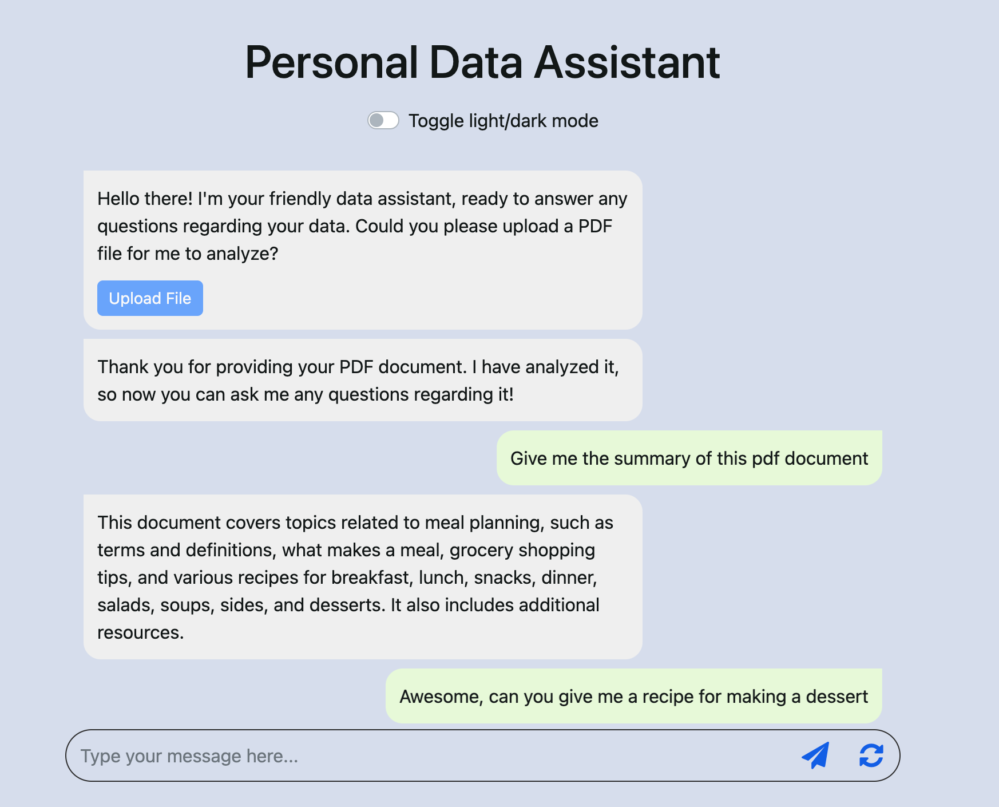
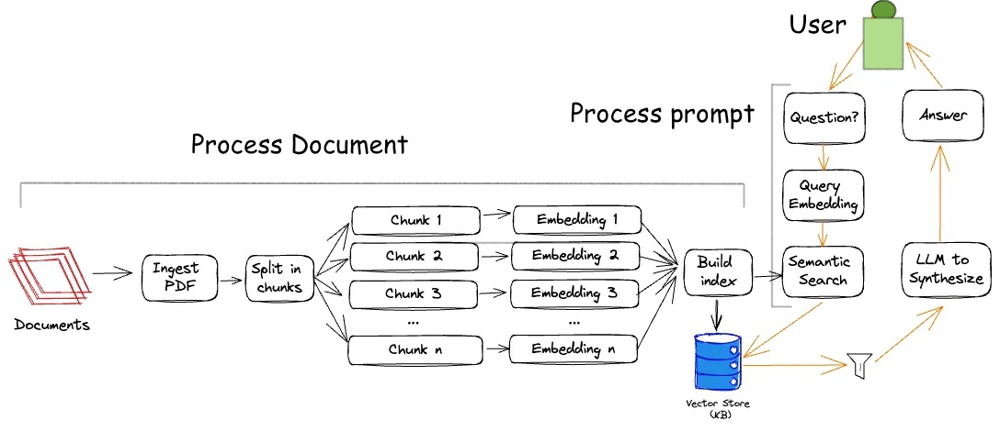
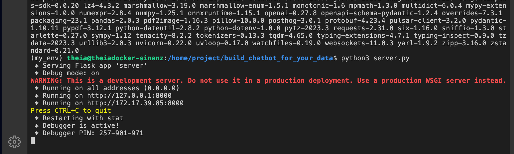
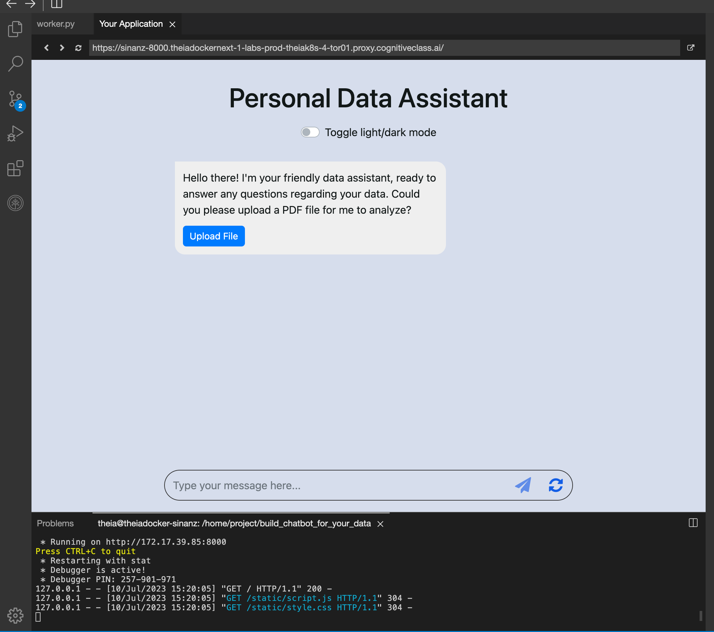
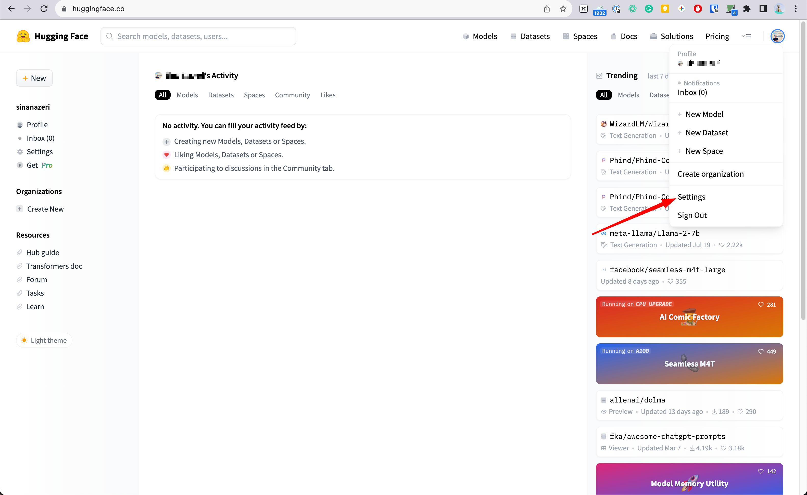

İşte metnin Türkçeye çevrilmiş ve başlıklara ayrılmış hali, her bölüm için emoji ile:

---

### 🤖 Verileriniz İçin Sohbet Botu Oluşturun

**cognitiveclass.ai logosu**

**Tahmini süre: 60 dakika**

---

### 🧭 Giriş

Bu projede, kendi PDF dosyanız için bir sohbet botu oluşturacaksınız. Bunu yapmak için popüler bir web çatısı olan **Flask** ile büyük dil modelleri (LLM) ile çalışmak için kullanılan **LangChain** çerçevesini kullanacaksınız.

Geliştireceğiniz sohbet botu, kullanıcılarla yalnızca metin üzerinden etkileşime geçmekle kalmayacak, aynı zamanda belirli bir belgenin içeriğini anlayacak ve bu içerikle ilgili soruları da yanıtlayabilecektir.

---

### 🎯 Proje Hedefi

Aşağıdaki demo bağlantısına tıklayarak, bu proje sonunda oluşturacağınız nihai uygulamayı deneyebilirsiniz!

Bu projenin sonunda:

* Sohbet botlarını daha derinlemesine anlayacaksınız.
* Flask ve Python kullanarak web uygulaması geliştirme becerileri kazanacaksınız.
* LangChain çerçevesini kullanarak geniş bir kullanıcı girdisi yelpazesine nasıl yanıt verileceğini öğreneceksiniz.

Ve en önemlisi: **Kapsamlı ve etkileyici bir sohbet botu uygulaması inşa etmiş olacaksınız!**


İşte metnin Türkçeye çevrilmiş ve başlıklara ayrılmış hali, her bölüm için emoji ile:

---

### 🧱 Başlamadan Önce: Kullanacağınız Temel Bileşenler

Uygulamanızı oluşturmadan önce, kullanacağınız ana bileşenlere birlikte göz atalım.

---

### 🤖 Sohbet Botları (Chatbots)

Sohbet botları, insan benzeri konuşmalar gerçekleştirmek üzere tasarlanmış yazılım uygulamalarıdır. Kullanıcılardan gelen metin girdilerine yanıt verebilirler ve müşteri hizmetleri, e-ticaret ve eğitim gibi pek çok alanda yaygın olarak kullanılırlar.

Bu projede, yalnızca genel sohbet gerçekleştirmekle kalmayıp aynı zamanda belirli bir belgeye dayalı soruları da yanıtlayabilen bir sohbet botu geliştireceksiniz.

---

### 🧠 LangChain

LangChain, yapay zeka destekli dil uygulamaları geliştirmek için çok yönlü bir araçtır. Önceden eğitilmiş dil modellerinden yararlanarak metin alma, özetleme, çeviri gibi birçok işlev sunar.

Bu projede, LangChain’i sohbet botunuza entegre ederek onun çeşitli kullanıcı girdilerini etkili şekilde anlamasını ve yanıtlamasını sağlayacaksınız.

---

### 🌐 Flask

Flask, Python için hafif ve esnek bir web çatısıdır; basitliği ve hızıyla bilinir. Web çatısı, web uygulamalarının geliştirilmesini desteklemek üzere tasarlanmış yazılım yapısıdır ve web sunucuları oluşturmayı, HTTP istek ve yanıtlarını yönetmeyi sağlar.

Sohbet botunuzun sunucu tarafını (backend) oluşturmak için Flask kullanacaksınız. Bu, kullanıcıdan gelen mesajların işlenmesi ve uygun yanıtların geri gönderilmesi işlemlerini kapsar.

---

### 🧭 Flask’te Rotalar (Routes)

Rotalar, web geliştirmede temel bir bileşendir. Uygulamanız bir istemciden (genellikle bir web tarayıcısı) bir istek aldığında, bu isteğin nasıl ele alınacağını bilmesi gerekir. İşte burada “routing” devreye girer.

Flask’te, `@app.route` dekoratörü kullanılarak URL rotalarına işlevler bağlanır. Bir kullanıcı bu URL’yi ziyaret ettiğinde, ilgili işlev çalıştırılır.

Sohbet botu projenizde, kullanıcı mesajlarını taşıyan POST isteklerini ele almak ve belge verilerini işlemek için rotaları kullanacaksınız.

---

### 💻 HTML - CSS - JavaScript

Size HTML, CSS ve JavaScript kullanılarak oluşturulmuş, kullanıma hazır bir sohbet botu arayüzü sunulmuştur.

* **HTML:** Web içeriğini yapılandırır.
* **CSS:** Görsel biçimlendirme sağlar.
* **JavaScript:** Etkileşim katar.

Bu teknolojiler, görsel olarak hoş ve etkileşimli bir sohbet arayüzü oluşturur.

---

### 🖼️ Arayüz Görseli

İşte sohbet botu arayüzünden bir anlık görüntü:

*(Not: Görsel belge içinde tanımlandığı için burada yer almamaktadır.)*

---



---

### 🎯 Öğrenme Hedefleri

Bu projenin sonunda aşağıdakileri yapabiliyor olacaksınız:

* LangChain ve yapay zeka uygulamalarının temellerini açıklamak
* Python Flask kullanarak bir asistan geliştirmek için geliştirme ortamı kurmak
* Kullanıcılardan gelen PDF dosyalarını algılayabilmesi için asistanınıza PDF yükleme işlevi eklemek
* Asistanı açık kaynak modellerle entegre ederek kullanıcı isteklerini anlayıp yanıt verebilecek yüksek seviyede zeka kazandırmak
* *(İsteğe bağlı)* PDF asistanınızı daha geniş bir kullanıcı kitlesinin erişebilmesi için bir web sunucusuna dağıtmak

---

### 📚 Ön Bilgiler (Gereksinimler)

HTML/CSS, JavaScript ve Python'un temellerine dair bilgi sahibi olmanız faydalı olabilir, ancak zorunlu değildir. Bu laboratuvar boyunca her adım ve kod bölümü kapsamlı biçimde açıklanacaktır.

---

### 🚀 Haydi Başlayalım!

Artık gerekli temele sahipsiniz; projenize başlamaya hazırsınız!

---


İşte metnin Türkçeye çevrilmiş ve başlıklara ayrılmış hali, her bölüm için emoji ile:

---

### 💬 Kullanıcı Arayüzünü Kurma ve Anlama

Bu projedeki hedef, iletişime olanak tanıyan bir arayüze sahip bir sohbet botu oluşturmaktır.

---

### ⚙️ Ortamı Kurma

İlk olarak aşağıdaki komutları çalıştırarak geliştirme ortamını kuruyoruz:

```bash
pip3 install virtualenv 
virtualenv my_env # my_env adında sanal ortam oluştur
source my_env/bin/activate # sanal ortamı etkinleştir
```

---

### 🖥️ Arayüz ve Genel Yapı

Frontend kısmı **HTML, CSS ve JavaScript** kullanacaktır. Kullanıcı arayüzü, internette sıkça gördüğünüz sohbet botlarına benzer olacaktır. Arayüz için gereken kodlar size sağlanmıştır. Bu rehberli projede odak noktanız, bu arayüzü arka uca (backend) bağlamak olacaktır. Backend, kullanıcı belgelerinin yüklenmesini ve LLM modeli ile etkileşimi yönetecektir.

Bu proje sayesinde frontend ve backend’in nasıl etkileşime girdiğini anlayacak, önemli bileşenlerin nasıl çalıştığını öğrenecek ve basit bir web sayfası oluşturma konusunda net bir kavrayışa sahip olacaksınız.

---

### 📁 Proje Dosyalarını İndirme

Aşağıdaki komutları çalıştırarak projeyi bilgisayarınıza indirin, uygun bir isim verin ve o dizine geçin:

```bash
git clone https://github.com/ibm-developer-skills-network/wbphl-build_own_chatbot_without_open_ai.git
mv wbphl-build_own_chatbot_without_open_ai build_chatbot_for_your_data
cd build_chatbot_for_your_data
```

---

### 📦 Gerekli Paketlerin Kurulumu

Projeye özel bağımlılıkları yüklemek için:

```bash
pip install -r requirements.txt
```

LangChain bileşenini eklemek için:

```bash
pip install langchain-community
```

☕ Bir kahve alın! Bu kurulum 5–10 dakika sürebilir. Ancak proje üzerinde çalışmaya devam edebilirsiniz.

```
          )  (
         (   ) )
          ) ( (
        _______)_
     .-'---------|  
    ( C|/\/\/\/\/|
     '-./\/\/\/\/|
       '_________'
        '-------'
```

---

### 🌐 Frontend Dosyalarının Yapısı

#### 📄 `index.html`

Web arayüzünün yapısını ve düzenini belirler. Dış kütüphaneleri içerir:

* JQuery
* Bootstrap
* FontAwesome ikonları

  Ayrıca stil (style.css) ve etkileşim (script.js) dosyalarını dahil eder.

#### 🎨 `style.css`

Sayfadaki bileşenlerin görsel görünümünü özelleştirir. Ayrıca CSS *keyframes* ile yükleme animasyonunu kontrol eder. Keyframes, bir animasyonun zaman içindeki stil değişimini tanımlamak için kullanılır ve dinamik geçişler sağlar.

#### 📜 `script.js`

Sayfanın etkileşimini ve işlevselliğini yönetir. İçeriğinde:

* Karanlık/aydınlık mod geçişi
* Mesaj gönderme
* Yeni mesajları ekranda gösterme
* Ses kaydı özelliği

  gibi temel işlevler yer alır.


---

### 🧠 Worker’ı Anlamak: Belge İşleme ve Konuşma Yönetimi (Bölüm 1)

Bu bölümde, sohbet botu uygulamasının bir parçası olan `worker.py` dosyasını inceleyeceğiz. Bu dosya, kullanıcı mesajlarını ve belgeleri işlemekle ilgilidir. Python dilinde yazılmış olan **LangChain** kütüphanesini kullanır ve konuşma tabanlı yapay zeka uygulamaları geliştirmeye yöneliktir.

---

### ⚙️ worker.py’nin Görevleri

Bu betik (script) aşağıdaki görevlerden sorumludur:

* **Dil modelini kurmak:** Kullanılacak büyük dil modelini başlatmak ve yapılandırmak
* **PDF belgelerini işlemek:** Belgeleri, konuşmaya dayalı bilgi alımı için uygun bir formata dönüştürmek
* **Kullanıcı girdilerini işlemek:** Kullanıcının gönderdiği mesajlara, işlenmiş belgeler üzerinden yanıt üretmek

---

### 🧾 worker.py İçeriğine Genel Bakış

`worker.py` dosyası, belirli bir PDF belgesinin içeriğine dayalı olarak soruları yanıtlayabilen bir konuşma arayüzü sağlamak amacıyla tasarlanmıştır.

---

### 🛠️ Göreviniz

Bu projede göreviniz, `worker.py` dosyasındaki açıklama satırlarının (yorumların) altına uygun Python kodlarını yerleştirmektir. Kodlar sayesinde sohbet botu:

* PDF dosyasını okuyacak
* İçeriğini bölerek analiz edilebilir hale getirecek
* Bu içerikle etkileşim kurabilecek şekilde model kuracak
* Kullanıcıdan gelen istemleri anlayarak yanıtlar oluşturacaktır

---

Hazırsanız, şimdi `worker.py` dosyasının bölümlerini detaylıca ele alacağız!




### 🗂️ Sürecin Genel Görünümü: Belge İşleme ve Bilgi Getirme

Bu diyagram, belge işleme ve bilgi getirme sürecini göstermektedir. Süreç, büyük bir dil modeli (LLM) ile entegre bir şekilde çalışarak, **soru yanıtlama** görevini kolaylaştırır.

---

### 🛠️ Tüm İşlem Nerede Gerçekleşiyor?

Bu işlemlerin tamamı **`worker.py`** dosyasında gerçekleşir.

Bu dosya; PDF belgesinin işlenmesinden, bilgi getirme adımına ve modelin kullanıcı sorularına yanıt üretmesine kadar olan tüm adımları kapsar.

---

📌 *Görsel kaynak bağlantısı: image credit link*

---


İşte açıklamalı metnin Türkçeye çevrilmiş ve başlıklara ayrılmış hali ile birlikte, istenen Python kodu da doğru şekilde tamamlanmış olarak verilmiştir:

---

### ⚙️ Başlatma: `init_llm()` Fonksiyonu

Bu fonksiyon, yapay zeka dil modelini (Watsonx LLM) ve gömlemeleri (embeddings) başlatmak için kullanılır. `worker.py` dosyasında tanımlıdır ve şu işlemleri gerçekleştirir:

---

### 🔐 Kimlik Bilgilerinin Ayarlanması

Watsonx platformuna erişim için servis URL’si ve kimlik doğrulama belirteci (token) içeren bir sözlük (dictionary) oluşturulur.

---

### 🎛️ Parametrelerin Yapılandırılması

* **max_new_tokens:** Üretilecek maksimum token sayısı (256)
* **temperature:** Rastgelelik düzeyi (0.1)

---

### 🧠 Modelin Başlatılması

* Meta tarafından geliştirilen **Llama 3** modeli kullanılmaktadır.
* IBM Watsonx ortamında, `"skills-network"` projesine özel olarak tanımlanmıştır.

---

### 🧬 Gömlemelerin (Embeddings) Başlatılması

Metni vektör temsiline dönüştürmek için HuggingFace’in önceden eğitilmiş modeli kullanılır.

---

### ✅ Tamamlanmış Kod

Aşağıda `worker.py` dosyasına yerleştirmeniz gereken doğru ve eksiksiz kod verilmiştir:

```python
# placeholder for Watsonx_API and Project_id in case you need to use the code outside this environment
Watsonx_API = "Your WatsonX API"
Project_id = "Your Project ID"

# Function to initialize the language model and its embeddings
def init_llm():
    global llm_hub, embeddings
    logger.info("Initializing WatsonxLLM and embeddings...")
  
    # Llama Model Configuration
    MODEL_ID = "meta-llama/llama-3-3-70b-instruct"
    WATSONX_URL = "https://us-south.ml.cloud.ibm.com"
    PROJECT_ID = "skills-network"
  
    # Model parameters
    model_parameters = {
        "max_new_tokens": 256,
        "temperature": 0.1,
    }
  
    # Initialize Llama LLM using the updated WatsonxLLM API
    llm_hub = WatsonxLLM(
        model_id=MODEL_ID,
        url=WATSONX_URL,
        project_id=PROJECT_ID,
        params=model_parameters
    )
    logger.debug("WatsonxLLM initialized: %s", llm_hub)
  
    # Initialize embeddings using a pre-trained model to represent the text data.
    embeddings = HuggingFaceInstructEmbeddings(
        model_name="sentence-transformers/all-MiniLM-L6-v2", 
        model_kwargs={"device": DEVICE}
    )
    logger.debug("Embeddings initialized with model device: %s", DEVICE)
```

---

Bu yapı, `worker.py` içinde hem Watsonx LLM modelini hem de metin gömlemelerini başarıyla başlatmanızı sağlar. Devamında belge işleme (`process_document`) ve kullanıcı sorgusu işleme (`process_prompt`) fonksiyonlarıyla birlikte kullanılacaktır.

### 🧠 Worker’ı Anlamak – Bölüm 2

---

### 📄 Belge İşleme: `process_document` Fonksiyonu

**Belge işleme:** `process_document` fonksiyonu, PDF belgelerini işlemekten sorumludur.

Bu işlem, belgeyi yüklemek, parçalara ayırmak, gömlemelerle bir vektör deposu oluşturmak ve ardından bu veritabanını kullanarak bir bilgi getirme (retrieval) sistemi kurmaktan oluşur. Bu sistem, belgenin içeriğine dayalı soruları yanıtlamak için bir **ConversationalRetrievalChain** oluşturur.

---

#### 📥 Belge Yükleme

PDF belgesi, `PyPDFLoader` sınıfı kullanılarak yüklenir. Bu sınıf, belge yolunu argüman olarak alır.

**(Yapılacak alıştırma: `PyPDFLoader(...)` ifadesini `loader` değişkenine ata)**

---

#### ✂️ Belgeyi Parçalama

Yüklenen belge, `RecursiveCharacterTextSplitter` sınıfı kullanılarak parçalara ayrılır.

**chunk_size** ve **chunk_overlap** gibi parametreler belirtilebilir.

**(Yapılacak alıştırma: `RecursiveCharacterTextSplitter(...)` ifadesini `text_splitter` değişkenine ata)**

---

#### 📦 Vektör Deposu Oluşturma

Belge parçalarından, dil modeli gömlemeleri kullanılarak bir vektör deposu (Chroma) oluşturulur. Bu, bir tür indeks işlevi görür.

---

#### 🔎 Bilgi Getirme Sistemi Kurulumu

Oluşturulan vektör deposu ile bir bilgi getirme sistemi kurulur.

Bu sistem, belgedeki içeriklere dayanarak soruları yanıtlayan **ConversationalRetrievalChain** oluşturur.

---

### ✅ Kod (Eksiksiz ve Tercümeli)

```python


# Bir PDF belgesini işlemek için fonksiyon
def process_document(document_path):
    global conversation_retrieval_chain

    logger.info("Belge şu yoldan yükleniyor: %s", document_path)

    # Belgeyi yükle
    loader = PyPDFLoader(document_path)  # ---> belgeyi PyPDFLoader ile yükle
    documents = loader.load()
    logger.debug("%d belge yüklendi", len(documents))

    # Belgeyi parçalara ayır (chunk_size=1024, chunk_overlap=64)
    text_splitter = RecursiveCharacterTextSplitter(chunk_size=1024, chunk_overlap=64)
    texts = text_splitter.split_documents(documents)
    logger.debug("Belge %d metin parçasına bölündü", len(texts))

    # Metin parçalarından Chroma ile bir gömleme veritabanı oluştur
    logger.info("Chroma vektör deposu belgelerden başlatılıyor...")
    db = Chroma.from_documents(texts, embedding=embeddings)
    logger.debug("Chroma vektör deposu başlatıldı.")

    # (İsteğe bağlı) Chroma'daki mevcut koleksiyonları günlüğe yaz
    try:
        collections = db._client.list_collections()
        logger.debug("Chroma'daki mevcut koleksiyonlar: %s", collections)
    except Exception as e:
        logger.warning("Chroma'dan koleksiyonlar alınamadı: %s", e)

    # LLM ve retriever kullanarak QA (soru-cevap) zinciri oluştur
    conversation_retrieval_chain = RetrievalQA.from_chain_type(
        llm=llm_hub,
        chain_type="stuff",
        retriever=db.as_retriever(search_type="mmr", search_kwargs={'k': 6, 'lambda_mult': 0.25}),
        return_source_documents=False,
        input_key="question"
        # chain_type_kwargs={"prompt": prompt}  # Eğer özel prompt kullanıyorsanız bu satırı açın
    )
    logger.info("RetrievalQA zinciri başarıyla oluşturuldu.")
```

# Cözüm


### 📄 PDF Belgesini İşleyen Fonksiyon (Türkçe Açıklamalı)

```python
# Bir PDF belgesini işlemek için fonksiyon
def process_document(document_path):
    global conversation_retrieval_chain

    logger.info("Belge şu yoldan yükleniyor: %s", document_path)
  
    # Belgeyi yükle
    loader = PyPDFLoader(document_path)
    documents = loader.load()
    logger.debug("%d belge yüklendi", len(documents))

    # Belgeyi parçalara ayır (chunk_size=1024, chunk_overlap=64)
    text_splitter = RecursiveCharacterTextSplitter(chunk_size=1024, chunk_overlap=64)
    texts = text_splitter.split_documents(documents)
    logger.debug("Belge %d metin parçasına bölündü", len(texts))

    # Metin parçalarından Chroma ile bir gömleme veritabanı oluştur
    logger.info("Belgelerden Chroma vektör deposu başlatılıyor...")
    db = Chroma.from_documents(texts, embedding=embeddings)
    logger.debug("Chroma vektör deposu başlatıldı.")

    # (İsteğe bağlı) Chroma'daki mevcut koleksiyonları günlüğe yaz
    try:
        collections = db._client.list_collections()  # _client dahili olabilir
        logger.debug("Chroma'daki mevcut koleksiyonlar: %s", collections)
    except Exception as e:
        logger.warning("Chroma koleksiyonları alınamadı: %s", e)

    # LLM ve retriever kullanarak soru-cevap zinciri oluştur
    conversation_retrieval_chain = RetrievalQA.from_chain_type(
        llm=llm_hub,
        chain_type="stuff",
        retriever=db.as_retriever(search_type="mmr", search_kwargs={'k': 6, 'lambda_mult': 0.25}),
        return_source_documents=False,
        input_key="question"
        # chain_type_kwargs={"prompt": prompt}  # Özel bir prompt kullanıyorsanız bu satırı açın
    )
    logger.info("RetrievalQA zinciri başarıyla oluşturuldu.")
```


### 💬 İstek İşleme (`process_prompt` fonksiyonu)

**İstek işleme:**

Bu fonksiyon, kullanıcının bir istemini (sorusunu) işler, daha önce işlenmiş PDF belgesinin içeriğine dayalı bir yanıt alır ve sohbet geçmişini güncel tutar.

#### İşlevleri:

* Kullanıcıdan gelen istemi ve mevcut sohbet geçmişini `ConversationalRetrievalChain` nesnesine aktarır.
* Modelden alınan yanıtla birlikte istemi sohbet geçmişine ekler.
* Modelin oluşturduğu yanıtı döndürür.

---

### ✅ Kod İskeleti (Tamamlanmış ve Türkçe Açıklamalı)

```python
# Bir kullanıcı istemini işlemek için fonksiyon
def process_prompt(prompt):
    global conversation_retrieval_chain
    global chat_history

    logger.info("İstem işleniyor: %s", prompt)

    # Modeli invoke() yöntemi ile sorgula
    output = conversation_retrieval_chain.invoke({
        "question": prompt,
        "chat_history": chat_history
    })
  
    # Modelin yanıtını al
    answer = output["result"]
    logger.debug("Model yanıtı: %s", answer)

    # Sohbet geçmişine istem ve yanıtı ekle
    chat_history.append((prompt, answer))
    logger.debug("Sohbet geçmişi güncellendi. Toplam alışveriş sayısı: %d", len(chat_history))

    # Yanıtı döndür
    return answer
```


### 💬 Kullanıcı İsteğini İşleme Fonksiyonu – Türkçe Açıklamalı

```python
# Bir kullanıcı istemini (sorusunu) işlemek için fonksiyon
def process_prompt(prompt):
    global conversation_retrieval_chain  # Model zincirine erişim
    global chat_history  # Sohbet geçmişine erişim

    logger.info("İstem işleniyor: %s", prompt)

    # Modeli invoke() yöntemiyle sorgula, önceki sohbet geçmişiyle birlikte
    output = conversation_retrieval_chain.invoke({
        "question": prompt,
        "chat_history": chat_history
    })

    # Modelin verdiği cevabı al
    answer = output["result"]
    logger.debug("Model yanıtı: %s", answer)

    # Sohbet geçmişini güncelle: (soru, yanıt) çiftini ekle
    chat_history.append((prompt, answer))
    logger.debug("Sohbet geçmişi güncellendi. Toplam alışveriş sayısı: %d", len(chat_history))

    # Yanıtı döndür
    return answer
```


### 🌐 Global Değişkenler

* `llm` ve `llm_embeddings`: Dil modelini ve bu modelin gömlemelerini (embeddings) tutar.
* `conversation_retrieval_chain` ve `chat_history`: Sohbet zinciri ve geçmişini saklamak için kullanılır.
* Bu değişkenlere fonksiyonlar içinden erişebilmek için `global` ifadesi kullanılır (`init_llm`, `process_document`, `process_prompt` fonksiyonlarında).
* Bu sayede değişkenlerde yapılan değişiklikler fonksiyon dışında da geçerli olur ve programın genel durumunu etkiler.

---

### 🧾 Tam worker.py Dosyasının Türkçeye Çevrilmiş Hali (Kod)

```python
import os
import torch
import logging

# Günlük kayıt yapılandırması
logging.basicConfig(level=logging.DEBUG)
logger = logging.getLogger(__name__)

from langchain_core.prompts import PromptTemplate
from langchain.chains import RetrievalQA
from langchain_community.embeddings import HuggingFaceInstructEmbeddings
from langchain_community.document_loaders import PyPDFLoader
from langchain.text_splitter import RecursiveCharacterTextSplitter
from langchain_community.vectorstores import Chroma
from langchain_ibm import WatsonxLLM

# GPU kullanılabiliyorsa cihazı belirle
DEVICE = "cuda:0" if torch.cuda.is_available() else "cpu"

# Global değişkenler
conversation_retrieval_chain = None
chat_history = []
llm_hub = None
embeddings = None

# Dil modelini ve gömlemeleri başlatan fonksiyon
def init_llm():
    global llm_hub, embeddings
    logger.info("WatsonxLLM ve embeddings başlatılıyor...")

    MODEL_ID = "meta-llama/llama-3-3-70b-instruct"
    WATSONX_URL = "https://us-south.ml.cloud.ibm.com"
    PROJECT_ID = "skills-network"

    model_parameters = {
        "max_new_tokens": 256,
        "temperature": 0.1,
    }

    llm_hub = WatsonxLLM(
        model_id=MODEL_ID,
        url=WATSONX_URL,
        project_id=PROJECT_ID,
        params=model_parameters
    )
    logger.debug("WatsonxLLM başlatıldı: %s", llm_hub)

    embeddings = HuggingFaceInstructEmbeddings(
        model_name="sentence-transformers/all-MiniLM-L6-v2",
        model_kwargs={"device": DEVICE}
    )
    logger.debug("Embeddings başlatıldı, cihaz: %s", DEVICE)

# PDF belgesini işleyen fonksiyon
def process_document(document_path):
    global conversation_retrieval_chain
    logger.info("Belge şu yoldan yükleniyor: %s", document_path)

    loader = PyPDFLoader(document_path)
    documents = loader.load()
    logger.debug("%d belge yüklendi", len(documents))

    text_splitter = RecursiveCharacterTextSplitter(chunk_size=1024, chunk_overlap=64)
    texts = text_splitter.split_documents(documents)
    logger.debug("Belge %d metin parçasına bölündü", len(texts))

    logger.info("Chroma vektör deposu başlatılıyor...")
    db = Chroma.from_documents(texts, embedding=embeddings)
    logger.debug("Chroma vektör deposu başlatıldı.")

    try:
        collections = db._client.list_collections()
        logger.debug("Chroma koleksiyonları: %s", collections)
    except Exception as e:
        logger.warning("Chroma koleksiyonları alınamadı: %s", e)

    conversation_retrieval_chain = RetrievalQA.from_chain_type(
        llm=llm_hub,
        chain_type="stuff",
        retriever=db.as_retriever(search_type="mmr", search_kwargs={'k': 6, 'lambda_mult': 0.25}),
        return_source_documents=False,
        input_key="question"
    )
    logger.info("RetrievalQA zinciri başarıyla oluşturuldu.")

# Kullanıcıdan gelen istemi işleyen fonksiyon
def process_prompt(prompt):
    global conversation_retrieval_chain
    global chat_history
    logger.info("İstem işleniyor: %s", prompt)

    output = conversation_retrieval_chain.invoke({
        "question": prompt,
        "chat_history": chat_history
    })
    answer = output["result"]
    logger.debug("Model yanıtı: %s", answer)

    chat_history.append((prompt, answer))
    logger.debug("Sohbet geçmişi güncellendi. Toplam değişim sayısı: %d", len(chat_history))

    return answer

# Başlat
init_llm()
logger.info("LLM ve embeddings başlatma tamamlandı.")
```


### 🚀 CloudIDE'de Uygulamayı Çalıştırma

Sohbet botunuzu uygulamak için öncelikle `server.py` dosyasını çalıştırmanız gerekir:

---

### ▶️ Adım 1: Sunucuyu Başlatma

```bash
python3 server.py
```

---

### 📟 Terminal Çıktısı

Terminalde şu şekilde bir çıktı görmelisiniz:

```
 * Running on http://127.0.0.1:8000/ (Press CTRL+C to quit)
```

Bu, sunucunun çalıştığını gösterir.



---

### 🌐 Tarayıcıda Açma

 **Eğer uygulamayı yerel olarak çalıştırıyorsanız** , tarayıcınızı açın ve şu adresi yazın:

```
http://127.0.0.1:8000
```

---

### 🖱️ Uygulamanızı Açın

Aşağıdaki butona tıklayarak uygulamanızı yeni bir pencerede açabilirsiniz:

> 💡 *Yeni bir pencere açılacak ve sohbet botu arayüzü görüntülenecek.*
>
> 


### 🎉 Harika İş Çıkardınız, Projenizi Tamamladınız!

Sohbet botu uygulamanız başarıyla çalıştı!

---

### 📂 Devam Etmek İstiyorsanız

Eğer:

* `server.py` dosyasını ve JavaScript dosyalarını daha iyi anlamak,
* Uygulamayı Docker kullanarak dağıtım için containerize etmek

istiyorsanız, projeye devam edebilirsiniz.

---

### 🧪 Uygulamayla Denemeler Yaptıktan Sonra

Uygulamayı çalıştırdıktan sonra biraz test edip keşfettikten sonra:

💻 **Terminali durdurmak için:**

Mac veya Windows'ta şu tuşlara aynı anda basın:

```text
Ctrl + C  (Mac'te Control + C veya ^ + C olarak da geçer)
```

Bu işlem konteyneri veya sunucuyu durdurur ve projeye kaldığınız yerden devam etmenizi sağlar.

( *Terminalde de bu bilgi yer alır.* )


### 🤖 (İsteğe Bağlı) worker.py Dosyasında HuggingFace API Kullanımı

`watsonX` yerine HuggingFace API kullanmak da mümkündür. Ancak  **ücretsiz sürümde model seçenekleri ve performans sınırlıdır** .

Eylül 2023 itibarıyla  **Llama2 ücretsiz sunulmamakta** , bunun yerine şu model kullanılmaktadır:

```
mistralai/Mistral-7B-Instruct-v0.3
```

---

### ⚙️ Gerekli Kurulumlar

Aşağıdaki komutları terminalinize yapıştırarak gerekli sürümleri yükleyin:

```bash
pip install langchain==0.1.17
pip install huggingface-hub==0.23.4
```

---

### 🔐 HuggingFace API Anahtarı Nasıl Alınır?

1. [https://huggingface.co/](https://huggingface.co/) adresine gidin
2. Giriş yapın (veya ücretsiz bir hesap oluşturun)
3. Sağ üstten **Settings → Access Tokens** bölümüne gidin
4. **New Token** oluşturun
5. "read" veya "write" seçeneğini seçip token'ı kopyalayın
6. Aşağıdaki kodda `"YOUR API KEY"` yerine yapıştırın

---

### ✅ `init_llm()` Fonksiyonu – HuggingFace ile Tamamlanmış Hali

```python
# Dil modelini ve gömlemeleri başlatmak için fonksiyon
def init_llm():
    global llm_hub, embeddings

    # HuggingFace API anahtarını tanımla
    os.environ["HUGGINGFACEHUB_API_TOKEN"] = "YOUR API KEY"

    # Kullanılacak modelin repo ID'si
    model_id = "mistralai/Mistral-7B-Instruct-v0.3"

    # Modeli HuggingFaceHub üzerinden yükle
    llm_hub = HuggingFaceHub(
        repo_id=model_id,
        model_kwargs={
            "temperature": 0.1,
            "max_new_tokens": 600,
            "max_length": 600
        }
    )

    # Önceden eğitilmiş gömleme modelini başlat
    embeddings = HuggingFaceInstructEmbeddings(
        model_name="sentence-transformers/all-MiniLM-L6-v2",
        model_kwargs={"device": DEVICE}
    )
```

---

Bu yapı sayesinde, HuggingFace üzerinden çağrılan bir LLM modeli ile sohbet botunuz Watsonx yerine tamamen HuggingFace API ile çalışacaktır.





### 🇹🇷 Kodun Türkçe Tercümesi ve Açıklamalarıyla Tam Hali

```python
import os
import torch
from langchain import PromptTemplate
from langchain.chains import RetrievalQA
from langchain.embeddings import HuggingFaceInstructEmbeddings
from langchain.document_loaders import PyPDFLoader
from langchain.text_splitter import RecursiveCharacterTextSplitter
from langchain.vectorstores import Chroma
from langchain.llms import HuggingFaceHub

# GPU kullanılabilirliğini kontrol et ve uygun cihazı ayarla
DEVICE = "cuda:0" if torch.cuda.is_available() else "cpu"

# Global değişkenler
conversation_retrieval_chain = None
chat_history = []
llm_hub = None
embeddings = None

# Dil modelini ve gömlemeleri başlatmak için fonksiyon
def init_llm():
    global llm_hub, embeddings

    # HuggingFace API anahtarını ayarla
    os.environ["HUGGINGFACEHUB_API_TOKEN"] = "YOUR API KEY"  # ← Buraya kendi anahtarınızı ekleyin

    # Kullanılacak modelin repo adı
    model_id = "mistralai/Mistral-7B-Instruct-v0.3"

    # HuggingFaceHub üzerinden modeli yükle
    llm_hub = HuggingFaceHub(
        repo_id=model_id,
        model_kwargs={
            "temperature": 0.1,
            "max_new_tokens": 600,
            "max_length": 600
        }
    )

    # Önceden eğitilmiş gömleme modelini başlat
    embeddings = HuggingFaceInstructEmbeddings(
        model_name="sentence-transformers/all-MiniLM-L6-v2",
        model_kwargs={"device": DEVICE}
    )


# PDF belgesini işlemek için fonksiyon
def process_document(document_path):
    global conversation_retrieval_chain

    # PDF belgesini yükle
    loader = PyPDFLoader(document_path)
    documents = loader.load()

    # Belgeyi parçalara ayır (chunk_size=1024, chunk_overlap=64)
    text_splitter = RecursiveCharacterTextSplitter(chunk_size=1024, chunk_overlap=64)
    texts = text_splitter.split_documents(documents)

    # Parçalardan Chroma kullanarak bir vektör deposu oluştur
    db = Chroma.from_documents(texts, embedding=embeddings)

    # Soru-cevap zincirini oluştur (Retriever + LLM kullanarak)
    conversation_retrieval_chain = RetrievalQA.from_chain_type(
        llm=llm_hub,
        chain_type="stuff",
        retriever=db.as_retriever(search_kwargs={'k': 3}),  # k: LLM’e gönderilecek sonuç sayısı
        return_source_documents=False,
        input_key="question"
        # chain_type_kwargs={"prompt": prompt}  # Eğer özel prompt kullanacaksanız bu satırı açın
    )


# Kullanıcı istemini işlemek için fonksiyon
def process_prompt(prompt):
    global conversation_retrieval_chain
    global chat_history

    # Modeli kullanıcı sorusu ve geçmişle sorgula
    output = conversation_retrieval_chain.invoke({
        "question": prompt,
        "chat_history": chat_history
    })

    # Modelin cevabını al
    answer = output["result"]

    # Sohbet geçmişine ekle
    chat_history.append((prompt, answer))

    # Cevapta "Helpful Answer:" varsa ayır
    if "Helpful Answer:" in answer:
        answer = answer.split("Helpful Answer:")[-1].strip()
    else:
        answer = answer.strip()

    # Modelin cevabını döndür
    return answer


# Dil modelini başlat
init_llm()
```

---

✅ **Hazır:** Bu kod ile HuggingFace API ve önceden eğitilmiş gömleme modeli kullanarak bir PDF tabanlı sohbet botu oluşturabilir, kullanıcıdan gelen sorulara belge içeriğine dayalı olarak cevap verebilirsiniz.


### 🤖 Sohbet Botunuzu Çalıştırmak İçin

Uygulamanızı başlatmak için ilk olarak `server.py` dosyasını çalıştırmanız gerekir:

---

### ▶️ 1. Komutu Terminalde Çalıştırın

```bash
python3 server.py
```

---

### 🌐 2. Uygulamanızı Açın

Aşağıdaki **butona tıklayın** veya belirtilen bağlantıyı tarayıcınızda açın:

> 💡 Yeni bir pencere açılacak ve sohbet botunuzun arayüzü görüntülenecektir.


### 🌐 Sunucuyu Anlamak (server.py)

---

### 🧠 Sunucu Nedir?

 **Sunucu** , uygulamanızın çalıştığı ve hizmetlerle iletişim kurduğu bileşendir.

Bu projede **Flask** kullanılmıştır — Python ile web uygulamaları geliştirmek için kullanılan  **hafif ve sade bir framework** ’tür.

---

### ⚙️ Flask Ne Sağlar?

* Kendi rotalarınızı tanımlayabilirsiniz.
* Kullanıcı isteklerini (HTTP request) işleyebilirsiniz.
* Harici API’lere veya servislerle bağlantı kurabilirsiniz.
* Ekstra karmaşık yapı ya da araçlara gerek kalmaz.

---

### 🧩 Bu Projede Flask Ne Yapıyor?

Bu rehberli projede Flask, **sohbet botunuzun arka ucunu (backend)** yönetir.

1. Kullanıcı, ön yüz arayüzünden bir işlem yapar (soru sorar, dosya yükler).
2. Bu istek Flask'a iletilir.
3. Flask bu isteği işler, ilgili servise yönlendirir ve cevabı geri döndürür.

---

### 🗂️ `server.py` Dosyasının Yapısı

#### 📥 1. Başlangıçta

* `worker` içe aktarılır → `worker.py` dosyasındaki mantığı kullanır.
* Flask uygulaması oluşturulur:
  ```python
  app = Flask(__name__)
  CORS(app)  # CORS politikası herkese açık olacak şekilde '*' ayarlanır
  ```

#### 🌐 2. İlk Rota – Ana Sayfa

```python
@app.route('/', methods=['GET'])
def index():
    return render_template('index.html')
```

* Kullanıcı uygulamayı açtığında `/` yoluna istek gönderir.
* Bu `index()` fonksiyonu çalışır ve **ön yüz arayüzü olan `index.html`** sayfasını yükler.

---

### 📄 3. Diğer İki Rota

#### 📁 `process_document_route()`

* Kullanıcı **bir PDF dosyası yüklediğinde** çağrılır.
* PDF işlenir, vektör veritabanı oluşturulur ve yanıt döner.

#### 💬 `process_message_route()`

* Kullanıcı **bir soru sorduğunda** çalışır.
* Soru, daha önce işlenmiş belgeye karşılık modele iletilir, cevap oluşturulur ve kullanıcıya geri gönderilir.

---

### 🚀 Sunucuyu Başlatmak

En altta şu komutla Flask uygulaması başlatılır:

```python
app.run(host="0.0.0.0", port=8080)
```

* **host="0.0.0.0"** → Her IP'den erişime izin verir (genelde `localhost` anlamına gelir).
* **port=8080** → Uygulama bu port üzerinden çalışır.

---


### 💻 `script.js` Dosyasını Anlamak (İsteğe Bağlı)

Bu JavaScript dosyası, **kullanıcı arayüzü ve etkileşimleri** yönetir. `static/` klasöründe bulunur. Sohbet botu uygulamasının ön yüzünde gerçekleşen tüm dinamik işlemler buradaki fonksiyonlarla gerçekleştirilir.

---

### 📨 1. **Mesaj İşleme**

Kullanıcının mesajını sunucuya gönderir ve cevabı bekler:

```javascript
const processUserMessage = async (userMessage) => {
  let response = await fetch(baseUrl + "/process-message", {
    method: "POST",
    headers: { Accept: "application/json", "Content-Type": "application/json" },
    body: JSON.stringify({ userMessage: userMessage }),
  });
  response = await response.json();
  console.log(response);
  return response;
};
```

---

### ⏳ 2. **Yükleniyor Animasyonu**

Sunucudan yanıt beklenirken "bot yazıyor" animasyonunu gösterir/gizler:

```javascript
async function showBotLoadingAnimation() {
  await sleep(200);
  $(".loading-animation")[1].style.display = "inline-block";
  document.getElementById('send-button').disabled = true;
}

function hideBotLoadingAnimation() {
  $(".loading-animation")[1].style.display = "none";
  if(!isFirstMessage){
    document.getElementById('send-button').disabled = false;
  }
}
```

---

### 💬 3. **Mesajları Gösterme**

Kullanıcı ve bot mesajlarını sohbet penceresine ekler:

```javascript
const populateUserMessage = (userMessage, userRecording) => {
  $("#message-input").val("");
  $("#message-list").append(
    `<div class='message-line my-text'><div class='message-box my-text${
      !lightMode ? " dark" : ""
    }'><div class='me'>${userMessage}</div></div></div>`
  );
  scrollToBottom();
};

const populateBotResponse = async (userMessage) => {
  // ... detaylar çıkarıldı
  $("#message-list").append(
    `<div class='message-line'><div class='message-box${!lightMode ? " dark" : ""}'>${response.botResponse.trim()}<br>${uploadButtonHtml}</div></div>`
  );
  scrollToBottom();
};
```

---

### ✂️ 4. **Kullanıcı Girdisini Temizleme**

Gereksiz boşluklar, satır atlamaları ve HTML etiketlerini temizler:

```javascript
const cleanTextInput = (value) => {
  return value
    .trim()
    .replace(/[\n\t]/g, "")
    .replace(/<[^>]*>/g, "")
    .replace(/[<>&;]/g, "");
};
```

---

### 📎 5. **PDF Dosyası Yükleme**

Kullanıcı PDF yüklediğinde dosyayı okur ve sunucuya gönderir:

```javascript
$("#file-upload").on("change", function () {
  const file = this.files[0];
  const reader = new FileReader();
  reader.onload = async function (e) {
    let response = await fetch(baseUrl + "/process-document", {
      method: "POST",
      headers: { Accept: "application/json", "Content-Type": "application/json" },
      body: JSON.stringify({ fileData: e.target.result }),
    });
    response = await response.json();
  };
  reader.readAsDataURL(file);
});
```

---

### 🔄 6. **Sohbeti Sıfırlama**

Tüm mesajları temizler ve botun ilk yanıtını yeniden başlatır:

```javascript
$("#reset-button").click(async function () {
  $("#message-list").empty();
  responses.length = 0;
  isFirstMessage = true;
  populateBotResponse();
});
```

---

### 🌗 7. **Aydınlık/Karanlık Mod Değiştirme**

Kullanıcının arayüz modunu değiştirmesine olanak tanır:

```javascript
$("#light-dark-mode-switch").change(function () {
  $("body").toggleClass("dark-mode");
  $(".message-box").toggleClass("dark");
  $(".loading-dots").toggleClass("dark");
  $(".dot").toggleClass("dark-dot");
  lightMode = !lightMode;
});
```

---


### 🚀 Uygulamayı Çalıştırmak ve Docker ile Dağıtmak

---

### ▶️ 1. Flask Uygulamasını Doğrudan Çalıştırmak

`server.py` dosyasının en altında şu kod bulunur:

```python
if __name__ == "__main__":
    app.run(debug=True, port=8000, host='0.0.0.0')
```

Bu satır, dosya doğrudan çalıştırıldığında Flask uygulamasını başlatır.

* `debug=True`: Kod değiştiğinde sunucuyu otomatik yeniden başlatır.
* `port=8000`: Uygulama bu port üzerinden çalışır.
* `host='0.0.0.0'`: Her IP’den erişime izin verir (yerel ağ dahil).

---

### 🐳 2. Docker Container Oluşturma

 **Docker** , uygulamayı ve tüm bağımlılıklarını birlikte paketleyerek farklı ortamlarda aynı şekilde çalışmasını sağlar.

**Avantajlar:**

* Tek bir Docker image ile dağıtım kolaylığı
* Geliştirme, test ve prodüksiyon ortamlarında tutarlılık

---

### 📦 3. Dockerfile ve `requirements.txt`

`git clone` komutuyla indirilen proje klasörü zaten:

* bir `Dockerfile`
* bir `requirements.txt`

dosyası içerir.

**Dockerfile** temel olarak şunları yapar:

1. Python ortamı oluşturur
2. Tüm dosyaları konteynıra kopyalar
3. Gerekli paketleri yükler
4. Uygulamayı `python server.py` ile başlatır

---

### ▶️ 4. Docker ile Uygulamayı Başlatmak

```bash
docker build . -t build_chatbot_for_your_data
docker run -p 8000:8000 build_chatbot_for_your_data
```

* `docker build . -t build_chatbot_for_your_data`: Uygulamayı derler ve imaj olarak etiketler
* `docker run -p 8000:8000 ...`: 8000 portundan uygulamayı başlatır

🧠 **Not:** Her dosya değişikliğinde imajı yeniden oluşturmanız gerekir.

---

### 🌐 5. Tarayıcıda Uygulamayı Açmak

> 📌 Uygulama,  **minitarayıcıda değil** , **yeni bir sekmede** açılmalıdır.

🔒 Tarayıcınız açılır pencereyi engelleyebilir — lütfen izin verin.

---

### 🛑 6. Uygulamayı Durdurmak

Çalışan container’ı durdurmak için:

```text
Ctrl + C  (Mac'te ^ + C)
```

---

### 🔁 7. Değişikliklerden Sonra Ne Yapmalı?

Dosyalarda değişiklik yaptıysanız:

1. `docker build` komutunu tekrar çalıştırın
2. `docker run` ile konteyneri yeniden başlatın

---


### 🎉 Sonuç

Tebrikler! Bu rehberli projeyi başarıyla tamamladınız! 🎓

---

### 🚀 Neler Öğrendiniz?

* **Retrieval Augmented Search (RAG)** kavramını ve bunu üretici yapay zekada nasıl kullanacağınızı
* **Büyük Dil Modelleri (LLM)** ile çalışma yöntemlerini
* **Vektör veritabanları** , **gömlemeler (embeddings)** ve **LangChain** entegrasyonunu
* Python, Flask ve JavaScript ile **gerçek bir uygulama (sohbet botu)** oluşturmayı
* Bu uygulamayı **Docker ve Kubernetes** kullanarak paketlemeyi ve dağıtmayı

---

### 🌍 Başarınızı Paylaşın

LinkedIn, Twitter ve diğer sosyal medya platformlarında başarınızı paylaşabilirsiniz.

Proje detay sayfasında bu paylaşım için hazır butonlar bulunuyor.

---

### 🧭 Sonraki Adımlar

**Üretici Yapay Zeka (Generative AI)** ve **LLM'ler** ilginizi çekiyorsa:

🧪 [IBM watsonx.ai](https://www.ibm.com/watsonx) için ücretsiz deneme hesabı alın!

WatsonX platformu 3 ana üründen oluşur:

* **watsonx.ai studio:** temel modeller, üretici yapay zeka ve makine öğrenimi için
* **watsonx.data:** açık lakehouse mimarisiyle veri yönetimi
* **watsonx.governance:** sorumlu, şeffaf ve açıklanabilir AI çözümleri geliştirmek için

---

### 🛠️ Derinleşmek İçin Önerilen Projeler

#### 🗣️ Sesli Asistan Oluşturun:

**➡️ Create a voice assistant with IBM Watson**

#### 🧠 LangChain ile Uygulama Geliştirme:

**➡️ Create AI-powered apps with open source LangChain**

Dosya analizi, grafik üretme ve daha fazlasını entegre etmek için LangChain’in olanaklarını keşfedin.

---

Tebrikler, üretici yapay zeka yolculuğunuzda önemli bir adımı başarıyla tamamladınız! 👏
