İşte metnin Türkçeye çevirisi, konu bütünlüğüne göre paragraflara ayrılmış ve başlıklarla birlikte emoji eklenmiş hali:

---

### 🤖 Kişisel Yapay Zekâ Destekli İş Başvuru Koçunuz

**Tahmini süre:** 60 dakika

---

### 🧭 Proje Genel Bakış

Öncü büyük dil modeli (LLM) teknolojilerini kullanıcı dostu uygulamalara entegre etmeyi öğrenmek üzere bir yolculuğa çıkın.

---

### 🛠️ Uygulamalı Başlangıç

İlk adımda, Gradio ile çalışarak basit ama etkili bir örnek uygulama geliştirme deneyimi kazanacaksınız. Uygulamanın derinliklerine indikçe, watsonx.ai platformunun sunduğu büyük dil modelinin potansiyelini keşfedecek ve bu gücü gerçek dünya uygulamaları için nasıl kullanacağınızı öğreneceksiniz.

---

### 🧰 Geliştireceğiniz Araçlar

Bu projenin sonunda üç özel aracı geliştirmede yetkin olacaksınız:

* Yapay zekâ destekli bir özgeçmiş güçlendirici
* Kişiselleştirilmiş bir kapak mektubu üretici
* Stratejik bir iş arama danışmanı

---

### 🔍 Piyasaya Uygunluk ve Teknik Bilgi

Her modül, yalnızca teknik bilgi kazandırmakla kalmaz, aynı zamanda sürekli değişen iş piyasasına dair önemli içgörüler de sunar. Böylece, modern iş arayanların ihtiyaçlarına uygun çözümler geliştirme becerisi kazanırsınız.

---

### 🌉 Yapay Zekâ ile Geleceğe Adım

"Yapay Zekâ Kariyer Koçu" sadece bir öğrenme deneyimi değildir; aynı zamanda yapay zekânın yetenek ile fırsat arasındaki köprüyü kurduğu bir geleceğe atılan önemli bir adımdır.

---


İşte metnin Türkçeye çevirisi, başlıklar ve emojilerle yapılandırılmış şekilde:

---

### 🎯 Öğrenme Hedefleri

Bu projenin sonunda aşağıdaki yetkinliklere sahip olacaksınız:

* **Gradio'yu Anlama ve Kullanma:** Gradio ile yapay zekâ tabanlı web uygulamaları oluşturma ve dağıtma konusunda yetkinlik kazanacaksınız.
* **watsonx.ai Dil Modelini Entegre Etme:** Büyük dil modelinin yeteneklerini uygulama geliştirmede nasıl entegre edip kullanacağınızı öğreneceksiniz.
* **Özgeçmiş Geliştirme Aracı Geliştirme:** Yapay zekâ kullanarak iş ilanlarına göre özgeçmişleri analiz edip iyileştiren bir uygulama oluşturma becerisi edineceksiniz.
* **Kişiselleştirilmiş Kapak Mektubu Üreticisi Oluşturma:** Kişiye özel kapak mektupları tasarlayan bir yapay zekâ uygulaması geliştirmede ustalaşacaksınız.
* **Kariyer Danışmanlığı Uygulaması Geliştirme:** Özgeçmiş ve iş tanımı analizine dayalı olarak kişiye özel kariyer ve iş arama önerileri sunan yenilikçi bir araç geliştireceksiniz.
* **Yapay Zekâ Çözümlerini Gerçek Dünyaya Uygulama:** Yapay zekâyı özellikle iş başvuruları ve kariyer gelişimi bağlamında, gerçek dünyadaki senaryolara nasıl uygulayacağınızı anlayacaksınız.

---

### 🧪 Sanal Ortam Kurulumu

Şimdi bir sanal ortam oluşturalım. Sanal ortam kullanmak, projelere özel bağımlılıkları ayrı yönetmenize olanak tanır ve paket sürümleri arasında çakışmaları önler.

Cloud IDE'nizin terminalinde, `/home/project` dizininde olduğunuzdan emin olun ve aşağıdaki komutları çalıştırın:

```
pip install virtualenv 
virtualenv my_env # my_env adında bir sanal ortam oluşturur
source my_env/bin/activate # sanal ortamı etkinleştirir
```

---

### 📦 Gerekli Kütüphanelerin Kurulumu

Kodlarımızın sorunsuz çalışması ve bazı fonksiyonların harici kütüphanelere bağlı olması nedeniyle, başlamadan önce bazı temel kütüphaneleri kurmamız gerekiyor.

Bu projede ihtiyaç duyulacak temel kütüphaneler şunlardır:

* **Gradio Paketi:** Kullanıcı dostu ve etkileşimli web arayüzleri oluşturmak için kullanılır.
* **IBM Watson Machine Learning Paketi:** IBM'in güçlü LLM modellerini projeye entegre eder.

Terminalden şu komutları kullanarak bu paketleri kurabilirsiniz:

```
# my_env içinde gerekli paketlerin kurulumu
python3.11 -m pip install gradio==5.12.0 
python3.11 -m pip install ibm_watsonx_ai==1.1.20
python3.11 -m pip install email-validator==2.1.1 
python3.11 -m pip install numpy==1.26.4 
python3.11 -m pip install pandas==2.1.4
```

---

### 🐍 Ortam Hazır

Artık Python dosyalarını oluşturmaya hazırsınız.

---

### ⚡ Gradio'ya Hızlı Giriş

---

### 🌐 Gradio Genel Bakış

Gradio, makine öğrenimi modelleri ile son kullanıcı etkileşimi arasında sorunsuz bir köprü kurmak için kullanılabilen bir web arayüzü oluşturma aracıdır. Geliştiricilerin algoritmalarını erişilebilir ve etkileşimli uygulamalara dönüştürmelerine olanak tanır.

Gradio sayesinde, kullanıcıların metin, görsel veya ses gibi çeşitli biçimlerde veri girmelerine ve modelinizin ürettiği çıktıyı anında görmelerine olanak sağlayan web arayüzlerini hızla tasarlayabilirsiniz.

Daha fazla bilgi için [Gradio resmi sitesini](https://www.gradio.app/) ziyaret edebilirsiniz.

Bu projede, LLM tabanlı özgeçmiş danışmanı uygulamamızın kullanıcı ile etkileşime geçebilmesi için bir web arayüzüne ihtiyacı olacak. Bu nedenle Gradio'ya aşina olalım ve basit bir Gradio uygulaması oluşturalım.

---

### 🧪 Gradio Demosu Oluşturma

---

### 📄 Bir `.py` Dosyası Oluşturma

İlk olarak, Cloud IDE'de bir `.py` dosyası oluşturmamız gerekiyor.

Soldaki **EXPLORER** sekmesinde **PROJECT** dizinini açın, sağ tıklayın ve **New File (Yeni Dosya)** seçeneğini seçin.

---

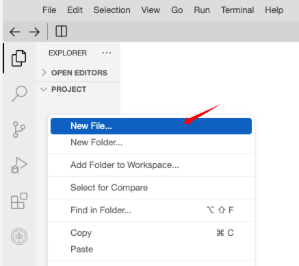

Dosyanıza şu adı verebilirsiniz: **gradio_demo.py**

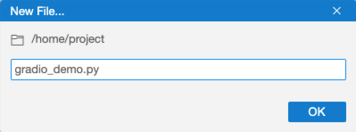

---

### ➕ Toplama Hesaplayıcı Demosu

Bu bölümde, girilen sayıları toplayan basit bir uygulama oluşturacağız.

---

### 🐍 gradio_demo.py Dosyasına Kod Yazma

`gradio_demo.py` dosyasına aşağıdaki Python kodunu ekleyebilirsiniz:

```python
import gradio as gr

def add_numbers(Num1, Num2):
    return Num1 + Num2

# Arayüzü tanımla
demo = gr.Interface(
    fn=add_numbers, 
    inputs=["number", "number"],  # Kullanıcının sayı girebileceği iki alan oluştur
    outputs="number"              # Sayısal çıktı alanı oluştur
)

# Arayüzü başlat
demo.launch(server_name="0.0.0.0", server_port=7860)
```

---

### 🚀 Uygulamayı Çalıştırma

Terminale geri dönün ve komut satırının başında `my_env` etiketinin göründüğünden emin olun. Bu, oluşturduğunuz sanal ortamda (my_env) olduğunuz anlamına gelir.

Sonra aşağıdaki komutu çalıştırarak Python betiğini başlatın:

```bash
python3.11 gradio_demo.py
```

---

### ✅ Başarılı Çalıştırma Mesajı

Komut başarılı şekilde çalıştıktan sonra terminalde aşağıdakine benzer bir mesaj görünecektir:

```
Running on local URL:  http://0.0.0.0:7860
```

Bu bağlantıyı tarayıcınıza kopyalayarak Gradio arayüzünüzü görüntüleyebilirsiniz.

---

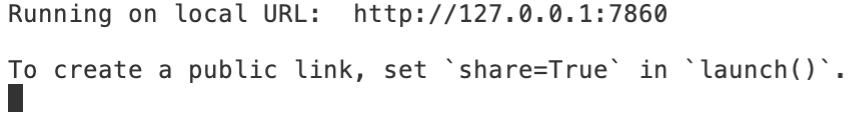

---

### 🌐 Web Uygulamasını Görüntüleme

Web uygulaması yerel olarak **7860 numaralı portta** barındırıldığı için, geliştirdiğimiz uygulamayı görüntülemek üzere aşağıdaki butona tıklayın.

---

### 👀 Web Uygulamasına Göz Atalım

Web uygulaması, **3 ve 4 sayılarının toplamı** örneğini göstermektedir. Giriş ve çıkış alanlarını kullanarak uygulamayı denemeniz teşvik edilmektedir!

Kendi sayılarınızı girerek uygulamanın nasıl çalıştığını keşfetmekten çekinmeyin.

---

Devam etmek istersen, sonraki kısmı gönder yeterli.

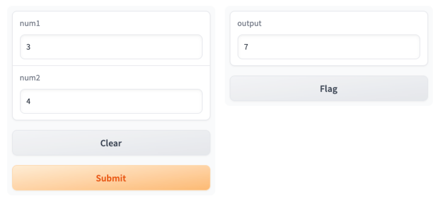

---

### 🛑 Uygulamayı Durdurma

Script’i durdurmak isterseniz, terminalde **Ctrl+C** tuşlarına basarak işlemi sonlandırabilir ve uygulama penceresini kapatabilirsiniz.

---

### 🧠 Alıştırma

İki giriş cümlesini birleştiren bir Gradio uygulaması oluşturabilir misiniz? Bu alıştırmayı tamamlamak için kendinize zaman tanıyın.

---

### ✅ Cevaba Göz Atalım

```python
import gradio as gr

def combine(a, b):
    return a + " " + b

demo = gr.Interface(
    fn=combine,
    inputs = [
        gr.Textbox(label="Input 1"),
        gr.Textbox(label="Input 2")
    ],
    outputs = gr.Textbox(value="", label="Output")
)

demo.launch(server_name="0.0.0.0", server_port=7860)
```

---

### 👏 Tebrikler!

Gradio arayüzüyle ilk deneyiminizi yaşadınız. **Kolaydı, değil mi?** 🎉

Gradio'da daha fazla özelleştirme öğrenmek isterseniz, sizi şu rehber projeye katılmaya davet ediyoruz:

**“Bring your Machine Learning model to life with Gradio”**

Bu projeyi **[cognitiveclass.ai](https://cognitiveclass.ai)** platformunda “Courses & Projects” bölümünde bulabilirsiniz.

---

### 📌 Devam Eden Proje İçin Not

Bu projenin geri kalanında, oluşturacağımız uygulamalara Gradio ile arayüz sağlayacağız.

---


---

### ⚡ watsonx.ai LLM’e Hızlı Başlangıç

---

### 🧠 watsonx.ai Tanıtımı

 **watsonx.ai** , IBM’in bulut tabanlı teknolojilere dayanan ticari üretken yapay zekâ ve bilimsel veri platformudur. Bu platform:

* Bir **stüdyo** (çalışma alanı),
* Bir  **veri deposu** ,
* Ve bir **yönetim araç seti** içerir.

watsonx.ai, birden fazla büyük dil modelini (LLM) desteklemek üzere tasarlanmıştır. Geniş bir yapay zekâ geliştirme yelpazesine hitap eder ve geliştiricilere şu modellere erişim imkânı sunar:

* IBM’in kendi LLM serileri
* Facebook’un **LLaMA-3** modelleri
* **Hugging Face** topluluğuna ait modeller

  

---

### 🚀 watsonx.ai LLM'e Hızlı Başlangıç

---

### 🧠 watsonx.ai Tanıtımı

 **watsonx.ai** , IBM’in bulut tabanlı ticari üretken yapay zekâ ve bilimsel veri platformudur. Bu platform:

* Bir **stüdyo** (geliştirme ortamı),
* Bir  **veri deposu** ,
* Ve bir **yönetim araç kiti** içerir.

watsonx.ai, çok sayıda büyük dil modelini (LLM) desteklemek üzere geliştirilmiştir. Geliştiricilere IBM’in kendi LLM serilerinin yanı sıra, Meta’nın **LLaMA-3** modeli ve **Hugging Face** topluluğunun modellerine erişim imkânı sunar.

---

### 🤖 Basit Bir Soru-Cevap Botu Oluşturma

Bu bölümde, watsonx.ai API'sini kullanarak basit bir **Soru-Cevap (Q&A) botu** oluşturma sürecini adım adım göstereceğiz. Bu bot, kullanıcı sorgularını anlayıp doğru şekilde yanıtlamak için watsonx.ai’nin gelişmiş olanaklarından yararlanacaktır.

Yeni başlayanlar ve deneyimli geliştiriciler için uygun olan bu eğitim, LLM'leri uygulamalara entegre etme konusunda sizi donatacaktır.

---

### 💬 Q&A Botu Geliştirme

Bu eğitimde, **Meta tarafından geliştirilen `llama-3-2-11b-vision-instruct` modelini** kullanacağız. Bu güçlü temel model, IBM'in watsonx.ai platformuna sorunsuz bir şekilde entegre edilmiştir.

Model şu görevleri destekler:

* Soru-Cevap (Q&A)
* Özetleme
* Sınıflandırma
* Metin üretimi
* Veri çıkarımı
* Retrieval-Augmented Generation (RAG)

> **Not:** Bu model, her yapay zekâ teknolojisinde olduğu gibi kusursuz değildir; zaman zaman mantıksız cevaplar verebilir. Bu projenin amacı, watsonx.ai ile LLM kullanımını öğretmektir.

---

### 📄 Python Script: `simple_llm.py`

1. **PROJECT** klasöründe **`simple_llm.py`** adında yeni bir dosya oluşturun.
2. Aşağıdaki kodu bu dosyaya yapıştırın ve kaydedin:

```python
# Gerekli paketleri içe aktar
from ibm_watsonx_ai import Credentials
from ibm_watsonx_ai import APIClient
from ibm_watsonx_ai.foundation_models import Model, ModelInference
from ibm_watsonx_ai.foundation_models.schema import TextChatParameters
from ibm_watsonx_ai.metanames import GenTextParamsMetaNames

# Model ayarları
model_id = "meta-llama/llama-3-2-11b-vision-instruct"

# Kimlik bilgileri
credentials = Credentials(
    url = "https://us-south.ml.cloud.ibm.com",
)

# Parametreler
params = TextChatParameters()

# Proje kimliği
project_id = "skills-network"

# Modeli başlat
model = ModelInference(
    model_id=model_id,
    credentials=credentials,
    project_id=project_id,
    params=params
)

# Soru
prompt_txt = "How to be a good Data Scientist?"

messages = [{
    "role": "user",
    "content": [{
        "type": "text",
        "text": prompt_txt
    }]
}]

# Yanıt oluştur
generated_response = model.chat(messages=messages)
generated_text = generated_response['choices'][0]['message']['content']

# Yanıtı yazdır
print(generated_text)
```

---

### 🧪 Script’i Çalıştırma

Terminalde sanal ortamınızın (`my_env`) aktif olduğundan emin olun.

Sonra şu komutu çalıştırın:

```bash
python3.11 simple_llm.py
```

Başarılı çalıştırma sonrası terminalde yanıt görünecektir. Örneğin:

> **Nasıl iyi bir veri bilimci olunur?** sorusuna teknik beceriler, iş zekâsı, istatistik bilgisi ve iletişim becerilerini kapsayan uzun bir açıklama sunulur.

---

### 🌐 Gradio Entegrasyonu

Terminalde yanıt almak güzel olsa da, bu uygulamayı **Gradio ile entegre ederek** web tabanlı bir arayüz oluşturabiliriz.

---

### 🔧 Web Arayüzüyle Entegre Script: `llm_chat.py`

1. **PROJECT** dizininde **`llm_chat.py`** adında yeni bir dosya oluşturun.
2. Aşağıdaki kodu yapıştırın:

```python
from ibm_watsonx_ai import Credentials
from ibm_watsonx_ai import APIClient
from ibm_watsonx_ai.foundation_models import Model, ModelInference
from ibm_watsonx_ai.foundation_models.schema import TextChatParameters
from ibm_watsonx_ai.metanames import GenTextParamsMetaNames
import gradio as gr

# Kimlik bilgileri
credentials = Credentials(
    url = "https://us-south.ml.cloud.ibm.com",
)

# Model ve proje ayarları
model_id = "meta-llama/llama-3-2-11b-vision-instruct"
project_id = "skills-network"
params = TextChatParameters(
    temperature=0.1,
    max_tokens=256
)

# Modeli başlat
model = ModelInference(
    model_id=model_id,
    credentials=credentials,
    project_id=project_id,
    params=params
)

# Yanıt üreten fonksiyon
def generate_response(prompt_txt):
    messages = [{
        "role": "user",
        "content": [{
            "type": "text",
            "text": prompt_txt
        }]
    }]
    generated_response = model.chat(messages=messages)
    generated_text = generated_response['choices'][0]['message']['content']
    return generated_text

# Gradio arayüzü
chat_application = gr.Interface(
    fn=generate_response,
    flagging_mode="never",
    inputs=gr.Textbox(label="Girdi", lines=2, placeholder="Sorunuzu buraya yazın..."),
    outputs=gr.Textbox(label="Yanıt"),
    title="Watsonx.ai Chatbot",
    description="Herhangi bir soru sorun, chatbot cevaplamaya çalışsın."
)

# Uygulamayı başlat
chat_application.launch()
```

---

### ▶️ Uygulamayı Başlatma

Terminalde şu komutu çalıştırın:

```bash
python3.11 llm_chat.py
```

Başarılı şekilde çalıştığında terminalde şu mesaja benzer bir çıktı göreceksiniz:

```
Running on local URL:  http://127.0.0.1:7860
```

Tarayıcıda bu URL’yi açarak Gradio arayüzü üzerinden chatbot’unuzu test edebilirsiniz.

---


---

### 🖱️ Uygulamayı Başlatmak ve Görüntülemek İçin Tıklayın

Aşağıdaki butona tıklayarak uygulamayı başlatabilir ve görüntüleyebilirsiniz.

---

### 💬 Oluşturduğunuz Chatbot Arayüzü

Başarıyla oluşturduğunuz chatbot uygulaması aşağıdaki gibi görünecektir:

* Üstte başlık: **Watsonx.ai Chatbot**
* Açıklama: **Herhangi bir soru sorun, chatbot cevaplamaya çalışsın.**
* Giriş alanı: Soru yazabileceğiniz bir metin kutusu
* Çıkış alanı: Modelin cevabını gösterecek bir metin kutusu
* Submit butonu: Soruyu göndermek için kullanılır

---

### 🚀 Uygulamayı Başlatmak ve Görüntülemek İçin Tıklayın

Aşağıdaki butona tıklayarak uygulamayı başlatabilir ve geliştirdiğiniz chatbot’u görüntüleyebilirsiniz.

---

### 💡 Chatbot Arayüzü Nasıl Görünür?

Başarıyla oluşturduğunuz chatbot uygulaması aşağıdaki gibi görünecektir:

* ✏️ **Girdi Alanı:** Sorunuzu yazabileceğiniz bir metin kutusu
* 📤 **Gönder Butonu:** Soruyu modele göndermek için
* 📥 **Çıktı Alanı:** Modelin yanıtını gösteren metin kutusu
* 🧠 **Başlık:** “Watsonx.ai Chatbot”
* 📄 **Açıklama:** “Herhangi bir soru sorun, chatbot cevaplamaya çalışsın.”

---

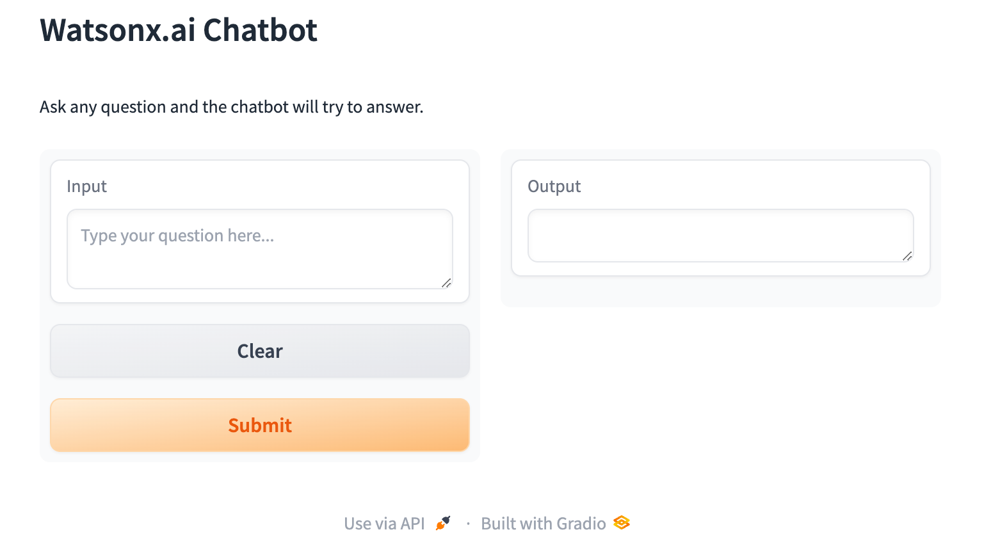


### 💬 Artık Sorularınızı Chatbot’a Sorabilirsiniz

Şimdi chatbot’a dilediğiniz soruyu sorabilirsiniz.

---

### 📝 Örnek Bir Soru:

> **“What are the key skills required for a data analyst?”**
>
> *(Bir veri analisti için gerekli olan temel beceriler nelerdir?)*

---

Başka bir bölüm çevirmemi isterseniz, lütfen paylaşın.

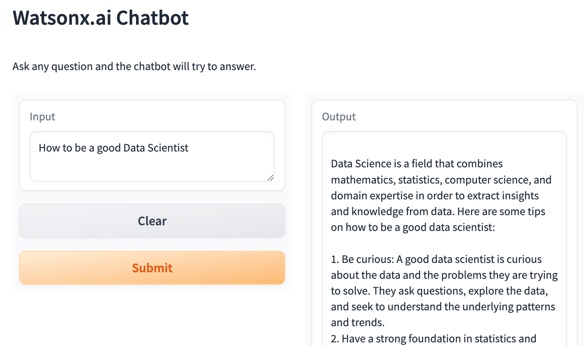

---

### 🛑 Script’i Sonlandırma

(Script’i sonlandırmak için terminalde **Ctrl+C** tuşlarına basın ve uygulama penceresini kapatın.)

---

### 🧠 Alıştırma

Bazen LLM’den gelen yanıtların **eksik** olduğunu gözlemlemiş olabilirsiniz.

* Bu durumun **sebebini** belirleyebilir misiniz?
* Ayrıca modeli daha fazla içerik üretmeye teşvik edecek şekilde **kodu değiştirebilir misiniz?**

---

### ✅ Aslında Yapmanız Gereken Tek Şey:

Aşağıdaki parametreyi artırmak:

```python
"max_tokens": 512  # `max_token` parametresini daha yüksek bir değere ayarlayın
```

---

### 🧾 Sıradaki Bölüm

Bir sonraki bölümde, az önce edindiğiniz bilgileri kullanarak **özgeçmiş düzenleyici (resume polisher)** geliştirmeyi öğreneceğiz.

---

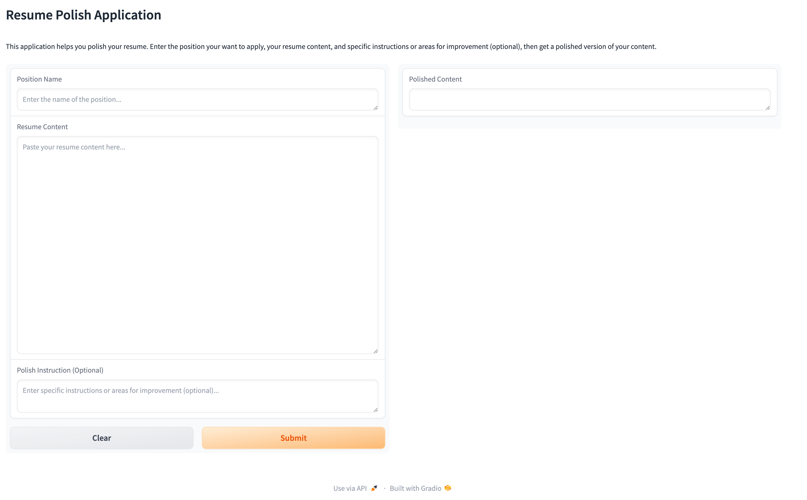

---

### 📝 Özgeçmişinizi Geliştirmeye Hazırsınız

Artık bu uygulamayı özgeçmişinizi geliştirmek için kullanmaya hazırsınız.  **En iyi sonuçları almak için** , özgeçmişinizi **bölüm bölüm düzenlemenizi** öneriyoruz. Bu, modelin daha etkili çalışmasını sağlar.

---

### 📄 Örnek Özgeçmiş İçeriği

Aşağıdaki gibi bir içerik kullanabilirsiniz:

```
Designed and implemented a machine learning system that 
predicts hardware malfunction with more than 80% accuracy.
```

---

### ✍️ Örnek Düzenleme Talimatları

Modelin çıktısını iyileştirmek için şu türde yönergeler verebilirsiniz:

```
I use random forest model. So you should make it more specific and eye catching. 
Also you should mention results it brings: cost savings by 20%.
```

---

### 🛑 Script’i Durdurma

(Script’i durdurmak için terminalde **Ctrl+C** tuşlarına basın ve uygulama penceresini kapatın.)

---

### 🧠 Alıştırma

Verdiğimiz prompt (istem), her zaman sizin ihtiyaçlarınıza veya tercihlerinize tam olarak uymayabilir.

Kodun içinde bu prompt’u  **dilediğiniz gibi düzenleyebilirsiniz** .

---

### ✅ Cevap

```python
prompt_use = f""   # prompt’u istediğiniz gibi kullanın
```


---

### ✉️ Kişiselleştirilmiş Kapak Mektubu

Günümüzün rekabetçi iş piyasasında **kalabalıktan sıyrılmak** hayati önem taşır. Bu noktada,  **kişiselleştirilmiş bir kapak mektubu** , potansiyel işvereninizin dikkatini çekmenin anahtarı olabilir.

Bu ihtiyacı göz önünde bulundurarak, bu bölümde sizi **Kişiselleştirilmiş Kapak Mektubu Üreticisi** oluşturma süreciyle tanıştırıyoruz.

---

### 💡 Bu Araç Ne Yapar?

Bu yenilikçi araç sayesinde, yalnızca benzersiz beceri ve deneyimlerinizi vurgulamakla kalmayacak, aynı zamanda mektubunuzu  **başvurduğunuz işe ve şirkete özel olarak uyarlayabileceksiniz** .

---

### 🧾 Girdi Olarak Şunları Sağlayacaksınız:

* Hedeflediğiniz **şirket**
* Başvurmak istediğiniz **pozisyon**
* İlgili **iş tanımı**
* Güncel **özgeçmişiniz**

---

### 🧠 Ne Sağlar?

Bu girdiler doğrultusunda araç, hem **profesyonel** hem de **kişiselleştirilmiş** bir kapak mektubu oluşturur. Böylece başvurunuz, diğerlerinden farklı ve akılda kalıcı bir izlenim bırakır.

---

Haydi, şimdi böyle bir aracın nasıl geliştirileceğini birlikte keşfedelim.


---

### 🧑‍💼 Kişiselleştirilmiş Kapak Mektubu Oluşturucusu

Önceki kod yaklaşımını takip ederek, şimdi **Gradio arayüzünü yeniden yapılandıracağız** ve özellikle **prompt (istem) oluşturma** kısmına odaklanarak kapak mektubu üretimi için özel bir fonksiyon geliştireceğiz.

---

### 🧾 Tam Python Kod Parçası

```python
# Gerekli paketleri içe aktar
from ibm_watsonx_ai import Credentials
from ibm_watsonx_ai import APIClient
from ibm_watsonx_ai.foundation_models import Model, ModelInference
from ibm_watsonx_ai.foundation_models.schema import TextChatParameters
from ibm_watsonx_ai.metanames import GenTextParamsMetaNames
import gradio as gr

# Model ve proje ayarları
model_id = "meta-llama/llama-3-2-11b-vision-instruct"

# Kimlik bilgileri
credentials = Credentials(
    url = "https://us-south.ml.cloud.ibm.com",
)

# Üretim parametreleri
params = TextChatParameters(
    temperature=0.7,
    max_tokens=512
)

project_id = "skills-network"

# Modeli başlat
model = ModelInference(
    model_id=model_id,
    credentials=credentials,
    project_id=project_id,
    params=params
)

# Kişiselleştirilmiş kapak mektubu oluşturma fonksiyonu
def generate_cover_letter(company_name, position_name, job_description, resume_content):
    prompt = f"Generate a customized cover letter using the company name: {company_name}, the position applied for: {position_name}, and the job description: {job_description}. Ensure the cover letter highlights my qualifications and experience as detailed in the resume content: {resume_content}. Adapt the content carefully to avoid including experiences not present in my resume but mentioned in the job description. The goal is to emphasize the alignment between my existing skills and the requirements of the role."
    messages = [{
        "role": "user",
        "content": [{
            "type": "text",
            "text": prompt
        }]
    }]
    generated_response = model.chat(messages=messages)
    cover_letter = generated_response['choices'][0]['message']['content']
    return cover_letter

# Gradio arayüzü oluştur
cover_letter_app = gr.Interface(
    fn=generate_cover_letter,
    flagging_mode="never",
    inputs=[
        gr.Textbox(label="Company Name", placeholder="Şirket adını girin..."),
        gr.Textbox(label="Position Name", placeholder="Pozisyon adını girin..."),
        gr.Textbox(label="Job Description Information", placeholder="İş tanımını buraya yapıştırın...", lines=10),
        gr.Textbox(label="Resume Content", placeholder="Özgeçmiş içeriğinizi buraya yapıştırın...", lines=10),
    ],
    outputs=gr.Textbox(label="Customized Cover Letter"),
    title="Customized Cover Letter Generator",
    description="Şirket adı, pozisyon adı, iş tanımı ve özgeçmişinizi girerek kişiselleştirilmiş kapak mektubu oluşturun."
)

# Uygulamayı başlat
cover_letter_app.launch()
```

---

### ▶️ Kodu Çalıştırmak İçin:

1. `cover_letter.py` adında yeni bir Python dosyası oluşturun.
2. Yukarıdaki kodu bu dosyaya yapıştırın ve kaydedin.
3. Terminalde aşağıdaki komutu çalıştırın:

```bash
python3.11 cover_letter.py
```

---

### 🌐 Uygulamayı Başlat

Aşağıdaki butona tıklayarak uygulamayı başlatabilirsiniz.

---

### 🧾 Uygulama Arayüzü Nasıl Görünür?

Başarıyla başlatıldığında arayüz şu şekilde olacaktır:

* **4 giriş kutusu:**
  * Şirket Adı
  * Pozisyon Adı
  * İş Tanımı
  * Özgeçmiş İçeriği
* **1 çıktı kutusu:**
  * Oluşturulan Kişiselleştirilmiş Kapak Mektubu
* **Başlık:** Customized Cover Letter Generator
* **Açıklama:** Girdi alanlarını doldurarak kapak mektubunuzu oluşturun

---

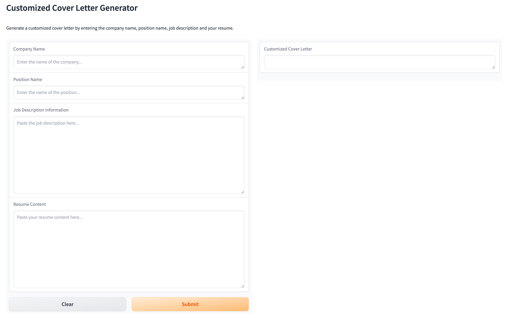


---

### 🧪 Uygulamayı Test Etmeye Hazırsınız

Gerekli bilgileri ilgili alanlara girerek bu uygulamayı artık test edebilirsiniz.

---

### 🛑 Script’i Sonlandırmak

Script’i durdurmak için terminalde **Ctrl+C** tuşlarına basın ve uygulama penceresini kapatın.

---

### 🧠 Alıştırma

Eğer tüm iş tanımını girmek yerine sadece **belirli teknik beceri anahtar kelimelerini** girmeyi tercih ediyorsanız,

**girdi alanını "İş Tanımı Bilgisi" yerine "İş Becerisi Anahtar Kelimeleri" olarak değiştirebilir misiniz?**

---

### ✅ Cevap

Aşağıdaki kod satırını değiştirmeniz yeterlidir. Prompt’u da bu değişikliğe göre uyarlamalısınız:

```python
#gr.Textbox(label="Job Description Information", placeholder="Paste the job description here...", lines=10),
gr.Textbox(label="Job Skills Keywords", placeholder="Paste the job required skills keywords here...", lines=2),
```

---

Bu şekilde, kullanıcıdan iş tanımı yerine yalnızca **gerekli beceri anahtar kelimelerini** girmesi istenmiş olur.

Prompt metni de buna uygun şekilde “job description” yerine “job skills keywords” içerecek şekilde düzenlenmelidir.

---


### 🧭 Kariyer Danışmanı

Bu bölümde, **LLM tabanlı** oldukça kullanışlı bir araç geliştireceğiz — bu araç,  **kariyerle ilgili sorularınıza yardımcı olacak** .

---

### 🧠 Ne Yapmanız Gerekiyor?

Tek yapmanız gereken:

* İlgi duyduğunuz **pozisyonu** girmek,
* Bu işin **neyle ilgili olduğunu** açıklamak,
* Ve **özgeçmişinizi** sağlamak.

---

### 🤖 Akıllı Kariyer Koçunuz

Bu akıllı araç, sağladığınız tüm bilgileri analiz edecek ve size **kariyerinizde nasıl ilerlemeniz gerektiği konusunda sağlam öneriler** sunacak.

Adeta, iş dünyasını ve sizin becerilerinizi çok iyi tanıyan bir **kariyer koçu** ile sohbet ediyormuşsunuz gibi olacak.


İşte bu bölümün Türkçeye çevrilmiş ve yapılandırılmış hali:

---

### 🧑‍💼 Kariyer Danışmanı Uygulaması

Benzer şekilde, şimdi **Gradio arayüzünü yeniden tasarlamamız** ve **prompt’u buna göre ayarlamamız** gerekiyor.

Aşağıda uygulamanın **tam Python kodu** yer almaktadır:

---

### 🧾 Tam Python Kod Parçası: `career_advisor.py`

```python
# Gerekli paketleri içe aktar
from ibm_watsonx_ai import Credentials
from ibm_watsonx_ai import APIClient
from ibm_watsonx_ai.foundation_models import Model, ModelInference
from ibm_watsonx_ai.foundation_models.schema import TextChatParameters
from ibm_watsonx_ai.metanames import GenTextParamsMetaNames
import gradio as gr

# Model ve proje ayarları
model_id = "meta-llama/llama-3-2-11b-vision-instruct"

# Kimlik bilgileri
credentials = Credentials(
    url = "https://us-south.ml.cloud.ibm.com",
)

# Üretim parametreleri
params = TextChatParameters(
    temperature=0.7,
    max_tokens=1024
)

project_id = "skills-network"

# Modeli başlat
model = ModelInference(
    model_id=model_id,
    credentials=credentials,
    project_id=project_id,
    params=params
)

# Kariyer tavsiyesi üreten fonksiyon
def generate_career_advice(position_applied, job_description, resume_content):
    prompt = f"Considering the job description: {job_description}, and the resume provided: {resume_content}, identify areas for enhancement in the resume. Offer specific suggestions on how to improve these aspects to better match the job requirements and increase the likelihood of being selected for the position of {position_applied}."
    messages = [{
        "role": "user",
        "content": [{
            "type": "text",
            "text": prompt
        }]
    }]
  
    # Yanıt üret
    generated_response = model.chat(messages=messages)
  
    # Yanıtı çıkar ve döndür
    advice = generated_response['choices'][0]['message']['content']
    return advice

# Gradio arayüzü oluştur
career_advice_app = gr.Interface(
    fn=generate_career_advice,
    flagging_mode="never",
    inputs=[
        gr.Textbox(label="Position Applied For", placeholder="Başvurduğunuz pozisyonu girin..."),
        gr.Textbox(label="Job Description Information", placeholder="İş tanımını buraya yapıştırın...", lines=10),
        gr.Textbox(label="Your Resume Content", placeholder="Özgeçmiş içeriğinizi buraya yapıştırın...", lines=10),
    ],
    outputs=gr.Textbox(label="Advice"),
    title="Career Advisor",
    description="Başvurduğunuz pozisyonu, iş tanımını ve özgeçmiş içeriğinizi girerek bu işe alınma şansınızı artırmak için geliştirmeniz gereken alanlara dair öneriler alın."
)

# Uygulamayı başlat
career_advice_app.launch()
```

---

### ▶️ Uygulamayı Çalıştırmak İçin:

1. `career_advisor.py` adında yeni bir dosya oluşturun.
2. Yukarıdaki kodu bu dosyaya yapıştırın.
3. Terminalde aşağıdaki komutu çalıştırın:

```bash
python3.11 career_advisor.py
```

---

### 🌐 Uygulamayı Başlatın

Aşağıdaki butona tıklayarak uygulamayı başlatabilirsiniz.

---

### 🧾 Uygulama Arayüzü Nasıl Görünür?

Başarıyla başlatıldığında arayüz aşağıdakilere benzer olur:

* **Pozisyon Girişi** (Position Applied For)
* **İş Tanımı** (Job Description Information)
* **Özgeçmiş İçeriği** (Your Resume Content)
* **Çıktı Alanı:** Kariyer tavsiyesi
* Başlık: **Career Advisor**
* Açıklama: Geliştirme alanlarına dair öneri almak için bilgilerinizi girin

---

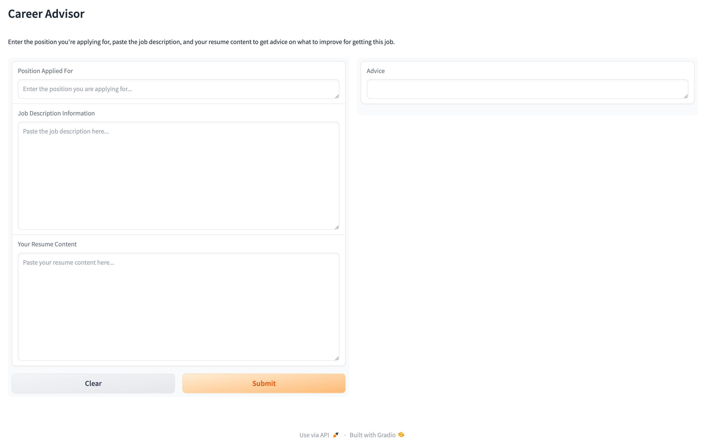


---

### 🎉 Şimdi Uygulamayla Oynama Zamanı!

Uygulamayı test edin, farklı girdiler deneyin ve nasıl çalıştığını keşfedin!

---

### 🛑 Script’i Sonlandırmak

Script’i durdurmak için terminalde **Ctrl+C** tuşlarına basın ve uygulama penceresini kapatın.

---

### 🧠 Alıştırma

Yanıtların rastgeleliğini kontrol eden **`temperature`** parametresini değiştirin.

Bu değerin yüksek olması daha  **yaratıcı ve serbest** , düşük olması ise daha **kesin ve tutarlı** yanıtlar üretir.

Farklı `temperature` değerlerinde üretilen yanıtları karşılaştırın.

---

### ✅ Cevap

```python
"temperature": 0.5
```

---

### 🙌 Harika İş Çıkardınız!

Artık **watsonx.ai kullanarak LLM tabanlı uygulamalar** oluşturmayı öğrendiniz! 🎉

---

### 💻 Sıradaki Bölüm

Bir sonraki bölümde, watsonx.ai'yi **kendi yerel ortamınızda nasıl kullanabileceğinizi** adım adım göstereceğiz.

---

### 🖥️ LLM'leri watsonx.ai ile Yerel Olarak Kullanma

**`ibm_watsonx_ai`** Python kütüphanesi, IBM watsonx Machine Learning hizmetleriyle — özellikle **LLM’ler** dahil — yerel ortamda çalışmanıza olanak tanır.

---

### ⚙️ Bu Kütüphane ile Neler Yapabilirsiniz?

* Modellerinizi  **eğitebilir** ,
* **Depolayabilir** ,
* **Yayınlayabilir (deploy)**
* ve  **API’ler aracılığıyla değerlendirebilirsiniz** .

Ayrıca, **önceden eğitilmiş son teknoloji LLM’lere** erişim sağlayarak, bu modelleri **uygulama geliştirme sürecinize kolayca entegre edebilirsiniz.**

---

### 📚 Tanıtım Dokümantasyonu

watsonx.ai’nin yerel kullanımıyla ilgili ayrıntılı bilgiye tanıtım belgelerinden ulaşabilirsiniz.

---

“Alt text” ifadesi burada bir görsele ait alternatif metin alanı gibi görünüyor ancak bir görsel referansı verilmediği için bu ifade boş kalmış olabilir. Görsel varsa paylaşabilirsin, açıklamasını da çevirebilirim.

---


---

### 📦 Paket Kurulumu

Aşağıdaki komutla `ibm-watson-machine-learning` paketi kurulabilir:

```bash
pip install ibm-watson-machine-learning
# Dilerseniz belirli bir sürüm numarası da belirtebilirsiniz, örneğin: 1.1.20
```

---

### 💬 Basit Bir Soru-Cevap (QA) Chatbot Oluşturma (Llama2 ile)

Aşağıda, watsonx.ai makine öğrenimi kütüphanesi kullanılarak **Llama2 modeliyle** oluşturulan basit bir QA sohbet uygulamasına ait kod örneği verilmiştir:

```python
from ibm_watsonx_ai import Credentials
from ibm_watsonx_ai import APIClient
from ibm_watsonx_ai.foundation_models import Model, ModelInference
from ibm_watsonx_ai.foundation_models.schema import TextChatParameters

# API anahtarı ve proje kimliği tanımla
watsonx_API = ""  # Aşağıda bu bilgileri nasıl alacağınız açıklanıyor
project_id = ""   # Örnek: "0blahblah-000-9999-blah-99bla0hblah0"

# Üretim parametreleri
params = TextChatParameters(
    temperature=0.7,
    max_tokens=1024
)

# Modeli başlat
model = ModelInference(
    model_id='meta-llama/llama-3-2-11b-vision-instruct', 
    params=params,
    credentials={
        "apikey": watsonx_API,
        "url": "https://us-south.ml.cloud.ibm.com"
    },
    project_id=project_id
)

# Soru tanımla
q = "How to be happy?"

messages = [
    {
        "role": "user",
        "content": [
            {
                "type": "text",
                "text": q
            },
        ]
    }
]

# Yanıt al
generated_response = model.chat(messages=messages)
print(generated_response['choices'][0]['message']['content'])
```

---

### 🔐 watsonx API ile Kimlik Doğrulama

Yukarıdaki örnekte de gördüğünüz gibi, **watsonx_API anahtarına** ve **project_id** bilgisine ihtiyacınız var.

Bu kimlik bilgileri olmadan API kullanımı mümkün değildir.

---

### 🧭 Kendi API Anahtarınızı ve Proje ID’nizi Alın

#### 🔑 watsonx API Anahtarı

1. Öncelikle **[IBM Cloud](https://cloud.ibm.com/registration)** sayfasına giderek bir IBM watsonx hesabı oluşturun (ücretsiz kayıt mümkündür).
2. Hesabınıza giriş yaptıktan sonra, **API anahtarınızı** oluşturmak veya almak için şu bağlantıyı ziyaret edin:

   👉 [https://cloud.ibm.com/iam/apikeys](https://cloud.ibm.com/iam/apikeys)

---

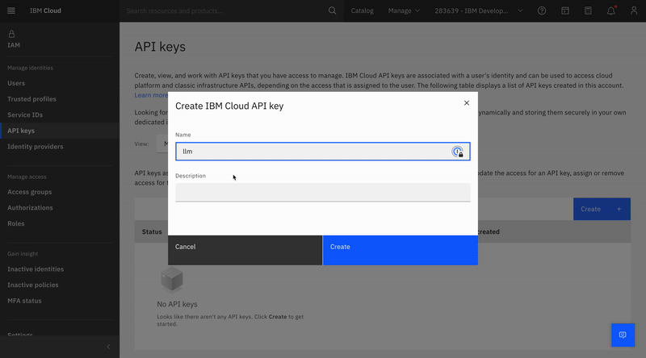

---

### 🆔 Proje Kimliği (Project ID)

Sıradaki adımda, **watsonx.ai projeniz için bir Project ID** (proje kimliği) oluşturmanız veya almanız gerekiyor.

---

### 🛠️ Project ID Nasıl Alınır?

1. **watsonx.ai** platformuna giriş yapın: [https://dataplatform.cloud.ibm.com/](https://dataplatform.cloud.ibm.com/)
2. Üst menüden **“Projects” (Projeler)** bölümüne gidin.
3. Yeni bir proje oluşturmak için **“New Project” (Yeni Proje)** butonuna tıklayın.
4. Projeyi oluşturduktan sonra, proje sayfasının üst kısmında **Project ID** bilgisi yer alacaktır. Bu bilgiyi kopyalayarak kodunuzda kullanabilirsiniz.

---

Bu kimlik, API ile model çağırırken projenizi doğru şekilde tanımlamanız için gereklidir.

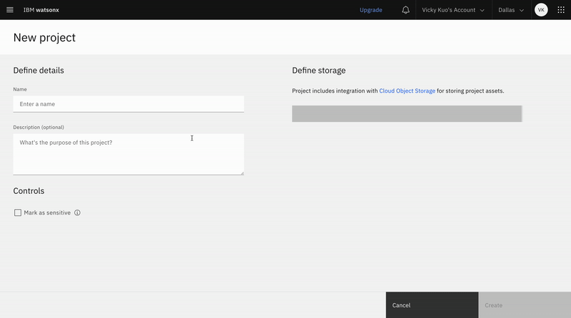


---

### 🔍 Project ID'yi Yönetim Panelinden Bulma

**project_id** bilgisine şu adımlarla ulaşabilirsiniz:

➡️ **Yönetim (Management) → Genel (General)** sekmesine gidin.

Orada **Project ID** açıkça görünecektir.

---

### ⚠️ Dikkat! Bu Kadarla Bitmiyor

Projenizin çalışması için sadece Project ID yeterli değildir.

Ayrıca projeye bir servis eklemeniz gerekir.

---

### 🔗 Projeye Servis Ekleme (Görselde Gösterildiği Gibi)

Proje oluşturduktan sonra şu adımları izleyin:

1. Proje sayfasında **“Manage” (Yönet)** sekmesine gidin.
2. **“Service and integrations”** (Servisler ve entegrasyonlar) sayfasını seçin.
3. **“Associate Services” (Servis Ekle)** butonuna tıklayın.
4. Listeden **Watson Machine Learning** servisini seçip projeye ekleyin.

---

Bu adımları tamamladıktan sonra, projeniz **watsonx.ai API** çağrılarıyla uyumlu hale gelecektir.

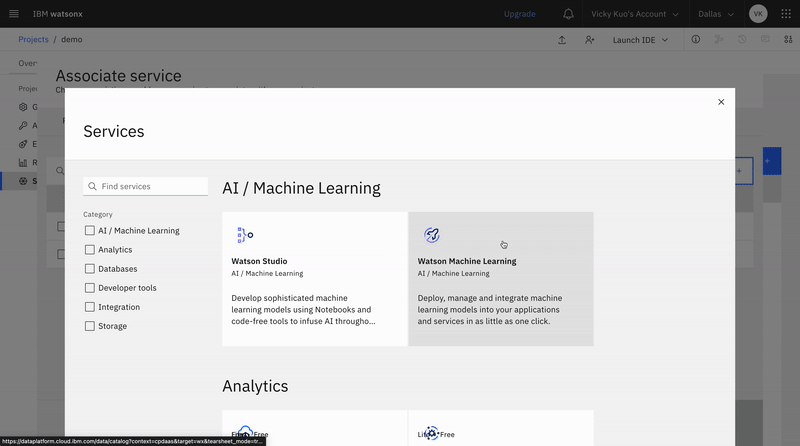


---

### 🎉 Tamamlandı! 🎉

Artık `watsonx_API` ve `project_id` bilgilerinizi kod parçacığına girebilir ve denemeye başlayabilirsiniz.

---

### 🧾 Örnek Çıktı

Kod başarıyla çalıştırıldığında alacağınız çıktı buna benzer olacaktır:

*(Burada “Alt text” bir görsele ait açıklama alanı olabilir, ancak görsel paylaşılmadığı için bu kısım boş kalmıştır. Görsel varsa, açıklamasını da çevirebilirim.)*

---

Yeni bir içerik çevirmemi istersen, paylaşman yeterli.

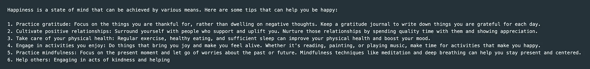
